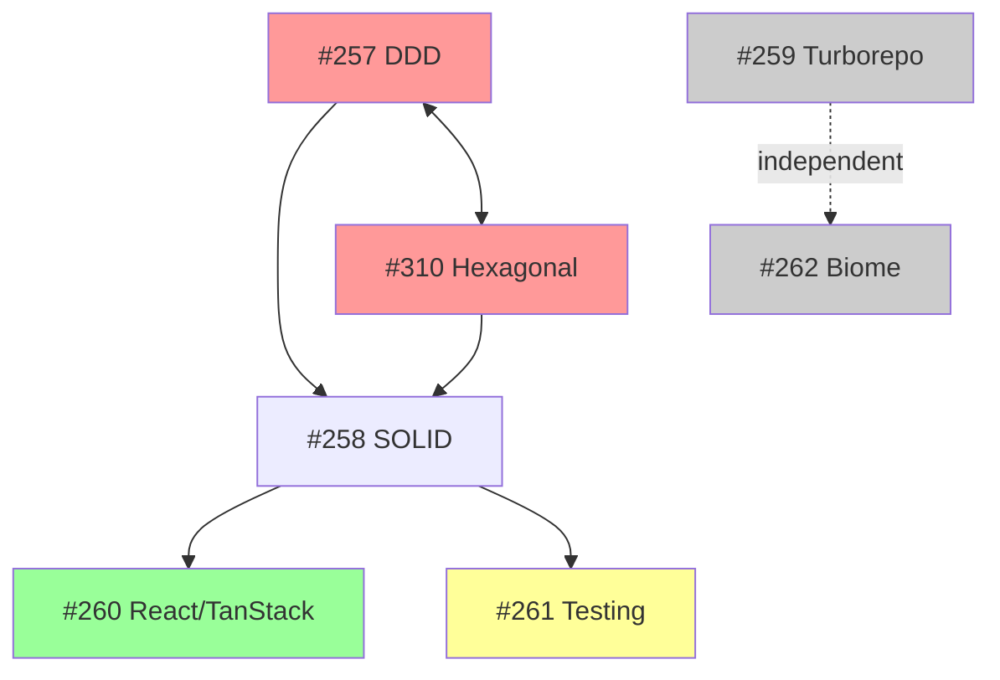

## Trigger

Epic #256 groups 7 sub-issues aimed at formalizing architecture standards across the monorepo:
#257 DDD, #258 SOLID, #259 Turborepo, #260 React/TanStack, #261 Testing, #262 Biome, #310 Hexagonal.

The codebase already has a solid foundation (modular NestJS, TanStack ecosystem, 93% coverage, Biome linting). This is proactive formalization — no acute pain — before the team or feature set scales. The goal is documentation only (no code refactoring, no config changes, no CI modifications) that serves AI agents, onboarding, and code review.

## Current State Assessment

A codebase audit of `apps/api/`, `apps/web/`, and monorepo configuration reveals:

### Backend (`apps/api`)

| Aspect | Maturity | Details |
|--------|----------|---------|
| Module structure | Strong | 9 feature modules, consistent structure (module → controller → service → exceptions → filters) |
| Dependency injection | Strong | Symbol tokens (`DRIZZLE`), `useFactory`, proper module exports, `forwardRef` for cycles |
| Error handling | Strong | Domain exceptions (pure TS, no NestJS imports) + per-type filters + global fallback |
| DDD patterns | Minimal | Drizzle schema = entity model. No domain entities, value objects, aggregates. 1 domain event only (`OrganizationCreatedEvent`) |
| Hexagonal patterns | None | No ports/adapters. Services directly compose Drizzle queries. Transactions embedded in service methods. |
| SOLID compliance | Fair | Good SRP/DIP via NestJS DI. Weak OCP (one filter per exception type, not composable). No LSP (minimal inheritance). |
| Tenant isolation | Good | RLS via `TenantService.query()`, CLS-based context, explicit WHERE clauses |

### Frontend (`apps/web`)

| Aspect | Maturity | Details |
|--------|----------|---------|
| Component separation | Good | Routes orchestrate, presentational components receive props + callbacks |
| TanStack Router | Strong | Type-safe file-based routing, auth guards in `beforeLoad` |
| TanStack Query | Early | No `queryOptions()` factory. Hardcoded query keys inline. No route-level prefetching. |
| State separation | Good | Server state via Query, client state via context/useState. Minimal duplication. |
| Code organization | Mixed | Hybrid feature/technical folders. No barrel exports in component dirs. |

### Infrastructure

| Aspect | Maturity | Details |
|--------|----------|---------|
| Turborepo | Strong | Smart caching, per-package config, clean task pipelines, proper inputs/outputs |
| Package boundaries | Strong | Clean barrel exports, `exports` field in all packages, no deep imports, `workspace:*` protocol |
| Biome | Strong | Custom rules (cognitive complexity, import types, no-any), NestJS override, test file relaxation |
| Testing | Strong | 93%+ coverage, multi-project workspace, behavior-driven patterns, auto-ratcheting |
| MSW | Missing | Raw `vi.fn()` fetch mocking only. No Mock Service Worker. |

## Relevance Fit Per Sub-Issue

| # | Issue | Gap Size | ROI | Recommendation |
|---|-------|----------|-----|----------------|
| **260** | React/TanStack best practices | **Large** | **Highest** | Most impactful. Clear gaps: queryOptions, prefetch, cache key management. Documenting these would immediately improve agent output and code consistency. |
| **310** | Hexagonal Architecture | **Large** | **High** | Genuine gap but deeply coupled to #257. Together they'd restructure the entire backend. Is that desirable for a *boilerplate* meant to be forked? |
| **257** | DDD | **Large** | **Medium** | Low DDD maturity, but the question is *should* a boilerplate adopt full DDD? Current CRUD approach is pragmatic. Document target patterns for when domain complexity warrants it. |
| **261** | Test best practices | **Medium** | **Medium** | Main gap is MSW adoption. Test pyramid and behavior-driven patterns are already practiced but undocumented. |
| **258** | SOLID principles | **Small** | **Medium** | Mostly codifies existing patterns. DI already strong. Value is making implicit knowledge explicit for agents/onboarding. |
| **259** | Turborepo best practices | **Small** | **Low** | Already well-configured. Remote caching is the only meaningful gap. Low documentation effort, low value add. |
| **262** | Biome lint rules | **Minimal** | **Lowest** | Custom rules already configured. Documenting the rationale is the only value-add. |

## Ideas

- **Idea 1: Top-Down (Architecture First)**
  - Start with #257 DDD + #310 Hexagonal as the "north star" architecture vision
  - Then #258 SOLID, #260 TanStack, #261 Testing flow naturally from the architecture
  - #259 Turborepo + #262 Biome are quick bolt-ons
  - Upside: Coherent architecture narrative. Each issue builds on the previous. Clear dependency chain.
  - Downside: Heaviest issues first. DDD + Hexagonal relevance to a boilerplate is questionable. Risk of scope creep — documenting a "target architecture" that's far from current reality creates a dissonance that may never be resolved.

- **Idea 2: ROI-Driven (Gaps First)**
  - Start with #260 React/TanStack (highest gap, highest ROI)
  - Then #261 Testing (MSW gap, testing pyramid)
  - Then #258 SOLID (codify existing patterns)
  - Defer #257 DDD + #310 Hexagonal to a later decision point
  - Close #259 + #262 as "already done" or convert to lightweight checklists
  - Upside: Immediate value. Addresses real gaps. No scope creep on theoretical architecture.
  - Downside: Skips the "big picture" architecture vision. DDD/Hexagonal debt remains undocumented.

- **Idea 3: Two-Phase (Pragmatic → Aspirational)**
  - **Phase 1** (docs only, current patterns): #260, #261, #258, #259, #262
    - Document what the codebase *should* be doing with its current stack
    - Focus on TanStack patterns, testing strategy, SOLID as practiced
    - Quick wins: #259 and #262 are nearly "already done" checklists
  - **Phase 2** (architecture vision): #257 DDD + #310 Hexagonal
    - Produce an "Architecture Vision" document that describes the *target* state
    - Frame as aspirational: "when the domain becomes complex enough, adopt these patterns"
    - Include decision criteria for *when* to introduce DDD/Hexagonal (e.g., "when a module has &gt;3 aggregates" or "when you need to swap the ORM")
  - Upside: Best of both worlds. Delivers value fast (Phase 1) while acknowledging the architecture gap (Phase 2). Phase 2 becomes a decision aid, not a mandate.
  - Downside: Phase 2 may feel disconnected if not well-framed. Two rounds of bootstrap/review.

- **Idea 4: Merge + Simplify**
  - Merge #257 DDD + #310 Hexagonal into a single "Backend Architecture Patterns" issue
  - Merge #258 SOLID into the existing `backend-patterns.mdx` and `frontend-patterns.mdx` (they already cover SOLID implicitly)
  - Keep #260 React/TanStack and #261 Testing as standalone
  - Close #259 + #262 — current config is the documentation
  - Net result: 3 documentation workstreams instead of 7
  - Upside: Reduces scope by half. Avoids creating 7 new standards docs that overlap with existing ones.
  - Downside: Loses granularity. Harder to track progress per concern.

## Dependency Analysis

- **#257 ↔ #310**: Strongly coupled. DDD defines domain boundaries; Hexagonal defines how those boundaries interface with infrastructure. Doing one without the other is architecturally incomplete.
- **#258 depends on #257 + #310**: SOLID principles (especially DIP and OCP) are easier to define once the architecture pattern is chosen. But SOLID can also stand alone as "principles to follow regardless."
- **#260 + #261**: Independent of backend architecture. Can proceed in parallel.
- **#259 + #262**: Fully independent. Already mostly done.

## Suggested Sequencing

Based on the analysis, **Idea 3 (Two-Phase)** with elements of **Idea 4 (Merge)**:

### Phase 1 — Practical standards (high ROI, low risk)

| Order | Issue | Deliverable | Effort |
|-------|-------|-------------|--------|
| 1 | **#260** React/TanStack | Standards doc: queryOptions, prefetch, cache keys, state separation | F-lite |
| 2 | **#261** Testing | Standards doc: testing pyramid, MSW adoption plan, behavior-driven patterns | F-lite |
| 3 | **#258** SOLID | Extend existing `frontend-patterns.mdx` + `backend-patterns.mdx` with explicit SOLID section | F-lite |
| 4 | **#259** Turborepo | Lightweight checklist appended to existing docs (or close as "done") | S |
| 5 | **#262** Biome | Lightweight rationale doc for current rules (or close as "done") | S |

### Phase 2 — Architecture vision (high effort, strategic)

| Order | Issue | Deliverable | Effort |
|-------|-------|-------------|--------|
| 6 | **#257 + #310** | Combined "Backend Architecture Vision" doc: DDD + Hexagonal as *target state*, with adoption criteria and migration guide | F-full |

## Decisions

1. **Strategy**: Two-Phase — practical standards first (Phase 1), backend architecture vision later (Phase 2).
2. **#257 + #310**: Merge into a single "Backend Architecture Patterns" issue for Phase 2.
3. **#259 + #262**: Quick checklists (not full analysis/spec), then close.
4. **Deliverable scope**: Documentation only — no code refactoring, no config changes, no CI modifications.

## Open Questions

1. Should #258 SOLID produce a new doc or extend existing `frontend-patterns.mdx` and `backend-patterns.mdx`?
2. Does the boilerplate need DDD/Hexagonal *documentation* if it doesn't adopt those patterns? Or is "here's what to do when you're ready" valuable enough?

## What's Next?

1. Merge #257 + #310 on GitHub (create new issue, make both sub-issues of it or close originals)
2. Generate quick checklists for #259 + #262 and close them
3. Bootstrap Phase 1 issues in order: #260 → #261 → #258
4. Phase 2: combined architecture analysis for merged #257+#310 issue
