## Workflow Diagram

```mermaid
flowchart TD
    START(["/dev #42"]) --> SCAN["🔍 Scan artifacts<br/><i>parallel, &lt;3s</i>"]
    SCAN --> PROGRESS["📊 Display progress bar"]
    PROGRESS --> NEXT{"Next step?"}

    %% ─── FRAME PHASE ───
    NEXT --> |"Frame"| TRIAGE

    subgraph FRAME ["🟦 Frame"]
        direction TB
        TRIAGE["/issue-triage<br/>Create/enrich GitHub issue"]
        TRIAGE --> FRAMING["/frame<br/>Problem · Who · Constraints · Scope"]
        FRAMING --> |"📄 artifacts/frames/slug.mdx"| FRAME_GATE{"🚦 GATE<br/>Approve frame?"}
        FRAME_GATE --> |"✅ Approved"| FRAME_DONE([Frame ✓])
        FRAME_GATE --> |"✏️ Revise"| FRAMING
    end

    %% ─── SHAPE PHASE ───
    FRAME_DONE --> TIER_CHECK{"Tier?"}

    subgraph SHAPE ["🟨 Shape"]
        direction TB
        ANALYZE["/analyze<br/>Exploration · Risks · Alternatives"]
        ANALYZE --> |"📄 artifacts/analyses/N-slug.mdx"| ANALYZE_DONE([Analysis ✓])
        ANALYZE_DONE --> SPEC_STEP
        SPEC_STEP["/spec<br/>Criteria · Breadboard · Slices"]
        SPEC_STEP --> |"📄 artifacts/specs/N-slug.mdx"| SPEC_GATE{"🚦 GATE<br/>Approve spec?"}
        SPEC_GATE --> |"✅ Approved"| SHAPE_DONE([Shape ✓])
        SPEC_GATE --> |"✏️ Revise"| SPEC_STEP
    end

    TIER_CHECK --> |"S-tier"| BUILD_DIRECT["Skip to implement"]
    TIER_CHECK --> |"F-lite"| SPEC_STEP
    TIER_CHECK --> |"F-full"| ANALYZE

    %% ─── BUILD PHASE ───
    SHAPE_DONE --> PLAN_STEP
    BUILD_DIRECT --> IMPLEMENT

    subgraph BUILD ["🟩 Build"]
        direction TB
        PLAN_STEP["/plan<br/>Tasks · Agents · Dependencies"]
        PLAN_STEP --> |"📄 artifacts/plans/N-slug.mdx"| PLAN_GATE{"🚦 GATE<br/>Approve plan?"}
        PLAN_GATE --> |"✅ Approved"| IMPLEMENT
        PLAN_GATE --> |"✏️ Modify"| PLAN_STEP
        IMPLEMENT["/implement<br/>Worktree · Agents · RED→GREEN→REFACTOR"]
        IMPLEMENT --> |"📁 Code + tests in worktree"| IMPL_DONE([Implement ✓])
        IMPL_DONE --> PR_STEP["/pr<br/>Commit · Push · Create PR"]
        PR_STEP --> |"🔗 GitHub PR"| BUILD_DONE([Build ✓])
    end

    %% ─── VERIFY PHASE ───
    BUILD_DONE --> VALIDATE

    subgraph VERIFY ["🟧 Verify"]
        direction TB
        VALIDATE["/validate<br/>Lint · Typecheck · Test · i18n"]
        VALIDATE --> |"✅ Pass"| REVIEW
        VALIDATE --> |"❌ Fail"| FIX_VAL["Fix & re-validate"]
        FIX_VAL --> VALIDATE
        REVIEW["/review<br/>Multi-agent review · Findings"]
        REVIEW --> REVIEW_CHECK{"Findings?"}
        REVIEW_CHECK --> |"0 findings"| VERIFY_DONE([Verify ✓])
        REVIEW_CHECK --> |"Has findings"| FIX_STEP["/fix<br/>Auto-apply + /1b1 + Fixers"]
        FIX_STEP --> REVALIDATE["/validate<br/>Confirm fixes"]
        REVALIDATE --> VERIFY_DONE
    end

    %% ─── SHIP PHASE ───
    VERIFY_DONE --> PROMOTE

    subgraph SHIP ["🟥 Ship"]
        direction TB
        PROMOTE["/promote<br/>Version · Changelog · Merge"]
        PROMOTE --> |"🏷️ Tag + Release"| CLEANUP["/cleanup<br/>Branches · Worktrees"]
        CLEANUP --> SHIP_DONE([Ship ✓])
    end

    SHIP_DONE --> COMPLETE(["✅ Done"])

    %% ─── STYLING ───
    classDef gate fill:#ff6b6b,stroke:#333,color:#fff
    classDef artifact fill:#4ecdc4,stroke:#333,color:#fff
    classDef skip fill:#95a5a6,stroke:#333,color:#fff
    classDef phase fill:#667eea,stroke:#333,color:#fff

    class FRAME_GATE,SPEC_GATE,PLAN_GATE gate
    class BUILD_DIRECT,TIER_CHECK skip
```



### Legend

| Symbol | Meaning |
|--------|---------|
| 🚦 **GATE** | Pause — requires user approval before continuing |
| 📄 `artifacts/...` | Artifact written to disk (state marker) |
| 📁 Code + tests | Files created in worktree |
| 🔗 GitHub PR | External resource created |
| 🏷️ Tag + Release | Git tag + GitHub release |
| ➡️ No gate | Auto-advance (orchestrator proceeds without pause) |
| Dashed skip | Step skipped based on tier/conditions |

### Skip Rules by Tier

```mermaid
flowchart LR
    subgraph S ["S-tier (≤3 files)"]
        S1["triage"] --> S2["implement"] --> S3["pr"] --> S4["validate"] --> S5["review"]
    end

    subgraph FL ["F-lite (clear scope)"]
        FL1["triage"] --> FL2["frame 🚦"] --> FL3["spec 🚦"] --> FL4["plan 🚦"]
        FL4 --> FL5["implement"] --> FL6["pr"] --> FL7["validate"]
        FL7 --> FL8["review"] --> FL9["fix"] --> FL10["promote"]
    end

    subgraph FF ["F-full (complex)"]
        FF1["triage"] --> FF2["frame 🚦"] --> FF3["analyze"] --> FF4["spec 🚦"]
        FF4 --> FF5["plan 🚦"] --> FF6["implement"] --> FF7["pr"]
        FF7 --> FF8["validate"] --> FF9["review"] --> FF10["fix"]
        FF10 --> FF11["validate"] --> FF12["promote"] --> FF13["cleanup"]
    end

    style S fill:#27ae60,color:#fff
    style FL fill:#f39c12,color:#fff
    style FF fill:#e74c3c,color:#fff
```



---

## Context

The current dev workflow chains 4 monolithic skills manually: `/bootstrap` → `/scaffold` → `/review` → `/promote`. Each does too much internally — can't resume mid-step, skip unnecessary phases, or reuse steps independently. The developer must remember which skill to call next.

**Promoted from:** [Workflow Orchestrator Analysis](../analyses/workflow-orchestrator-design.mdx)
**Frame:** [Atomic Workflow Orchestrator Frame](../frames/atomic-workflow-orchestrator.mdx)
**GitHub issue:** #364

## Goal

1. Single entry point (`/dev #42`) that shows progress and delegates to the right step
2. Atomic step skills that each produce ONE artifact and can be called independently
3. Artifact-based state detection — no state files, resume works by re-scanning
4. Skip logic based on tier and artifact quality
5. Backward-compatible with all existing artifacts

## Artifact Model

| Type | Directory | Question answered | Gate |
|------|-----------|-------------------|------|
| **Frame** | `artifacts/frames/{slug}.mdx` | What's the problem? | User approval |
| **Analysis** | `artifacts/analyses/{N}-{slug}.mdx` | How deep is it? | Expert review (skippable) |
| **Spec** | `artifacts/specs/{N}-{slug}.mdx` | What will we build? | User approval |
| **Plan** | `artifacts/plans/{N}-{slug}.mdx` | How do we build it? | User approval |

---

## Step Skills

### `/frame` (NEW)

**Purpose:** Capture problem statement, constraints, scope boundaries, and complexity tier.

**Input:** Issue #N or free text idea.
**Output:** `artifacts/frames/{slug}.mdx` with frontmatter `{title, issue, status, tier, date}`.
**Sections:** Problem, Who, Constraints, Out of scope, Complexity.

**Behavior:**
1. If `--issue N` → fetch issue title/body as seed context
2. If free text → use as seed
3. Interview user (3-5 questions max): problem, who, constraints, scope boundaries
4. Auto-detect tier from complexity signals → AskUserQuestion to confirm
5. Write frame doc with `status: draft`
6. Present to user → AskUserQuestion: Approve | Revise
7. Approved → set `status: approved`

**File:** `.claude/skills/frame/SKILL.md`
**Allowed tools:** Bash, AskUserQuestion, Read, Write, Edit, Glob, Grep

---

### `/analyze` (extracted from `/bootstrap` Gate 1)

**Purpose:** Deep technical exploration — existing code, dependencies, risks, alternatives.

**Input:** Frame doc path or issue #N (finds frame automatically).
**Output:** `artifacts/analyses/{N}-{slug}.mdx`

**Behavior:**
1. Read frame doc → extract problem, constraints
2. Glob + Grep codebase for related files
3. Interview user for technical context (via `/interview` skill)
4. Generate analysis with sections: Source, Problem, Outcome, Appetite, Shapes, Fit Check
5. Expert review (spawn architect, product-lead, doc-writer as needed — same logic as current bootstrap Gate 1b)
6. Present to user → AskUserQuestion: Approve | Revise

**Extracted from:** Bootstrap Steps 1, 1a, Gate 1 (1a-1c).
**File:** `.claude/skills/analyze/SKILL.md`
**Allowed tools:** Bash, AskUserQuestion, Read, Write, Edit, Glob, Grep, Task

---

### `/spec` (extracted from `/bootstrap` Gate 2)

**Purpose:** Solution design — acceptance criteria, breadboard, slices. Buildable blueprint.

**Input:** Analysis doc path or frame doc path (if analysis skipped) or issue #N.
**Output:** `artifacts/specs/{N}-{slug}.mdx`

**Behavior:**
1. Read analysis (or frame if analysis skipped) → extract context
2. Ensure GitHub issue exists (create if needed)
3. Generate spec via `/interview --promote` with sections: Context, Goal, Users, Expected Behavior, Breadboard, Slices, Success Criteria
4. Pre-check ("unit tests for English"): testable criteria, no dangling refs, ambiguity budget ≤5, slice coverage, edge completeness
5. Expert review (architect always included for specs)
6. Present to user → AskUserQuestion: Approve | Revise
7. Optional: smart splitting if |criteria| > 8 or |slices| > 3
8. Update issue status → "Specs"

**Extracted from:** Bootstrap Gate 2 (2a-2c), Gate 2.5, Ensure GitHub Issue, Issue Status.
**File:** `.claude/skills/spec/SKILL.md`
**Allowed tools:** Bash, AskUserQuestion, Read, Write, Edit, Glob, Grep, Task

---

### `/plan` (extracted from `/scaffold` Steps 1-4)

**Purpose:** Implementation breakdown — tasks, agents, file groups, dependencies.

**Input:** Spec path or issue #N (finds spec automatically).
**Output:** `artifacts/plans/{N}-{slug}.mdx`

**Behavior:**
1. Read spec → extract criteria, breadboard, slices
2. Ambiguity check: grep `[NEEDS CLARIFICATION]` → block or warn
3. Scope: Glob + Grep → files to create/modify
4. Tier confirmation (from frame or re-assess)
5. Agent assignment per path prefix (FE, BE, devops, tester, etc.)
6. Generate micro-tasks with: description, files, agent, dependencies, parallel-safe flag
7. Slice selection if multi-slice: AskUserQuestion
8. Present plan → AskUserQuestion: Approve | Modify | Cancel
9. Write plan artifact

**Extracted from:** Scaffold Steps 1, 2 (2a-2f), 4 (4a-4b).
**File:** `.claude/skills/plan/SKILL.md`
**Allowed tools:** Bash, AskUserQuestion, Read, Write, Edit, Glob, Grep, Task

---

### `/implement` (extracted from `/scaffold` Steps 3, 5-7)

**Purpose:** Execute plan — setup worktree, spawn agents, write code + tests.

**Input:** Plan path or issue #N (finds plan automatically).
**Output:** Code + tests in worktree. Branch `feat/{N}-{slug}`.

**Behavior:**
1. Read plan → extract tasks, agents, tier
2. Setup:
   - Worktree: `git worktree add ../roxabi-{N} -b feat/{N}-{slug} staging`
   - Install: `cp .env.example .env && bun install`
   - DB: `cd apps/api && bun run db:branch:create --force {N}`
3. Context injection per agent (standards docs, ref patterns)
4. Execute:
   - Tier S → direct implementation (single session)
   - Tier F → RED/GREEN/REFACTOR cycle with tester + domain agents
5. Quality gate: `bun lint && bun typecheck && bun run test` → fix loop (max 3)
6. Update issue status → "In Progress"

**Does NOT create PR** — that's `/pr` (next step).

**Extracted from:** Scaffold Steps 3, 5, partially 6-7.
**File:** `.claude/skills/implement/SKILL.md`
**Allowed tools:** Bash, AskUserQuestion, Read, Write, Edit, Glob, Grep, Task, Skill

---

### `/fix` (extracted from `/review` Phases 5, 7)

**Purpose:** Apply review findings — auto-apply high-confidence, 1b1 for the rest.

**Input:** PR #N or review findings from conversation context.
**Output:** Modified files, commit with fixes.

**Behavior:**
1. Gather findings (from PR comments or conversation)
2. Queue split:
   - `Q_auto`: C ≥ 80, actionable, not security-auditor → verify with fresh agent → apply
   - `Q_1b1`: everything else → invoke `/1b1`
3. Auto-apply serially (rollback on failure)
4. 1b1 walkthrough for remaining
5. Spawn fixer agents per domain for accepted findings
6. Stage + commit + push
7. Post follow-up comment to PR

**Extracted from:** Review Phases 5 (auto-apply) + 7 (1b1 + fixers).
**File:** `.claude/skills/fix/SKILL.md`
**Allowed tools:** Bash, AskUserQuestion, Read, Write, Edit, Glob, Grep, Task, Skill

---

### `/review` (simplified)

**Keep:** Phases 1-4 (gather, spec compliance, multi-domain agents, merge + present), Phase 6 (post to PR), Phase 8 (auto-merge gate).
**Remove:** Phase 5 (auto-apply) → now `/fix`. Phase 7 (1b1 + fixers) → now `/fix`.

**New behavior:**
1. Gather changes
2. Spec compliance check
3. Multi-domain agent review
4. Merge, dedup, present findings with verdict
5. Post to PR
6. AskUserQuestion: Fix now (`/fix`) | Merge as-is | Stop
7. If merge → auto-merge gate (rebase, label, squash)

**File:** `.claude/skills/review/SKILL.md` (modify in place)

---

## `/dev` Orchestrator

### Entry point

```
/dev #42           → resume/start from issue
/dev "dark mode"   → find or create issue, then start
```

### State detection (parallel, `<3s`)

```python
def scan(issue_num, slug):
    # All in parallel
    issue    = gh_issue_exists(issue_num)
    frame    = glob(f"artifacts/frames/*{slug}*")
    analysis = glob(f"artifacts/analyses/{issue_num}-*") or glob(f"artifacts/analyses/*{slug}*")
    spec     = glob(f"artifacts/specs/{issue_num}-*")
    plan     = glob(f"artifacts/plans/{issue_num}-*")
    worktree = worktree_exists(issue_num)
    branch   = branch_exists(issue_num)
    pr       = gh_pr_for_branch(issue_num)

    return {
        'triage':    issue is not None,
        'frame':     frame and frontmatter(frame).status == 'approved',
        'analyze':   analysis is not None,
        'spec':      spec is not None,
        'plan':      plan is not None,
        'implement': worktree and has_code_changes(worktree),
        'pr':        pr is not None,
        'validate':  None,  # always re-run
        'review':    pr and pr.review_state in ('approved', 'changes_requested'),
        'fix':       pr and no_open_findings(pr),
        'promote':   pr and pr.merged,
        'cleanup':   not worktree_exists(issue_num) and not stale_branch(issue_num),
    }
```

### Step chain (ordered)

```
STEPS = [
    ('Frame',  'triage',    '/issue-triage'),
    ('Frame',  'frame',     '/frame'),
    ('Shape',  'analyze',   '/analyze'),     # skippable
    ('Shape',  'spec',      '/spec'),
    ('Build',  'plan',      '/plan'),
    ('Build',  'implement', '/implement'),
    ('Build',  'pr',        '/pr'),
    ('Verify', 'validate',  '/validate'),
    ('Verify', 'review',    '/review'),
    ('Verify', 'fix',       '/fix'),         # skippable if 0 findings
    ('Ship',   'promote',   '/promote'),
    ('Ship',   'cleanup',   '/cleanup'),
]
```

### Skip logic

```python
def should_skip(step, tier, state):
    if step == 'triage'  and state['triage']:         return True
    if step == 'frame'   and tier == 'S':             return True
    if step == 'analyze' and tier in ('S', 'F-lite'): return True  # frame sufficient
    if step == 'spec'    and tier == 'S':             return True
    if step == 'plan'    and tier == 'S':             return True
    if step == 'fix'     and no_findings():           return True
    if step == 'promote' and not needs_release():     return True
    if step == 'cleanup' and not has_stale():         return True
    return False
```

### Progress display

```
## Dark Mode (#42)  [F-lite]

  Frame    ██████████  ✓ triage, frame (approved)
  Shape    ████░░░░░░    analyze skipped, spec pending
  Build    ░░░░░░░░░░    —
  Verify   ░░░░░░░░░░    —
  Ship     ░░░░░░░░░░    —

→ Next: spec (generate solution spec from frame)
```

### Main loop

```
1. Parse input → issue #N + slug
2. scan(N, slug) → state
3. Determine tier (frame.tier || issue.size || ask user)
4. Walk STEPS:
   a. Skip completed steps (state[step] == True)
   b. Skip per skip_logic(step, tier, state)
   c. First non-skipped, non-completed = next_step
5. Display progress + next_step
6. AskUserQuestion:
   - Continue    → invoke next_step skill
   - Skip to...  → jump (warn if deps missing)
   - Stop        → exit (artifacts persist)
7. On skill completion → goto 2 (re-scan)
```

### Gates (auto-pause)

| After step | Gate behavior |
|-----------|---------------|
| `/frame` | Show frame, require `status: approved` before continuing |
| `/spec` | Show spec, require user approval before continuing |
| `/implement` | Show summary, confirm ready for PR |
| `/review` | Show findings, choose fix/merge/stop |

### Phase calculation for display

```python
def phase_progress(phase_name, steps_in_phase, state):
    done = sum(1 for s in steps_in_phase if state[s] or should_skip(s))
    total = len(steps_in_phase)
    return done, total  # renders as progress bar
```

---

## Deprecated Aliases

### `/bootstrap` → `/dev`

```
/bootstrap "idea"     → /dev "idea"      (starts at Frame)
/bootstrap --issue N  → /dev #N          (starts at Frame)
/bootstrap --spec N   → /dev #N --from spec  (starts at Shape.spec)
```

Emit deprecation notice: "⚠ /bootstrap is deprecated. Use /dev #N instead."

### `/scaffold` → `/dev`

```
/scaffold --spec N    → /dev #N --from plan   (starts at Build.plan)
/scaffold --issue N   → /dev #N --from plan
```

Emit deprecation notice: "⚠ /scaffold is deprecated. Use /dev #N instead."

---

## Directory Structure

```
.claude/skills/
├── dev/               # NEW — orchestrator
│   └── SKILL.md
├── frame/             # NEW — problem framing
│   └── SKILL.md
├── analyze/           # NEW — extracted from bootstrap Gate 1
│   └── SKILL.md
├── spec/              # NEW — extracted from bootstrap Gate 2
│   └── SKILL.md
├── plan/              # NEW — extracted from scaffold Steps 1-4
│   └── SKILL.md
├── implement/         # NEW — extracted from scaffold Steps 3,5
│   └── SKILL.md
├── fix/               # NEW — extracted from review Phases 5,7
│   └── SKILL.md
├── bootstrap/         # DEPRECATED — alias to /dev
│   └── SKILL.md       # Minimal: redirect + deprecation notice
├── scaffold/          # DEPRECATED — alias to /dev
│   └── SKILL.md       # Minimal: redirect + deprecation notice
├── review/            # MODIFIED — simplified (no auto-apply, no 1b1)
│   └── SKILL.md
├── (unchanged skills) # 1b1, adr, cleanup, interview, issue-triage,
│                      # issues, pr, promote, test, validate, etc.
└── shared/            # Shared references (keep as-is)
```

```
artifacts/
├── frames/            # NEW
│   └── {slug}.mdx
├── analyses/          # existing (also reads {N}-{slug}.mdx and legacy formats)
├── specs/             # existing
└── plans/             # existing
```

---

## Acceptance Criteria

### Orchestrator (`/dev`)
- [ ] `/dev #N` shows progress in `<5` seconds
- [ ] Correctly detects all existing artifact types (frames, analyses, specs, plans, worktrees, PRs)
- [ ] Resumes from any point — `/dev #N` after session restart picks up correctly
- [ ] Skip logic works: S-tier skips frame/analyze/spec/plan, F-lite skips analyze
- [ ] Pauses at gates (frame approval, spec approval, post-implement, post-review)
- [ ] `--from <step>` allows jumping to a specific step
- [ ] Handles both `#N` and `"text"` input formats

### Step skills
- [ ] `/frame` produces valid frame doc with all sections + frontmatter
- [ ] `/analyze` produces analysis with expert review (same quality as bootstrap Gate 1)
- [ ] `/spec` produces spec with expert review + pre-checks (same quality as bootstrap Gate 2)
- [ ] `/plan` produces plan with tasks, agents, dependencies (same quality as scaffold Step 2+4)
- [ ] `/implement` sets up worktree + executes plan (same behavior as scaffold Steps 3+5)
- [ ] `/fix` handles auto-apply + 1b1 + fixer agents (same behavior as review Phases 5+7)
- [ ] `/review` simplified: no auto-apply, no 1b1, ends with findings + verdict

### Each step skill independently callable
- [ ] `/frame "dark mode"` works without `/dev`
- [ ] `/spec --issue 42` works without `/dev`
- [ ] `/plan --issue 42` works without `/dev`
- [ ] All other step skills work standalone

### Backward compatibility
- [ ] Existing `artifacts/analyses/*.mdx` recognized by state detection (with or without issue prefix)
- [ ] Existing `artifacts/specs/*.mdx` recognized
- [ ] Existing `artifacts/plans/*.mdx` recognized
- [ ] `/bootstrap` and `/scaffold` redirect to `/dev` with deprecation notice

### Docs
- [ ] CLAUDE.md updated with `/dev` workflow, artifact model, phase definitions
- [ ] `dev-process.mdx` updated with new phases and step skill references

---

## Implementation Tasks

### Phase 1 — Core (orchestrator + frame)
1. Create `artifacts/frames/` directory (done)
2. Write `/dev` orchestrator SKILL.md
3. Write `/frame` SKILL.md
4. Test: `/dev "test idea"` → shows empty progress → runs `/frame` → shows updated progress

### Phase 2 — Extract from bootstrap
5. Write `/analyze` SKILL.md (from bootstrap Gate 1)
6. Write `/spec` SKILL.md (from bootstrap Gate 2)
7. Convert `/bootstrap` to deprecation alias
8. Test: `/dev #N` through full Shape phase

### Phase 3 — Extract from scaffold
9. Write `/plan` SKILL.md (from scaffold Steps 1-4)
10. Write `/implement` SKILL.md (from scaffold Steps 3, 5)
11. Convert `/scaffold` to deprecation alias
12. Test: `/dev #N` through full Build phase

### Phase 4 — Extract from review + polish
13. Write `/fix` SKILL.md (from review Phases 5, 7)
14. Simplify `/review` SKILL.md (remove Phases 5, 7)
15. Test: `/dev #N` through full Verify phase

### Phase 5 — Docs + migration
16. Update CLAUDE.md — new workflow, artifact model, phase definitions
17. Update `dev-process.mdx` — align with new phases
18. End-to-end test: `/dev #N` from Frame through Ship
