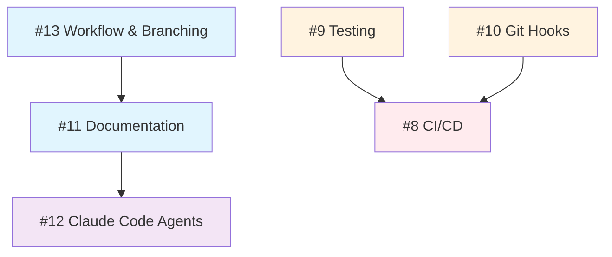

> **Deprecated**: This document is outdated and kept for historical reference only. Please refer to the main documentation sections for current information.


**Date**: 2026-02-02
**Project**: Roxabi Boilerplate - SaaS Framework with AI Team Integration
**Tech Stack**: Bun, TurboRepo, TypeScript, TanStack Start (frontend), NestJS + Fastify (backend)

---

## 1. Overview

This document consolidates the technical analysis of six foundational infrastructure issues (#8-#13) for the Roxabi Boilerplate project. Each issue was evaluated against the current state of the art (2025-2026), presenting three implementation options: MVP (fastest), Gold Standard (best quality), and Balanced (recommended).

The Roxabi Boilerplate aims to provide a production-ready SaaS foundation with integrated AI development capabilities. The analyses cover the complete developer workflow: from local development quality gates (git hooks, testing) through CI/CD automation, documentation practices, AI agent integration, and team collaboration conventions.

**Key Finding**: All six analyses converge on the "Balanced Approach" recommendation, validating a consistent philosophy: implement enough infrastructure to enforce quality and enable scale, without over-engineering for the current project stage. The recommended stack leverages modern tools (Lefthook, Vitest, Changesets, GitHub Actions) that are purpose-built for Bun/TurboRepo monorepos.

---

> **Deprecated**: This document is outdated and kept for historical reference only. Please refer to the main documentation sections for current information.

## 2. Issue Dependency Graph



**ASCII Version:**
```
                    Foundation Layer
    +----------------+     +----------------+
    | #13 Workflow   |     | #9 Testing     |
    | & Branching    |     | Infrastructure |
    +-------+--------+     +-------+--------+
            |                      |
            v                      v
    +-------+--------+     +-------+--------+
    | #11 Docs       |     | #10 Git Hooks  |
    | Structure      |     |                |
    +-------+--------+     +-------+--------+
            |                      |
            v                      |
    +-------+--------+             |
    | #12 Claude     |             |
    | Code Agents    |             |
    +----------------+             |
                                   v
                           +-------+--------+
                           | #8 CI/CD       |
                           | GitHub Actions |
                           +----------------+
```

**Dependency Notes:**
- Issue #8 (CI/CD) is blocked by #9 (Testing) and #10 (Git Hooks) - CI needs tests to run and hooks define local quality gates
- Issue #11 (Documentation) is blocked by #13 (Workflow conventions) - docs structure follows workflow patterns
- Issue #12 (Claude Agents) is blocked by #11 (Documentation) - agents need documented processes to follow

---

## 3. Recommended Implementation Order

| Phase | Issue | Title | Justification |
|-------|-------|-------|---------------|
| **1** | #13 | Workflow & Branching | Foundation for all collaboration; enables consistent commits and PRs |
| **2** | #10 | Git Hooks | Local quality enforcement before any code leaves dev machine |
| **3** | #9 | Testing Infrastructure | Required for CI; establishes TDD practices early |
| **4** | #8 | CI/CD GitHub Actions | Depends on tests and hooks; automates quality gates |
| **5** | #11 | Documentation Structure | Formalizes decisions and processes from phases 1-4 |
| **6** | #12 | Claude Code Agents | Builds on documented workflows; highest abstraction layer |

**Rationale**: Start with conventions (how we work), then enforcement (hooks), then validation (tests + CI), then documentation (capture what we built), then AI augmentation (leverage patterns).

---

> **Deprecated**: This document is outdated and kept for historical reference only. Please refer to the main documentation sections for current information.

## 4. Summary Table

| Issue | Title | Recommended Option | Complexity | Key Tool/Approach |
|-------|-------|-------------------|------------|-------------------|
| #8 | CI/CD GitHub Actions | **C: Balanced** | 3/5 | Parallel jobs + `rharkor/caching-for-turbo` + coverage reports |
| #9 | Testing Infrastructure | **C: Balanced** | 3/5 | Vitest with `projects` config + Playwright + shared `vitest.shared.ts` |
| #10 | Git Hooks | **C: Simplified** | 2/5 | Lefthook (Go binary) with parallel pre-commit/pre-push |
| #11 | Documentation Structure | **C: Balanced** | 2/5 | Markdown + TypeDoc + MADR templates |
| #12 | Claude Code Agents | **C: Balanced** | 3/5 | Core agents (dev/review/test) + essential skills (/commit, /pr, /review, /test) |
| #13 | Workflow & Branching | **C: Balanced** | 3/5 | GitHub Flow + Conventional Commits + Changesets |

---

## 5. Quick Wins (Immediate Actions)

These can be implemented in the first 1-2 days with minimal dependencies:

1. **Install Lefthook** (#10)
   ```bash
   bun add -D lefthook && bunx lefthook install
   ```
   - Add basic `lefthook.yml` with Biome pre-commit hook
   - Immediate enforcement of code formatting

2. **Create GitHub Templates** (#13)
   - Add YAML issue forms: `bug-report.yml`, `feature-request.yml`
   - Add PR template with checklist
   - Configure branch protection on `main`

3. **Create ADR Template** (#11)
   - Add `docs/decisions/000-template.md` using MADR format
   - Document first decision: tech stack choices

4. **Add Basic CI Workflow** (#8)
   - Single workflow with lint/typecheck/test/build
   - No TurboRepo caching initially (add in phase 2)

5. **Initialize Vitest** (#9)
   - Add root `vitest.config.ts` with projects configuration
   - Create one example test per app to validate setup

---

> **Deprecated**: This document is outdated and kept for historical reference only. Please refer to the main documentation sections for current information.

## 6. Key Themes Across All Analyses

### Common Patterns Observed

1. **Runtime-Agnostic Tooling**: Preference for Go/Rust-based tools (Lefthook, Biome) over Node.js-based alternatives for performance and cross-platform consistency.

2. **Parallel Execution**: All recommended options leverage parallel processing (Lefthook parallel hooks, GitHub Actions parallel jobs, Vitest parallel tests).

3. **Monorepo-Native Design**: Tools explicitly support TurboRepo patterns (Changesets for versioning, Vitest `projects` for testing, `--affected` filtering for CI).

4. **Progressive Enhancement**: All balanced options provide clear upgrade paths to gold-standard implementations without requiring rewrites.

5. **Docs-as-Code**: Documentation treated as first-class code with version control, CI validation, and automation.

### Shared Tooling Recommendations

| Category | Tool | Why |
|----------|------|-----|
| Package Manager | Bun | 2x faster installs, native TypeScript |
| Build Orchestration | TurboRepo | Caching, affected detection, parallel tasks |
| Linting/Formatting | Biome | Single tool, fastest execution |
| Testing | Vitest + Playwright | Vite-native, excellent DX |
| Git Hooks | Lefthook | Go binary, parallel, monorepo support |
| Release Management | Changesets | Built for monorepos, decoupled versioning |
| CI/CD | GitHub Actions | Native integration, generous free tier |
| API Documentation | TypeDoc | TypeScript-native, Markdown output |

### Architectural Direction

The analyses point toward a **convention-over-configuration** philosophy:
- Standardized commit messages enable automation
- Consistent file structures enable AI assistance
- Shared configurations reduce duplication
- Clear workflows enable onboarding

---

## 7. Total Estimated Effort

### Aggregate Complexity Assessment

| Issue | Complexity | Estimated Hours |
|-------|------------|-----------------|
| #13 Workflow | 3/5 | 6-8 hours |
| #10 Git Hooks | 2/5 | 2-4 hours |
| #9 Testing | 3/5 | 4-8 hours |
| #8 CI/CD | 3/5 | 4-6 hours |
| #11 Documentation | 2/5 | 4-6 hours |
| #12 Claude Agents | 3/5 | 8-16 hours |
| **Total** | **2.7/5 avg** | **28-48 hours** |

### Suggested Phases/Sprints

**Sprint 1: Foundation (Week 1)**
- Issues: #13, #10, #9
- Goal: Local development workflow complete
- Deliverables: Git hooks, test infrastructure, CONTRIBUTING.md

**Sprint 2: Automation (Week 2)**
- Issues: #8, #11
- Goal: CI/CD pipeline and documentation structure
- Deliverables: GitHub Actions workflows, TypeDoc setup, ADR templates

**Sprint 3: AI Integration (Week 3)**
- Issues: #12
- Goal: Claude Code agents and skills
- Deliverables: Core agents, essential skills, process documentation

---

> **Deprecated**: This document is outdated and kept for historical reference only. Please refer to the main documentation sections for current information.

## 8. Next Steps

### Immediate Actions (This Week)

1. **Review and approve this summary** with stakeholders
2. **Create GitHub Project board** with issues #8-#13
3. **Start Issue #13**: Create CONTRIBUTING.md and branch protection
4. **Start Issue #10**: Install and configure Lefthook

### Short-term Actions (Weeks 2-3)

5. **Complete Sprint 1** deliverables (local dev workflow)
6. **Implement CI/CD** with parallel jobs and coverage
7. **Set up documentation** structure with TypeDoc

### Medium-term Actions (Week 4+)

8. **Deploy Claude Code agents** for dev/review/test
9. **Iterate based on feedback** from actual usage
10. **Consider Gold Standard upgrades** for high-value improvements

---

## Appendix: File Locations

All individual analyses are available at:

- `docs/analyses/08-cicd-github-actions.md`
- `docs/analyses/09-testing-infrastructure.md`
- `docs/analyses/10-git-hooks.md`
- `docs/analyses/11-documentation-structure.md`
- `docs/analyses/12-claude-code-agents.md`
- `docs/analyses/13-workflow-branching.md`

---

> **Deprecated**: This document is outdated and kept for historical reference only. Please refer to the main documentation sections for current information.

*Executive Summary prepared: 2026-02-02*
