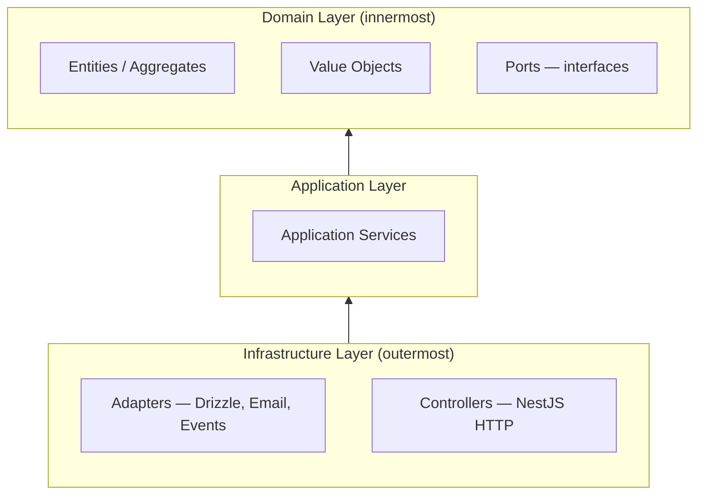
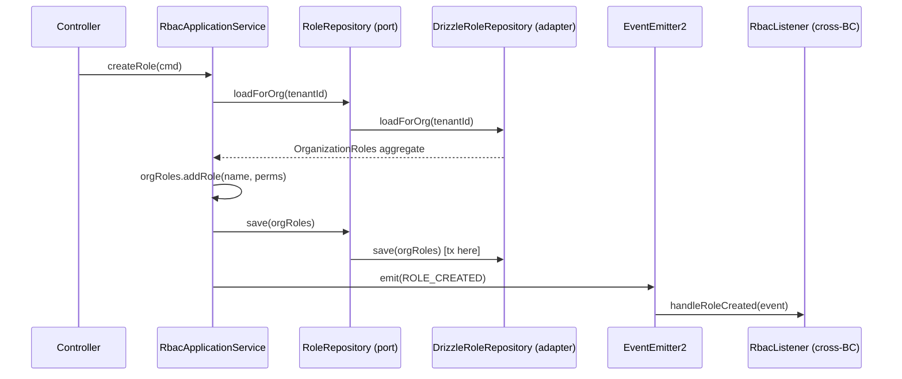

## Overview

This document describes the **target architecture** for Roxabi API modules when domain complexity warrants it. The current baseline is deliberate: pragmatic CRUD with NestJS services that directly use Drizzle ORM. That baseline is appropriate for modules with simple, well-understood operations and minimal cross-entity invariants.

As a module grows — more entities, more external integrations, more invariants to protect — the CRUD baseline begins to show cracks. Business rules scatter across service methods, tests start requiring a running database, and swapping an external service becomes a surgical operation. Domain-Driven Design (DDD) and Hexagonal Architecture (also called Ports and Adapters) are the structured response to this complexity.

The upgrade is not a rewrite. Roxabi already has proto-DDD artifacts: Symbol-token ports in `apps/api/src/auth/email/email.provider.ts`, four domain events in `apps/api/src/common/events/`, cross-module event consumers, and 46 domain exception classes. This document shows how to build on those patterns systematically, and provides a worked migration using the `rbac` module as the example.

## When to Adopt

Use this table to decide whether a module needs DDD or Hexagonal patterns. The signals are observable in the code — not a judgment about complexity.

| Observable signal | Pattern to add |
|-------------------|----------------|
| Module has &gt;3 operations that validate pre-conditions on the same entity | Value objects + domain entities |
| Module calls &gt;1 external service that may be swapped or mocked | Define a port (interface + Symbol token) |
| Module owns &gt;2 entities with cross-entity invariants | Aggregate root |
| Two modules reference the same domain concept with different exception classes | Shared kernel |
| Domain logic needs to be tested without hitting the database | Repository port + in-memory adapter |
| Better Auth / ORM types leak into business logic | Anti-Corruption Layer |

The RBAC module currently satisfies several of these signals: it has five cross-entity exceptions, it calls `TenantService` (which wraps Drizzle), and it has invariants that span `roles`, `role_permissions`, and `members`. It is the natural first candidate for migration.

## Current Baseline

The codebase already contains several patterns that are adjacent to DDD and Hexagonal Architecture, even though they do not yet form a complete implementation.

**Proto-port pattern.** `apps/api/src/auth/email/email.provider.ts` defines a Symbol injection token (`EMAIL_PROVIDER`) and a TypeScript type (`EmailProvider`) with a single `send()` method. The concrete adapter (`ResendEmailProvider`) is bound at the module level via `useClass`. The domain never references `ResendEmailProvider` directly. This is the port-and-adapter pattern in miniature.

**Domain events.** `apps/api/src/common/events/` contains four domain events: `OrganizationCreatedEvent`, `OrganizationSoftDeletedEvent`, `UserSoftDeletedEvent`, and `EmailSendFailedEvent`. Each carries typed payload data and a string constant for the event name. These demonstrate that the codebase already treats events as first-class domain constructs.

**Cross-module event consumer.** `apps/api/src/rbac/rbac.listener.ts` (`RbacListener`) subscribes to `ORGANIZATION_CREATED` and reacts by seeding default roles and assigning the Owner role to the organization creator. This is the bounded-context integration pattern: the RBAC module reacts to events from the organization domain without being directly imported by it.

**Domain exceptions.** 46 exception files across the codebase (`*.exception.ts`) are pure TypeScript `Error` subclasses with no NestJS imports. The `rbac` module has five: `RoleNotFoundException`, `MemberNotFoundException`, `RoleSlugConflictException`, `DefaultRoleException`, and `OwnershipConstraintException`. This is the most complete DDD-adjacent pattern in the current baseline.

What is missing from a full DDD/Hexagonal implementation: explicit aggregate roots that enforce cross-entity invariants, value objects for primitive-obsession prevention, repository interfaces (ports) that abstract away Drizzle queries, application services that own transaction boundaries, and an anti-corruption layer for Better Auth types.

## DDD Patterns

### Branded Types and Value Objects

Branded types prevent primitive obsession — passing a raw `string` where a `RoleId` is expected becomes a compile-time error. Value objects are immutable and enforce domain invariants on construction.

```ts
// Branded type (prevent primitive obsession)
type UserId = string & { readonly _brand: 'UserId' }
type RoleSlug = string & { readonly _brand: 'RoleSlug' }
type OrganizationId = string & { readonly _brand: 'OrganizationId' }
type RoleId = string & { readonly _brand: 'RoleId' }

// Value object (immutable, equality by value)
class Email {
  private constructor(private readonly value: string) {}
  static create(raw: string): Email {
    if (!raw.includes('@')) throw new Error('Invalid email') // NOTE: simplified for illustration — use Zod or class-validator isEmail() in production
    return new Email(raw.toLowerCase())
  }
  toString() { return this.value }
}
```

The `PermissionString` type in `packages/types/src/rbac.ts` is a template literal union (`` `${PermissionResource}:${PermissionAction}` ``) that catches typos at compile time. Branded types are stricter — they prevent passing any `string` where a `RoleId` is expected, even a structurally valid one. The two patterns are complementary; extend the branded-type approach to entity identifiers.

### Entities and Aggregates

Domain entities have identity-based equality (two `Role` objects with the same `id` are the same role). An aggregate root groups related entities and enforces invariants across them — no entity inside the aggregate should be modified except through the root.

```ts
// Domain entity (identity-based equality)
class Role {
  constructor(
    public readonly id: RoleId,
    private name: string,
    private readonly tenantId: OrganizationId,
  ) {}
  rename(newName: string) { this.name = newName }
}

// Aggregate root (enforces invariants across entities)
class OrganizationRoles {
  constructor(private readonly tenantId: OrganizationId, private roles: Role[] = []) {}
  addRole(name: string, permissions: string[]): Role {
    if (this.roles.some(r => r.name === name))
      throw new RoleSlugConflictException(name)
    const role = new Role(`${crypto.randomUUID()}` as RoleId, name, this.tenantId)
    this.roles.push(role)
    return role
  }
}
```

The `RoleSlugConflictException` is already defined in the codebase. The aggregate root pattern simply moves the invariant check from the service method into the domain object where it belongs.

### Domain Services and Application Service

The application service is the transaction boundary. It orchestrates the sequence: validate inputs, load the aggregate via a port, call domain methods, persist via the port, and emit events. Domain services handle domain logic that does not belong on a single entity. Neither aggregates nor domain services ever touch the database directly.

Domain services are stateless operations that span multiple entities. They live in the domain layer and have no database access:

```ts
// Domain service — stateless, spans multiple entities, no database access
class RolePermissionPolicy {
  canAssignPermission(role: Role, permission: string): boolean {
    // Default roles cannot be assigned additional permissions
    if (role.isDefault) return false
    // Owner role implicitly has all permissions
    if (role.name === 'owner') return false
    return !role.hasPermission(permission)
  }
}
```

```ts
// Application service — orchestrates: validate → load → domain call → persist → emit
// Logical unit-of-work boundary is HERE — adapter save() executes the SQL transaction
class RbacApplicationService {
  constructor(
    private readonly roleRepo: RoleRepository,  // port (interface)
    private readonly events: EventEmitter2,
  ) {}

  // Auth guard enforces 'role:write' at the controller — this service assumes caller is already authorized
  async createRole(cmd: CreateRoleCommand): Promise<RoleId> {
    // 1. Load aggregate (via port — no Drizzle here)
    const orgRoles = await this.roleRepo.loadForOrg(cmd.tenantId)
    // 2. Domain call (enforces invariants)
    const role = orgRoles.addRole(cmd.name, cmd.permissions)
    // 3. Persist via port (adapter handles transaction + tenantService.query())
    await this.roleRepo.save(role)
    // 4. Emit event at aggregate boundary (forward-looking — new event)
    await this.events.emitAsync(ROLE_CREATED, new RoleCreatedEvent(role.id))
    return role.id
  }
}
```

The *logical* boundary (what must succeed atomically as a whole) lives at the application service. The *physical* SQL transaction (`tenantService.queryAs()`) lives inside the adapter's `save()` — visible in the sequence diagram below.

## Hexagonal Patterns

### Layer Model

The hexagonal model organizes code into three concentric rings. The dependency rule is strict: outer rings depend on inner rings, never the reverse. Domain code never imports from infrastructure.



Arrows show import/dependency direction (bottom to top): Infrastructure depends on Application; Application depends on Domain. Domain imports nothing from outside itself.

Controllers live in the infrastructure layer, not the application layer. They translate HTTP requests into commands and delegate to application services. The application service calls domain objects and repository ports. Adapters implement those ports using Drizzle, external APIs, or in-memory stores.

### Ports and Adapters

A **port** is an interface defined in the domain layer with a Symbol injection token. An **adapter** is an infrastructure-layer class that implements the port using a concrete technology (Drizzle, Resend, an in-memory map for tests).

Port — domain layer, Symbol token, no infrastructure imports:

```ts
// rbac/ports/role.repository.ts  ← domain layer
export const ROLE_REPOSITORY = Symbol('ROLE_REPOSITORY')
export interface RoleRepository {
  loadForOrg(tenantId: OrganizationId): Promise<OrganizationRoles>
  save(roles: OrganizationRoles): Promise<void>
}
```

Adapter — infrastructure layer, implements the port:

```ts
// rbac/adapters/drizzle-role.repository.ts  ← infrastructure layer
@Injectable()
export class DrizzleRoleRepository implements RoleRepository {
  constructor(@Inject(DRIZZLE) private readonly db: DrizzleDB) {}
  async loadForOrg(tenantId: OrganizationId): Promise<OrganizationRoles> { /* Drizzle query here */ }
  async save(roles: OrganizationRoles): Promise<void> { /* Drizzle update here */ }
}
```

The existing `apps/api/src/auth/email/email.provider.ts` is the canonical proto-port example in the codebase: `EMAIL_PROVIDER` is the Symbol token, `EmailProvider` is the port interface, and `ResendEmailProvider` is the adapter bound at module registration. Apply this same structure to repository abstractions.

### Anti-Corruption Layer

When external systems — particularly Better Auth and Drizzle — define their own types for users, sessions, and database rows, those types must not leak into domain entities. An Anti-Corruption Layer (ACL) translates between the external model and the local domain model at the module boundary.

In practice, this means the adapter (not the application service) is responsible for mapping a Drizzle row shape into a domain entity. The application service receives a `Role` domain object from `roleRepo.loadForOrg()`, not a Drizzle result set. Better Auth session types are translated into local `UserId` branded types at the controller or service boundary before entering the application service.

The guard's `session.permissions` approach already applies this principle: `AuthService.getSession()` resolves and attaches permissions before the guard returns, so inner services never see raw Better Auth session internals.

```ts
// rbac/adapters/drizzle-role.repository.ts  ← infrastructure layer
@Injectable()
export class DrizzleRoleRepository implements RoleRepository {
  constructor(@Inject(DRIZZLE) private readonly db: DrizzleDB) {}

  async loadForOrg(tenantId: OrganizationId): Promise<OrganizationRoles> {
    const rows = await this.db.select().from(roles).where(eq(roles.tenantId, tenantId))
    return new OrganizationRoles(tenantId, rows.map(this.toRole))
  }

  // ACL: translates Drizzle row → domain entity. Domain code never sees raw DB rows.
  private toRole(row: typeof roles.$inferSelect): Role {
    return new Role(row.id as RoleId, row.name, row.tenantId as OrganizationId)
  }
}
```

### Shared Kernel

A **shared kernel** is a small, stable set of domain concepts that two or more modules need to agree on. It lives in `@repo/types` or a dedicated `common/` module and is explicitly shared — changes require coordination across all consumers.

The motivation for introducing a shared kernel is already visible in the codebase. `apps/api/src/admin/exceptions/orgNotFound.exception.ts` and `apps/api/src/organization/exceptions/orgNotFound.exception.ts` represent the same domain fact — "an organization with this ID does not exist" — but are defined independently in separate modules. Even if their constructor signatures or error codes differ by context, the underlying concept is duplicated: if the base message or class contract ever changes, both files must be updated separately, and consumers in different modules import different classes that mean the same thing.

The solution is to promote `OrgNotFoundException` into a shared location (`packages/types/src/exceptions/` or `apps/api/src/common/exceptions/`) and have both the `admin` and `organization` modules import from that shared location. The `PermissionString` type in `@repo/types` is the existing example of this pattern done correctly.

```ts
// BEFORE — duplicated across two modules (the problem):
// apps/api/src/admin/exceptions/orgNotFound.exception.ts
export class OrgNotFoundException extends Error {
  constructor(id: string) { super(`Organization ${id} not found`) }
}
// apps/api/src/organization/exceptions/orgNotFound.exception.ts
export class OrgNotFoundException extends Error {  // identical definition
  constructor(id: string) { super(`Organization ${id} not found`) }
}

// AFTER — shared kernel (the solution):
// apps/api/src/common/exceptions/orgNotFound.exception.ts
export class OrgNotFoundException extends Error {
  constructor(id: string) { super(`Organization ${id} not found`) }
}
// Both modules import from the shared location:
import { OrgNotFoundException } from '../../common/exceptions/orgNotFound.exception.js'
```

### What Does Not Belong in the Domain Layer

The domain layer must remain free of infrastructure concerns. This table shows the most common violations and their corrections.

| What to keep out | Wrong (in domain) | Right (in adapter) |
|------------------|------------------|--------------------|
| NestJS decorators | `@Injectable()` on an aggregate | Aggregates are plain TypeScript classes |
| HTTP types | `FastifyRequest` in an application service | Controllers translate requests before calling services |
| Drizzle ORM types | `DrizzleDB`, `eq`, `and` in a domain service | Adapters own all Drizzle imports |
| Transaction coordination | `db.transaction()` called from an aggregate | Adapters manage transactions inside `save()` |
| Tenant service calls | `tenantService.query()` in a domain method | Adapters call `TenantService` and map results to domain types |

Wrong — Drizzle leaks into domain logic:

```ts
// WRONG: domain service imports Drizzle
import { eq } from 'drizzle-orm'
import type { DrizzleDB } from '../../database/drizzle.provider.js'

class RoleService {
  constructor(private readonly db: DrizzleDB) {}
  async rename(id: string, name: string) {
    await this.db.update(roles).set({ name }).where(eq(roles.id, id))
  }
}
```

Right — domain service is pure TypeScript, adapter owns Drizzle:

```ts
// RIGHT: domain method is pure TypeScript
class Role {
  rename(newName: string) { this.name = newName }
}

// RIGHT: adapter owns Drizzle and transaction logic
async save(orgRoles: OrganizationRoles): Promise<void> {
  await this.tenantService.queryAs(orgRoles.tenantId, async (tx) => {
    for (const role of orgRoles.dirtyRoles()) {
      await tx.update(roles).set({ name: role.name }).where(eq(roles.id, role.id))
    }
  })
}
```

## Unified Architecture

### CreateRole Flow

This sequence diagram shows how the layers collaborate for a `createRole` operation after the RBAC module has been migrated.



The controller never touches the aggregate. The application service never touches Drizzle. The adapter owns the transaction. Events are emitted after the persist succeeds, at the application service boundary — not from inside the aggregate or the adapter.

## Migration Guide — RBAC Module

The following steps take the RBAC module from its current pragmatic CRUD baseline to the hexagonal architecture described above. Each step is independently deployable — the module continues to function correctly between steps.

### Step 1 — Introduce Branded Types

Add branded types for `RoleId`, `OrganizationId`, and `PermissionString` in `apps/api/src/rbac/types.ts`. The `PermissionString` type is already defined in `@repo/types` — import it rather than duplicating it. Use the branded types in service method signatures to replace raw `string` parameters. No runtime behavior changes; this is a type-level refactor that surfaces misuse at compile time.

### Step 2 — Reinforce Domain Exceptions (Already Present)

The RBAC module already has five domain exceptions: `RoleNotFoundException`, `MemberNotFoundException`, `RoleSlugConflictException`, `DefaultRoleException`, and `OwnershipConstraintException`. These are correct DDD practice and require no changes. Document them as the established baseline and ensure new exception classes in the module follow the same convention: pure TypeScript `Error` subclasses in `rbac/exceptions/`, no NestJS imports, no HTTP status codes.

### Step 3 — Define RoleRepository Port and DrizzleRoleRepository Adapter

Create `apps/api/src/rbac/ports/role.repository.ts` with the `RoleRepository` interface and `ROLE_REPOSITORY` Symbol token. Create `apps/api/src/rbac/adapters/drizzleRole.repository.ts` implementing `RoleRepository` using the existing Drizzle queries from `RbacService`. Register the adapter in `RbacModule` via `{ provide: ROLE_REPOSITORY, useClass: DrizzleRoleRepository }`. At this point, `RbacService` injects `@Inject(ROLE_REPOSITORY) private readonly roleRepo: RoleRepository` instead of `@Inject(DRIZZLE) private readonly db: DrizzleDB`.

### Step 4 — Restructure RbacService into RbacApplicationService

This is a **restructuring**, not a new layer added above the existing service. Move domain-orchestration logic (load → domain call → persist → emit) into the application service. Move Drizzle queries and `TenantService.queryAs()` calls into the `DrizzleRoleRepository` adapter. The application service holds the transaction boundary via the repository port — it calls `roleRepo.save()`, and the adapter decides how to execute the transaction. The existing `RbacService` method signatures become the public API of `RbacApplicationService`; controller call sites do not change.

### Step 5 — Introduce RoleCreated and RoleDeleted Events at Aggregate Boundary

Forward-looking: emit `RoleCreatedEvent` and `RoleDeletedEvent` from the application service after aggregate operations succeed and the persist completes. These replace any ad-hoc inline actions triggered from within the current service methods. The existing four domain events in `apps/api/src/common/events/` demonstrate that this pattern already works in the codebase. New events follow the same convention: a constant string key (e.g., `ROLE_CREATED = 'role.created'`) and a typed event class with readonly payload properties.

## Common Mistakes

These mistakes appear repeatedly when teams adopt DDD incrementally. Each one undermines the architecture without breaking tests.

| Mistake | Why it matters |
|---------|----------------|
| Importing `drizzle-orm` (`eq`, `and`, `DrizzleDB`) inside domain classes or aggregates | Locks domain logic to a specific ORM; prevents testing without a database |
| Calling `tenantService.query()` from aggregates or domain services | Tenant context is infrastructure concern; domain should be tenant-agnostic |
| Placing `@Injectable()` on domain entities or aggregates | NestJS DI is an infrastructure concern; domain objects are plain TypeScript |
| Using `FastifyRequest` or `FastifyReply` inside application services | HTTP is an adapter concern; application services receive commands, not HTTP objects |
| Adding a new service class above the existing one instead of restructuring it | Creates a facade layer that duplicates orchestration logic; migrate in place instead |
| Emitting events from inside adapters | Events signal domain outcomes, not persistence mechanics; emit from the application service |
| Defining the same exception class in two modules | Violates shared kernel principle; promote to `@repo/types` or `common/exceptions/` |

## Related Documentation

- [Architecture overview](./index) — Monorepo structure and data flow
- [RBAC Architecture](./rbac) — Current permission model, guard chain, and module structure
- [Auth & Security Architecture](./auth-security) — Guard system, session management, and email port usage
- [Database Architecture](./database) — Drizzle ORM setup and schema conventions
- [Multi-Tenant Architecture](./multi-tenant) — RLS and tenant isolation (relevant for adapter transaction patterns)
- [Ubiquitous Language](./ubiquitous-language) — Domain glossary, including RBAC and organization terms
