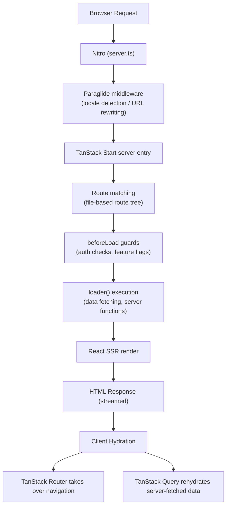
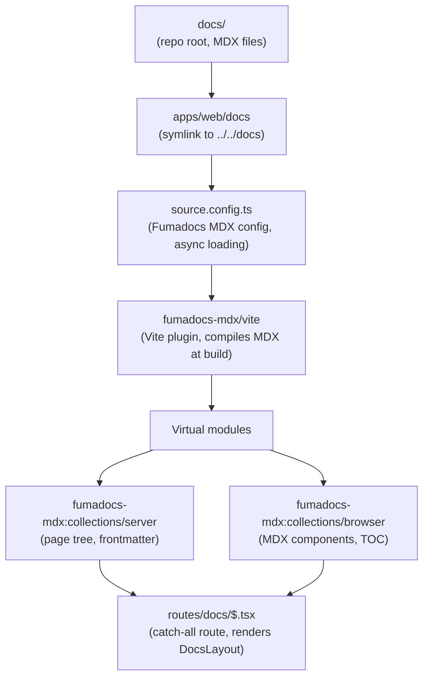
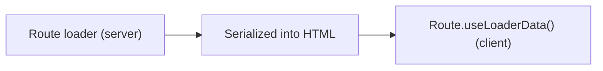
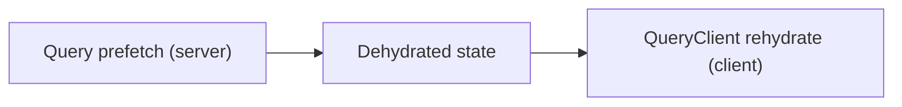
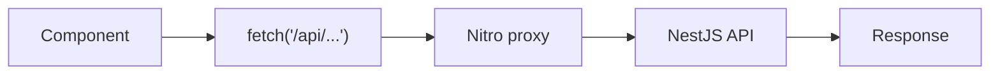
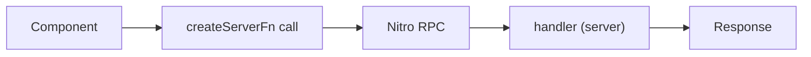

## Overview

The web application (`apps/web`) is built with **TanStack Start**, a full-stack React framework powered by Vite and Nitro. It provides server-side rendering, file-based routing, and seamless integration with the TanStack ecosystem (Router, Query, Form, Store).

Key architectural decisions:

- **SSR by default** -- TanStack Start renders pages on the server via Nitro, then hydrates on the client. This gives fast initial loads and SEO support without a separate SSR framework.
- **Single dev server** -- The web app and documentation (`/docs/*`) run in the same Vite process. Fumadocs MDX content is compiled at build time and rendered through a catch-all route.
- **Proxy to API** -- In both development and production, API requests (`/api/**`) are proxied through Nitro to the NestJS backend, avoiding CORS complexity.
- **Shared UI package** -- Presentational components live in `@repo/ui`, while app-specific components live in `apps/web/src/components/`.

## SSR and Rendering Pipeline

TanStack Start uses **Nitro** as its server runtime. The pipeline:



The server entry point (`src/server.ts`) wraps the default TanStack Start handler with Paraglide middleware for locale-aware URL handling:

```ts
// src/server.ts
import handler from '@tanstack/react-start/server-entry'
import { paraglideMiddleware } from './paraglide/server'

export default {
  fetch(req: Request): Promise<Response> {
    return paraglideMiddleware(req, () => handler.fetch(req))
  },
}
```

### Vite Plugin Stack

The Vite configuration (`vite.config.ts`) chains several plugins in order:

| Plugin | Purpose |
|--------|---------|
| `fumadocs-mdx/vite` | Compiles MDX files from `docs/` into virtual modules |
| `@tanstack/devtools-vite` | Unified TanStack devtools panel (dev only) |
| `@inlang/paraglide-js` | Compile-time i18n with URL-based locale strategy |
| `nitro/vite` | SSR runtime, API proxy, and production build |
| `@content-collections/vite` | Content collections for structured data (jobs, education) |
| `vite-tsconfig-paths` | Path alias resolution (`@/` maps to `src/`) |
| `@tailwindcss/vite` | Tailwind CSS v4 JIT compilation |
| `@tanstack/react-start/plugin/vite` | TanStack Start framework integration |
| `@vitejs/plugin-react` | React JSX transform and fast refresh |

### API Proxy

Nitro proxies `/api/**` requests to the NestJS backend. The target is read from the `API_URL` environment variable (defaulting to `http://localhost:4000`):

```ts
nitro({
  config: {
    devProxy: {
      '/api/**': { target: apiTarget, changeOrigin: true },
    },
    routeRules: {
      '/api/**': { proxy: `${apiTarget}/api/**` },
    },
  },
})
```

This means the frontend never calls the API directly across origins -- all requests go through the same domain.

## File-Based Routing

TanStack Router generates a typed route tree from the file system. Routes live in `apps/web/src/routes/` and follow these conventions:

### Route File Patterns

| Pattern | URL | Example File |
|---------|-----|-------------|
| `index.tsx` | `/` | `routes/index.tsx` |
| `login.tsx` | `/login` | `routes/login.tsx` |
| `demo.tsx` | `/demo` (layout) | `routes/demo.tsx` |
| `demo/index.tsx` | `/demo` (page) | `routes/demo/index.tsx` |
| `demo/store.tsx` | `/demo/store` | `routes/demo/store.tsx` |
| `demo/start.ssr.full-ssr.tsx` | `/demo/start/ssr/full-ssr` | Dot notation for nested paths |
| `demo/form/steps.tsx` | `/demo/form/steps` | Directory for deeper nesting |
| `docs/$.tsx` | `/docs/*` (splat) | Catch-all for Fumadocs |
| `$.tsx` | `/*` (root splat) | 404 fallback |
| `demo/api.tq-todos.ts` | `/demo/api/tq-todos` | Server-only API route |
| `-components/` | (not routed) | Private directory prefix |

### Configuration

Route generation is configured in `tsr.config.json`:

```json
{
  "routeFileIgnorePattern": "\\.test\\.tsx?$"
}
```

Test files (`*.test.tsx`) colocated with routes are excluded from route generation.

### Route Anatomy

Every route uses `createFileRoute` with a route path that matches its filesystem position:

```ts
// routes/login.tsx
export const Route = createFileRoute('/login')({
  beforeLoad: async () => {
    // Auth guard -- redirect if already logged in
    const { data } = await authClient.getSession()
    if (data) throw redirect({ to: '/' })
  },
  loader: fetchEnabledProviders,
  component: LoginPage,
  head: () => ({
    meta: [{ title: 'Sign In | Roxabi' }],
  }),
})
```

Key hooks in the route lifecycle:

| Hook | Runs on | Purpose |
|------|---------|---------|
| `beforeLoad` | Server + client navigation | Auth guards, feature flags, redirects |
| `loader` | Server (SSR) + client (navigation) | Data fetching, server function calls |
| `head` | Server | Sets `<title>`, `<meta>` tags |
| `component` | Client (after hydration) | React component to render |

### Layout Routes

A route file without child routes in a matching directory acts as a layout when it renders `<Outlet />`.

### Root Route

The root route (`__root.tsx`) defines the HTML shell, global providers, and chromeless mode:

```ts
export const Route = createRootRouteWithContext<MyRouterContext>()({
  beforeLoad: async () => {
    if (typeof document !== 'undefined') {
      document.documentElement.setAttribute('lang', getLocale())
    }
  },
  head: () => ({ /* charset, viewport, title, stylesheet */ }),
  notFoundComponent: NotFound,
  shellComponent: RootDocument,
})
```

The `AppShell` component conditionally hides the main `Header` for routes under `/docs` and `/talks`, which provide their own chrome (Fumadocs layout, presentation nav):

```ts
const CHROMELESS_PREFIXES = ['/docs', '/talks'] as const

function AppShell({ children }: { children: React.ReactNode }) {
  const pathname = useRouterState({ select: (s) => s.location.pathname })
  const isChromeless = CHROMELESS_PREFIXES.some((prefix) => pathname.startsWith(prefix))

  return (
    <RootProvider>
      {!isChromeless && <Header />}
      <ErrorBoundary FallbackComponent={ErrorFallback}>{children}</ErrorBoundary>
      <Toaster richColors />
    </RootProvider>
  )
}
```

### Server API Routes

TanStack Start supports server-only API handlers using the `server.handlers` property:

```ts
// routes/demo/api.tq-todos.ts
export const Route = createFileRoute('/demo/api/tq-todos')({
  server: {
    handlers: {
      GET: () => Response.json(todos),
      POST: async ({ request }) => {
        const name = await request.json()
        todos.push({ id: todos.length + 1, name })
        return Response.json({ id: todos.length, name })
      },
    },
  },
})
```

These files use the `.ts` extension (not `.tsx`) and run exclusively on the server.

## State Management

The frontend uses a layered approach to state, matching each concern to the right tool:

```txt
+---------------------------+----------------------------------+
|  Layer                    |  Tool                            |
+---------------------------+----------------------------------+
|  Server/async state       |  TanStack Query                  |
|  Form state               |  TanStack Form                   |
|  Client-side global state |  TanStack Store                  |
|  Route-level data         |  Route loaders (SSR)             |
|  Server mutations         |  Server functions (createServerFn)|
|  Local component state    |  React useState                  |
+---------------------------+----------------------------------+
```

### TanStack Query

TanStack Query handles all asynchronous server state. It is initialized in `src/integrations/tanstack-query/root-provider.tsx` and integrated with the router for SSR data dehydration:

```ts
// src/router.tsx
const rqContext = TanstackQuery.getContext()

const router = createRouter({
  routeTree,
  context: { ...rqContext },
  defaultPreload: 'intent',
})

setupRouterSsrQueryIntegration({ router, queryClient: rqContext.queryClient })
```

The `setupRouterSsrQueryIntegration` call ensures query data fetched during SSR is serialized into the HTML and rehydrated on the client without duplicate requests.

Route loaders prefetch queries, and components consume them with `useQuery`:

```ts
// In a route component
const { data, refetch } = useQuery<Todo[]>({
  queryKey: ['todos'],
  queryFn: () => fetch('/demo/api/tq-todos').then((res) => res.json()),
  initialData: [],
})
```

### TanStack Form

Form state uses `@tanstack/react-form` with a **form hook factory** pattern defined in `src/hooks/demo.form.ts`:

```ts
import { createFormHook } from '@tanstack/react-form'
import { Select, SubscribeButton, TextArea, TextField } from '../components/demo.FormComponents'
import { fieldContext, formContext } from './demo.form-context'

export const { useAppForm } = createFormHook({
  fieldComponents: { TextField, Select, TextArea },
  formComponents: { SubscribeButton },
  fieldContext,
  formContext,
})
```

This creates a `useAppForm` hook that bundles form field components with validation, enabling a composable API:

```tsx
const form = useAppForm({
  defaultValues: { title: '', description: '' },
  validators: { onBlur: schema },
  onSubmit: () => {},
})

// In JSX:
<form.AppField name="title">
  {(field) => <field.TextField label="Title" />}
</form.AppField>
```

Validation integrates with Zod schemas via the `validators` option.

### TanStack Store

For lightweight client-side global state that does not involve server data, TanStack Store provides a reactive store with derived values:

```ts
// src/lib/demo-store.ts
import { Derived, Store } from '@tanstack/store'

export const store = new Store({
  firstName: 'Jane',
  lastName: 'Smith',
})

export const fullName = new Derived({
  fn: () => `${store.state.firstName} ${store.state.lastName}`,
  deps: [store],
})
```

Components subscribe with `useStore`:

```ts
const firstName = useStore(store, (state) => state.firstName)
```

### Server Functions

TanStack Start's `createServerFn` provides type-safe server-only functions callable from loaders or components. These run on the server during SSR and via RPC on client navigation:

```ts
const getPunkSongs = createServerFn({ method: 'GET' })
  .handler(async () => [
    { id: 1, name: 'Teenage Dirtbag', artist: 'Wheatus' },
    // ...
  ])

// Used in a route loader
export const Route = createFileRoute('/demo/start/ssr/full-ssr')({
  loader: async () => await getPunkSongs(),
})
```

Server functions can also accept validated input:

```ts
const addTodo = createServerFn({ method: 'POST' })
  .inputValidator((d: string) => d)
  .handler(async ({ data }) => { /* server-side logic */ })
```

## Fumadocs Integration

Documentation is rendered at `/docs/*` using **Fumadocs v16** with TanStack Start. This is not a separate application -- it runs in the same Vite dev server and production build.

### Content Pipeline



### Configuration

The Fumadocs source config (`source.config.ts`) defines the docs collection with **async loading** to prevent out-of-memory errors during Nitro's SSR build:

```ts
import { defineConfig, defineDocs } from 'fumadocs-mdx/config'

export const docs = defineDocs({
  dir: 'docs',
  docs: {
    async: true, // Lazy-load MDX body; only frontmatter is eagerly bundled
  },
})

export default defineConfig()
```

The source loader (`src/lib/source.ts`) converts the collection into a navigable page tree:

```ts
import { docs } from 'fumadocs-mdx:collections/server'
import { loader } from 'fumadocs-core/source'

export const source = loader({
  baseUrl: '/docs',
  source: docs.toFumadocsSource(),
})
```

### Docs Route

The catch-all route `routes/docs/$.tsx` handles all documentation pages:

1. **Server loader** resolves the slug to a page entry and serializes the page tree
2. **Client loader** preloads the MDX content for the matched path
3. **Component** renders the Fumadocs `DocsLayout` with sidebar navigation and the `DocsPage` with title, description, TOC, and MDX body

Navigation metadata comes from `meta.json` files in each docs subdirectory. These control sidebar ordering and section titles.

### Type Safety

Virtual module types are declared in `src/fumadocs.d.ts`, providing TypeScript definitions for the `fumadocs-mdx:collections/server` and `fumadocs-mdx:collections/browser` imports.

## Component Architecture

Components are organized in two layers: **shared** (`@repo/ui`) and **app-specific** (`apps/web/src/components/`).

### Directory Structure

```txt
apps/web/src/
  components/
    Header.tsx              # App header with nav, auth, locale
    Footer.tsx              # App footer
    AuthLayout.tsx          # Shared layout for auth pages
    UserMenu.tsx            # Authenticated user dropdown
    OrgSwitcher.tsx         # Organization switching dropdown
    ThemeToggle.tsx         # Dark/light mode toggle
    LocaleSwitcher.tsx      # Language selector
    GithubIcon.tsx          # GitHub link icon
    FeatureCard.tsx         # Landing page feature card
    docs-error-boundary.tsx # Error boundary for docs pages
    demo.FormComponents.tsx # Form field components for TanStack Form
    landing/                # Landing page sections
      HeroSection.tsx
      FeaturesSection.tsx
      AiTeamSection.tsx
      DxSection.tsx
      TechStackSection.tsx
      CtaSection.tsx
      SectionHeading.tsx
    presentation/           # Presentation/talk components
      IntroSection.tsx
      BuildingBlocksSection.tsx
      ...
```

### Component Patterns

**Route-specific components** live in route directories using the `-` prefix to exclude them from routing:

```txt
routes/design-system/-components/    # Not routed
  ColorPicker.tsx
  ComponentShowcase.tsx
  ThemeEditor.tsx
```

**Page components** are defined inline in route files. Each route file exports a `Route` object and defines its component as a local function -- not as a separate file:

```ts
export const Route = createFileRoute('/login')({
  component: LoginPage,
})

function LoginPage() {
  // ...
}
```

**Section components** break large pages into focused, testable units. The landing page composes sections:

```tsx
function LandingPage() {
  return (
    <div>
      <HeroSection />
      <AnimatedSection><FeaturesSection /></AnimatedSection>
      <AnimatedSection><AiTeamSection /></AnimatedSection>
      {/* ... */}
    </div>
  )
}
```

**Auth client usage** follows a consistent pattern: `authClient.getSession()` in `beforeLoad` for guards, and `useSession()` hook in components for reactive session state.

## Shared UI Package (`@repo/ui`)

The `packages/ui` package provides the design system primitives consumed by `apps/web`.

### Architecture

| Concern | Implementation |
|---------|---------------|
| Bundler | tsup (ESM only, with `"use client"` banner) |
| Styling | Tailwind CSS v4 + `class-variance-authority` (CVA) |
| Primitives | Radix UI (headless) |
| Icons | Lucide React |
| Notifications | Sonner toast library |
| Theme engine | OKLCH color space with WCAG AA contrast checks |

### Package Exports

The package exposes three entry points:

```json
{
  ".": { "import": "./dist/index.js", "types": "./dist/index.d.ts" },
  "./styles.css": "./dist/styles.css",
  "./theme.css": "./src/theme.css"
}
```

- **`@repo/ui`** -- All components, hooks, theme utilities, and the `cn()` helper
- **`@repo/ui/styles.css`** -- Compiled component styles
- **`@repo/ui/theme.css`** -- CSS custom properties for theming

### Component Catalog

The package exports 30+ components, including:

| Category | Components |
|----------|------------|
| Layout | Card, Separator, Sheet, Tabs, Accordion |
| Forms | Input, Label, Checkbox, Select, Textarea, PasswordInput, Slider, Switch |
| Feedback | Alert, AlertDialog, Dialog, Tooltip, Sonner (Toaster), Spinner |
| Navigation | Button, NavigationMenu, DropdownMenu, Badge |
| Data | Table, Avatar, HoverCard, Skeleton, StatCounter |
| Animation | AnimatedSection (intersection observer) |
| Auth | OAuthButton (Google/GitHub) |

### Theme Engine

The theme system uses OKLCH color space for perceptually uniform color manipulation:

```ts
import { applyTheme, deriveFullTheme, hexToOklch, meetsWcagAA } from '@repo/ui'
```

Theme presets (base + color variants) can be composed and applied at runtime. The `contrastRatio` and `meetsWcagAA` utilities ensure accessibility compliance.

### Integration with `apps/web`

Components are imported directly from the package:

```ts
import { Button, Card, CardContent, CardHeader, CardTitle, Input, Label } from '@repo/ui'
```

The `"use client"` banner in the tsup build ensures all UI components are treated as client components in SSR contexts.

## Client/Server Boundary

The architecture maintains a clear separation between server-side and client-side code:

### Server-Only Code

| Location | Purpose |
|----------|---------|
| `src/server.ts` | Server entry point, Paraglide middleware |
| `src/lib/api-client.server.ts` | Server-side API client (ofetch with correlation IDs) |
| `src/lib/source.ts` | Fumadocs page tree resolution |
| `src/data/*.ts` | Server functions (`createServerFn`) |
| `routes/**/api.*.ts` | Server-only API route handlers |
| Route `loader` functions | Run on server during SSR |
| Route `beforeLoad` guards | Run on server during SSR, client during navigation |

### Client-Only Code

| Location | Purpose |
|----------|---------|
| `src/components/*.tsx` | React UI components |
| `src/lib/auth-client.ts` | Better Auth client (browser-side session) |
| `src/lib/demo-store.ts` | TanStack Store instances |
| `src/hooks/*.ts` | Form hooks, custom React hooks |
| `src/integrations/tanstack-query/` | Query client setup and devtools |

### Data Flow Patterns

**SSR with loader** -- Data is fetched server-side and available immediately on hydration:



**SSR with TanStack Query** -- Server-fetched queries are dehydrated and rehydrated:



**Client-side API call** -- Post-hydration data fetching through the Nitro proxy:



**Server function RPC** -- Type-safe server calls from client components:



## Internationalization

The frontend uses **Paraglide JS** (Inlang) for compile-time i18n with URL-based locale routing.

| Concern | Implementation |
|---------|---------------|
| Locale strategy | URL-based (`/fr/...`, `/en/...`) |
| Default locale | `en` |
| Supported locales | `en`, `fr` |
| Message files | `apps/web/messages/{locale}.json` |
| Compile step | `paraglide-js compile` generates typed message functions |
| Usage | `import { m } from '@/paraglide/messages'` then `m.key()` |

The router integrates locale-aware URL rewriting:

```ts
const router = createRouter({
  routeTree,
  rewrite: {
    input: ({ url }) => deLocalizeUrl(url),
    output: ({ url }) => localizeUrl(url),
  },
})
```

This means route definitions use unlocalized paths (`/login`), while the actual URLs include the locale prefix (`/fr/login`).

## Error Handling

Error boundaries are layered at two levels:

1. **Root error boundary** (`__root.tsx`) -- Catches unhandled errors in any route. Displays a generic error page with a retry button and uses i18n messages.
2. **Docs error boundary** (`docs-error-boundary.tsx`) -- Wraps the Fumadocs layout specifically, providing a docs-themed error page with a "back to docs" link.

Both use `react-error-boundary` with custom fallback components.

## Developer Tooling

In development mode (`import.meta.env.DEV`), the root route renders a unified TanStack Devtools panel with three plugins:

| Plugin | Purpose |
|--------|---------|
| TanStack Router Devtools | Route tree inspection, navigation state |
| TanStack Query Devtools | Query cache, refetch status, stale tracking |
| Store Devtools (demo store) | Store state inspection |

These are tree-shaken from production builds.

## Related Documentation

- [Architecture overview](./index) -- Monorepo structure and data flow
- [Database architecture](./database) -- Drizzle ORM and schema conventions
- [Frontend patterns](../standards/frontend-patterns) -- Coding standards for React and TanStack
- [Authentication guide](../guides/authentication) -- Better Auth integration details
- [Deployment guide](../guides/deployment) -- Vercel deployment for web and API
