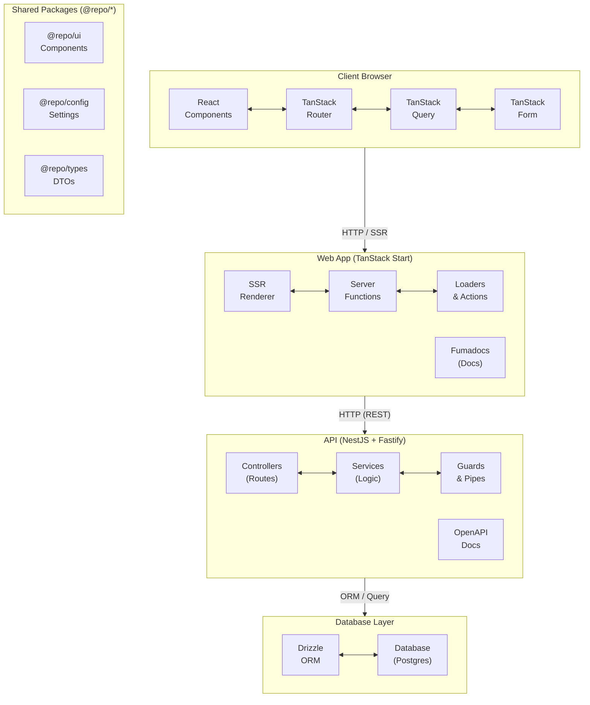
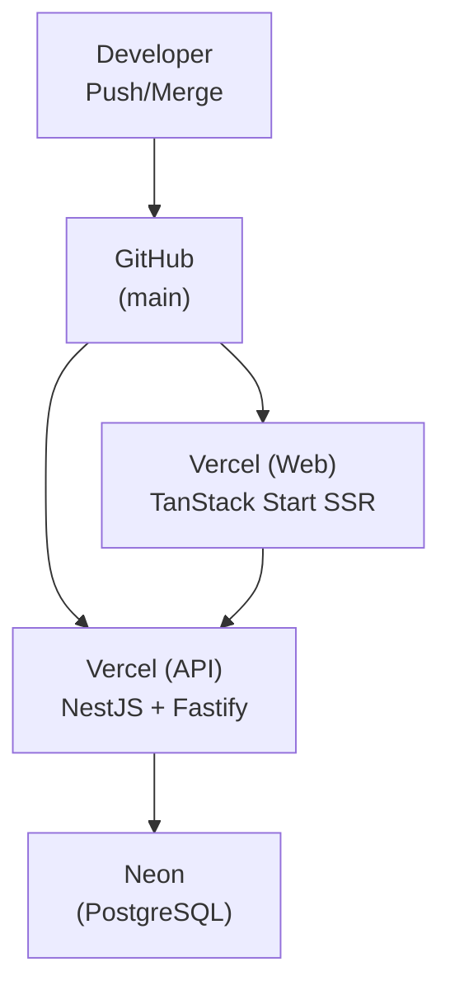

## Monorepo Structure

```txt
roxabi_boilerplate/
├── .env                      # Global environment variables
├── apps/
│   ├── web/                  # Frontend + Documentation (TanStack Start + Fumadocs)
│   │   ├── src/
│   │   │   ├── routes/       # File-based routing
│   │   │   ├── components/   # React components
│   │   │   └── lib/          # Utilities and helpers
│   │   ├── docs -> ../../docs  # Symlink to root docs
│   │   └── source.config.ts  # Fumadocs MDX configuration
│   └── api/                  # Backend API (NestJS + Fastify)
│       └── src/
│           ├── auth/         # Authentication module
│           ├── user/         # User module
│           ├── tenant/       # Multi-tenant module (global)
│           ├── rbac/         # Role-based access control
│           ├── database/     # Database providers
│           ├── common/       # Shared utilities & filters
│           └── config/       # Environment validation
├── packages/
│   ├── ui/                   # Shared UI components (@repo/ui)
│   ├── config/               # Shared configurations (@repo/config)
│   ├── types/                # Shared TypeScript types (@repo/types)
│   ├── email/                # Email templates
│   ├── vitest-config/        # Shared Vitest configuration
│   └── playwright-config/    # Shared Playwright configuration
├── docs/                     # Documentation content (MDX files)
│   ├── index.mdx             # Docs home page
│   ├── meta.json             # Navigation order
│   ├── architecture/         # Architecture documentation
│   ├── processes/            # Development processes
│   └── standards/            # Coding standards
├── artifacts/                # Dev process artifacts (not served by Fumadocs)
│   ├── frames/               # Problem framing documents
│   ├── analyses/             # Pre-spec analyses & research
│   ├── specs/                # Feature specifications
│   └── plans/                # Scaffold execution plans
└── .claude/                  # Claude Code configuration
    ├── settings.json         # Project settings and hooks
    ├── agents/               # Agent team definitions
    ├── agent-memory/         # Persistent agent memory across sessions (created at runtime — not committed)
    ├── hooks/                # Git hook scripts
    └── skills/               # Custom skills
```

## Applications

### Web (`apps/web`)

Frontend application built with TanStack Start.

- Server-side rendering
- File-based routing
- TypeScript strict mode

See [Frontend Architecture](./frontend) for the full deep-dive.

### API (`apps/api`)

Backend API built with NestJS and Fastify.

- REST API
- Modular architecture
- OpenAPI documentation

See [Auth & Security Architecture](./auth-security) for authentication, guards, CORS, and security headers. See [Multi-Tenant Architecture](./multi-tenant) for RLS and tenant isolation. See [RBAC Architecture](./rbac) for the permission model and role hierarchy. See [Database Architecture](./database) for Drizzle ORM setup, schema conventions, and migration workflow. See [Ubiquitous Language](./ubiquitous-language) for a glossary of domain terms, common confusions, and entity lifecycle diagrams.

### CLI (`apps/cli`) - Planned

Command-line interface generated from OpenAPI spec.

- Auto-generated from API's OpenAPI/Swagger spec
- Usable by humans and AI agents
- Multiple auth modes (env vars, config file, interactive login)
- JSON output for scripting and AI parsing

## Packages (`packages/`)

Shared code used by applications.

### UI (`packages/ui`)

Shared UI component library.

- React components
- Design system primitives
- Exported from `@repo/ui`

### Config (`packages/config`)

Shared configurations.

- TypeScript configs
- Biome configs
- Exported from `@repo/config`

### Types (`packages/types`)

Shared TypeScript type definitions.

- Domain models
- API contracts
- Exported from `@repo/types`

## Documentation

Documentation is integrated into `apps/web` using Fumadocs v16 with TanStack Start.

- MDX content lives in `docs/` at the repo root
- Fumadocs renders docs at `/docs/*` routes
- Single dev server for both app and documentation

```bash
# Start documentation server
bun docs
```

## Data Flow



## Build System

TurboRepo handles:

- Parallel task execution
- Dependency-aware builds
- Caching for faster rebuilds

Build order: `packages/* → apps/*`

Workspaces configuration:
```json
{
  "workspaces": ["apps/*", "packages/*"]
}
```

### Environment Handling

TurboRepo distinguishes between two types of environment variables:

- **`env`** (root `turbo.jsonc`) — Variables that affect build output (`API_URL`, `APP_URL`, `VITE_*`). Changing these invalidates the Turbo cache.
- **`passThroughEnv`** (`apps/api/turbo.json`) — Runtime-only secrets (database, auth). Available at runtime but excluded from cache keys, preventing unnecessary rebuilds when only secrets rotate.

App-specific `turbo.json` files extend the root config with `"extends": ["//"]`.

## Deployment Architecture

Production uses **Vercel** for both web and API with automatic deploys from GitHub.



Key decisions:
- **Single platform** — Both apps on Vercel, one dashboard, automatic SSL
- **Vercel for SSR** — TanStack Start + Nitro has native Vercel support
- **Vercel for API** — Zero-config NestJS support with Fluid compute
- **Serverless PostgreSQL** — Managed by Neon
- **Docker configs included** — For local dev and self-hosted VPS alternative

See [CI/CD Architecture](./ci-cd) for the full pipeline from git hooks through deployment.
