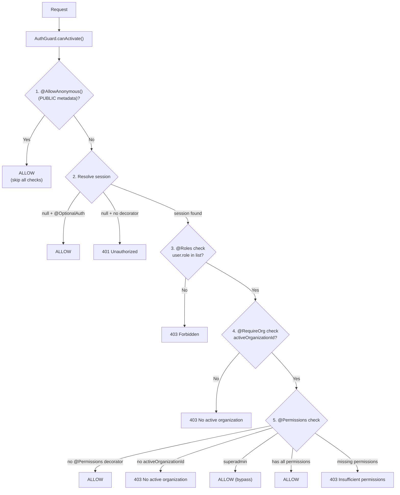
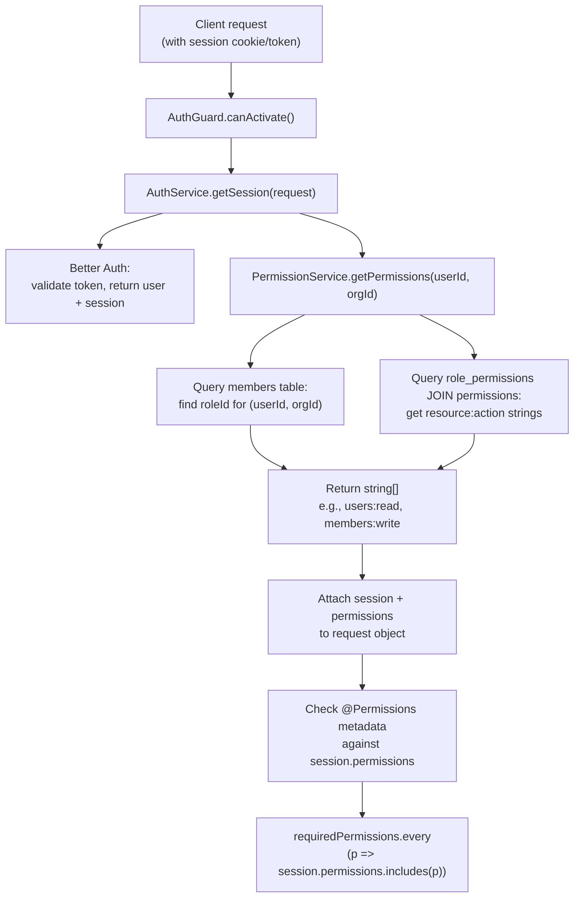
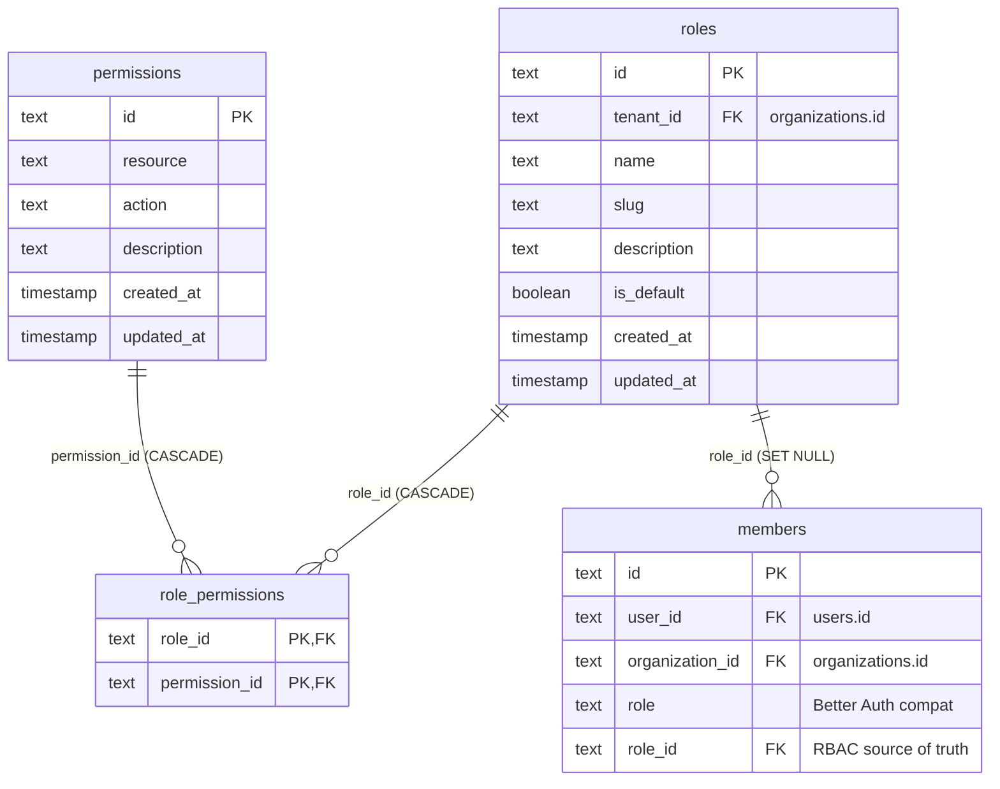

## Overview

The RBAC (Role-Based Access Control) system provides fine-grained, per-organization authorization. Every organization gets its own set of roles and permission assignments, isolated at the database level through tenant-scoped queries and Row-Level Security policies.

Key design decisions:

- **Permission model:** `resource:action` strings (e.g., `members:write`) stored globally and assigned to roles per tenant
- **Role isolation:** Roles are tenant-scoped -- each organization has independent role definitions
- **Guard-based enforcement:** A single `AuthGuard` handles authentication, organization context, and permission checks in one pass
- **Event-driven seeding:** Default roles are created automatically when an organization is created, via `RbacListener`
- **Dual-role columns:** The `members` table carries both a Better Auth `role` text column and an RBAC `role_id` FK, bridging the two systems

All RBAC code lives in `apps/api/src/rbac/`. Shared TypeScript types are in `packages/types/src/rbac.ts`.

## Permission Model

Permissions use a `resource:action` string format, type-checked at compile time via the `PermissionString` type from `@repo/types`:

```ts
type PermissionResource = 'users' | 'organizations' | 'members' | 'invitations' | 'roles'
type PermissionAction = 'read' | 'write' | 'delete'
type PermissionString = `${PermissionResource}:${PermissionAction}`
```

This produces 15 possible permissions (5 resources x 3 actions). Permissions are **global** -- they are seeded via database migration and are not editable by tenants. The `permissions` table has a unique constraint on `(resource, action)`.

### Why resource:action instead of flat strings

The structured format provides two advantages:

1. **Compile-time safety** -- The `PermissionString` template literal type prevents typos like `member:write` (missing `s`)
2. **Grouping** -- Permissions can be displayed by resource in role management UIs

## Role Hierarchy

Each organization gets four default roles, seeded automatically on creation:

| Role | Slug | Permissions | Purpose |
|------|------|-------------|---------|
| Owner | `owner` | All 15 permissions | Full organization control, including deletion |
| Admin | `admin` | All except `organizations:delete` | Day-to-day management |
| Member | `member` | Read-only on `users`, `organizations`, `members`, `invitations`, `roles` | Standard member access |
| Viewer | `viewer` | Read-only on `users`, `organizations`, `members`, `invitations`, `roles` | Minimal read access |

Default roles are marked with `is_default: true` and cannot be deleted. Organizations can also create **custom roles** with any subset of permissions.

### Ownership constraints

The system enforces single-owner integrity:

- Only the Owner can transfer ownership (to an Admin)
- Changing the last Owner to a different role is blocked
- Ownership transfer is an atomic swap: current Owner becomes Admin, target Admin becomes Owner

## Guard Evaluation Chain

Authorization is handled by a single `AuthGuard` that runs as a global NestJS guard. It performs checks in a defined order, short-circuiting on failure:



### How permissions reach the guard

Permissions are resolved **once** during session retrieval in `AuthService.getSession()`, not inside the guard itself. This avoids repeated database queries per guard check:

```ts
// auth.service.ts — getSession()
const session = await this.auth.api.getSession({ headers })
const orgId = session.session?.activeOrganizationId
let permissions: string[] = []

if (orgId && session.user?.id) {
  permissions = await this.permissionService.getPermissions(session.user.id, orgId)
}

return { ...session, permissions }
```

The guard then reads `session.permissions` directly when checking `@Permissions` metadata. This means the permission array is always fresh for the current request, but only costs one database round-trip.

### Superadmin bypass

Users with `role: 'superadmin'` on the `users` table (a Better Auth concept, not an RBAC role) bypass all RBAC permission checks. This is a platform-level escape hatch, not an organization-level role.

Important caveats:

- **RLS still applies.** Superadmin bypasses the `@Permissions` decorator check, but tenant isolation via `TenantInterceptor`/CLS and PostgreSQL RLS policies remains in effect. A superadmin can only see data for the currently active organization.
- **Assigned via database.** Superadmin is set by updating `users.role = 'superadmin'` directly in the database -- there is no API endpoint or UI for this.
- **Limit the count.** Superadmin accounts should be limited in number and carefully controlled, since they bypass all RBAC authorization.

## Permission Checking Flow

The full request lifecycle from HTTP request to permission evaluation:



The `PermissionService` intentionally uses the raw `DRIZZLE` connection (not `TenantService`) because it runs during authentication, before tenant context is established. The `WHERE` clauses on `userId` and `organizationId` provide equivalent row-level isolation.

> **Warning:** The raw DRIZZLE connection bypasses all RLS policies. Any new queries added to this service must include explicit `WHERE` clauses for user/org isolation. Changes to this file should be flagged in code review.

### Sanctioned RLS Bypass Services

Two services intentionally use the raw `DRIZZLE` connection instead of `TenantService`. Both are documented in-code with a block comment explaining the justification and security constraints.

| Service | Location | Justification | Isolation mechanism |
|---------|----------|---------------|---------------------|
| `PermissionService` | `apps/api/src/rbac/permission.service.ts` | Runs during authentication, before tenant context is established | Explicit `WHERE` on `userId` and `organizationId` |
| `AdminMembersService` | `apps/api/src/admin/adminMembers.service.ts` | Admin operations require organization-scoped access derived from the session's `activeOrganizationId`, not from RLS policies | Explicit `WHERE` on `organizationId` in every query |

> **Adding a new RLS bypass:** If a new service needs raw DRIZZLE access, it must (1) document the justification in a block comment at the top of the service class, (2) include explicit `WHERE` clauses for tenant isolation in every query, and (3) be added to this table. Changes to RLS bypass services should always be flagged in code review.

## Schema Design

Three tables implement the RBAC model, defined in `apps/api/src/database/schema/rbac.schema.ts`. For the full schema conventions (naming, timestamps, primary keys), see the [Database Architecture](./database).

### Entity-Relationship Diagram



### Table Details

**`permissions`** -- Global permission definitions. Not tenant-scoped, no RLS. Seeded by database migration, not editable at runtime.

**`roles`** -- Tenant-scoped role definitions. Protected by RLS via `create_tenant_rls_policy('roles')`. The `is_default` flag marks the four built-in roles.

**`role_permissions`** -- Join table mapping roles to permissions. Uses a composite primary key on `(role_id, permission_id)`. Inherits tenant isolation through the FK to `roles`. Both FKs cascade on delete.

### The members.role_id Column

The `members` table in `auth.schema.ts` has two role-related columns:

| Column | Type | Source of truth | Purpose |
|--------|------|-----------------|---------|
| `role` | `text` | Better Auth | Legacy compatibility with Better Auth's built-in organization roles |
| `role_id` | `text` (FK) | RBAC system | Points to the RBAC `roles` table, used for permission resolution |

The `role_id` column is the authoritative source for permission checks. The `role` text column is retained because Better Auth reads it internally for its own organization membership logic. When a member's RBAC role changes, only `role_id` is updated.

The FK uses `ON DELETE SET NULL` so that deleting a custom role does not cascade-delete the membership record. The `RbacService.deleteRole()` method reassigns affected members to the Viewer role before deletion.

## Role Seeding

When an organization is created, the `RbacListener` handles automatic setup via the NestJS event emitter:

```ts
// organizationCreated.event.ts
export const ORGANIZATION_CREATED = 'organization.created'

export class OrganizationCreatedEvent {
  constructor(
    public readonly organizationId: string,
    public readonly creatorUserId: string
  ) {}
}
```

The listener performs two operations in sequence:

1. **Seed default roles** -- Creates the four default roles (Owner, Admin, Member, Viewer) with their permission assignments, using `RbacService.seedDefaultRoles()`
2. **Assign Owner to creator** -- Finds the Owner role and sets `role_id` on the creator's membership record

```ts
@OnEvent(ORGANIZATION_CREATED)
async handleOrganizationCreated(event: OrganizationCreatedEvent) {
  await this.rbacService.seedDefaultRoles(event.organizationId)

  // Assign Owner role to the creator
  await this.tenantService.queryAs(event.organizationId, async (tx) => {
    const [ownerRole] = await tx
      .select({ id: roles.id })
      .from(roles)
      .where(and(eq(roles.tenantId, event.organizationId), eq(roles.slug, 'owner')))
      .limit(1)

    if (ownerRole) {
      await tx
        .update(members)
        .set({ roleId: ownerRole.id })
        .where(
          and(
            eq(members.userId, event.creatorUserId),
            eq(members.organizationId, event.organizationId)
          )
        )
    }
  })
}
```

The event is emitted by `AuthService` during the Better Auth organization creation callback. Both seeding operations use `TenantService.queryAs()` to execute within the correct tenant context.

### Default role permissions matrix

The permission assignments are defined in `rbac.constants.ts`:

| Permission | Owner | Admin | Member | Viewer |
|------------|:-----:|:-----:|:------:|:------:|
| `users:read` | x | x | x | x |
| `users:write` | x | x | | |
| `users:delete` | x | | | |
| `organizations:read` | x | x | x | x |
| `organizations:write` | x | x | | |
| `organizations:delete` | x | | | |
| `members:read` | x | x | x | x |
| `members:write` | x | x | | |
| `members:delete` | x | x | | |
| `invitations:read` | x | x | x | x |
| `invitations:write` | x | x | | |
| `invitations:delete` | x | x | | |
| `roles:read` | x | x | x | x |
| `roles:write` | x | x | | |
| `roles:delete` | x | x | | |

## Custom Decorators

Four decorators control authorization behavior on controller methods, all defined in `apps/api/src/auth/decorators/`:

### @Permissions

Requires specific RBAC permissions. Implicitly requires an active organization context.

```ts
import { Permissions } from '../auth/decorators/permissions.decorator.js'

@Get()
@Permissions('roles:read')
async listRoles() { ... }

// Multiple permissions (ALL required)
@Post()
@Permissions('members:write', 'invitations:write')
async inviteMember() { ... }
```

Uses the `PermissionString` type from `@repo/types` for compile-time validation.

### @Roles

Requires a specific Better Auth user-level role (not an RBAC organization role). Used for platform-level access control.

```ts
import { Roles } from '../auth/decorators/roles.decorator.js'

@Get('admin-panel')
@Roles('admin')
async adminPanel() { ... }
```

### @RequireOrg

Requires an active organization in the session (`activeOrganizationId` must be set). The `@Permissions` decorator implicitly enforces this, so `@RequireOrg` is only needed when you want organization context without specific permission checks.

```ts
import { RequireOrg } from '../auth/decorators/require-org.decorator.js'

@Get('org-dashboard')
@RequireOrg()
async orgDashboard() { ... }
```

### @Session

Parameter decorator that extracts the authenticated session from the request object. Not an authorization decorator, but commonly used alongside them.

```ts
import { Session } from '../auth/decorators/session.decorator.js'

@Post('transfer-ownership')
@Permissions('members:write')
async transferOwnership(@Session() session: { user: { id: string } }) {
  return this.rbacService.transferOwnership(session.user.id, body.targetMemberId)
}
```

## Better Auth Roles vs. RBAC Roles

The system has two distinct role concepts that serve different purposes:

| Aspect | Better Auth Role | RBAC Role |
|--------|-----------------|-----------|
| **Scope** | Platform-wide (per user) | Per organization |
| **Column** | `users.role` | `members.role_id` |
| **Values** | `user`, `admin`, `superadmin` | `owner`, `admin`, `member`, `viewer`, custom |
| **Checked by** | `@Roles` decorator | `@Permissions` decorator |
| **Purpose** | Platform access (superadmin panels) | Organization-level authorization |

The `superadmin` Better Auth role has a special property: it **bypasses all RBAC permission checks**. This allows platform administrators to access any organization's resources without being assigned a role in that organization.

## Error Handling

The RBAC module defines domain-specific exceptions, all caught by `RbacExceptionFilter` (registered as a global filter via `APP_FILTER`):

| Exception | HTTP Status | When |
|-----------|-------------|------|
| `RoleNotFoundException` | 404 | Role ID does not exist in the tenant |
| `MemberNotFoundException` | 404 | Member ID does not exist in the organization |
| `RoleSlugConflictException` | 409 | Creating/renaming a role with a duplicate slug |
| `DefaultRoleException` | 400 | Attempting to delete a default role |
| `OwnershipConstraintException` | 400 | Violating ownership rules (last owner, non-admin target) |

All error responses include a `correlationId` from the CLS context and a structured `errorCode` field for client-side error handling.

## API Endpoints

The `RbacController` exposes role management at `/api/roles`:

| Method | Path | Permission | Description |
|--------|------|------------|-------------|
| `GET` | `/api/roles` | `roles:read` | List roles for the current organization |
| `GET` | `/api/roles/permissions` | `roles:read` | List all available permissions |
| `GET` | `/api/roles/:id/permissions` | `roles:read` | Get permissions for a specific role |
| `POST` | `/api/roles` | `roles:write` | Create a custom role |
| `PATCH` | `/api/roles/:id` | `roles:write` | Update a role |
| `DELETE` | `/api/roles/:id` | `roles:delete` | Delete a custom role (members fallback to Viewer) |
| `POST` | `/api/roles/transfer-ownership` | `members:write` | Transfer ownership to another Admin |
| `PATCH` | `/api/roles/members/:id/role` | `members:write` | Change a member's role |

All endpoints require authentication and an active organization context. Request bodies are validated with Zod schemas, and UUID path parameters use `ParseUUIDPipe`.

## Module Structure

```txt
apps/api/src/rbac/
├── rbac.module.ts              # NestJS module definition
├── rbac.controller.ts          # REST endpoints for role management
├── rbac.service.ts             # Role CRUD, ownership transfer, member role changes
├── permission.service.ts       # Permission resolution for auth context
├── rbac.listener.ts            # Event listener for org creation seeding
├── rbac.constants.ts           # Default role definitions and permission mappings
├── exceptions/                 # Domain exceptions
│   ├── defaultRole.exception.ts
│   ├── memberNotFound.exception.ts
│   ├── ownershipConstraint.exception.ts
│   ├── roleNotFound.exception.ts
│   └── roleSlugConflict.exception.ts
└── filters/
    └── rbacException.filter.ts  # Maps domain exceptions to HTTP responses
```

The `RbacModule` imports `AuthModule` (via `forwardRef` to resolve the circular dependency with `PermissionService`) and `TenantModule`. It exports `RbacService` and `PermissionService` for use by other modules.

## Related Documentation

- [Architecture overview](./index) -- Monorepo structure and data flow
- [Auth & Security Architecture](./auth-security) -- Guard system and session management
- [Database Architecture](./database) -- Drizzle ORM and schema conventions
- [Multi-Tenant Architecture](./multi-tenant) -- RLS and tenant isolation
