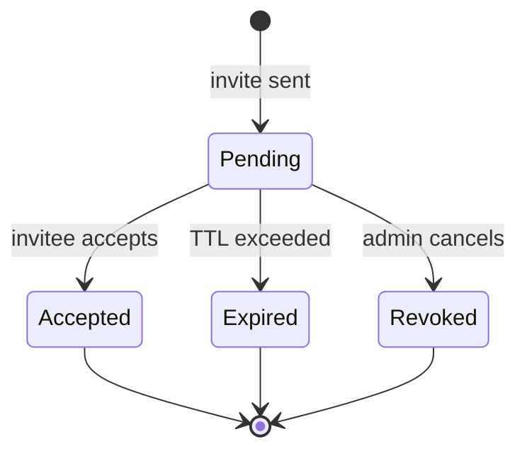
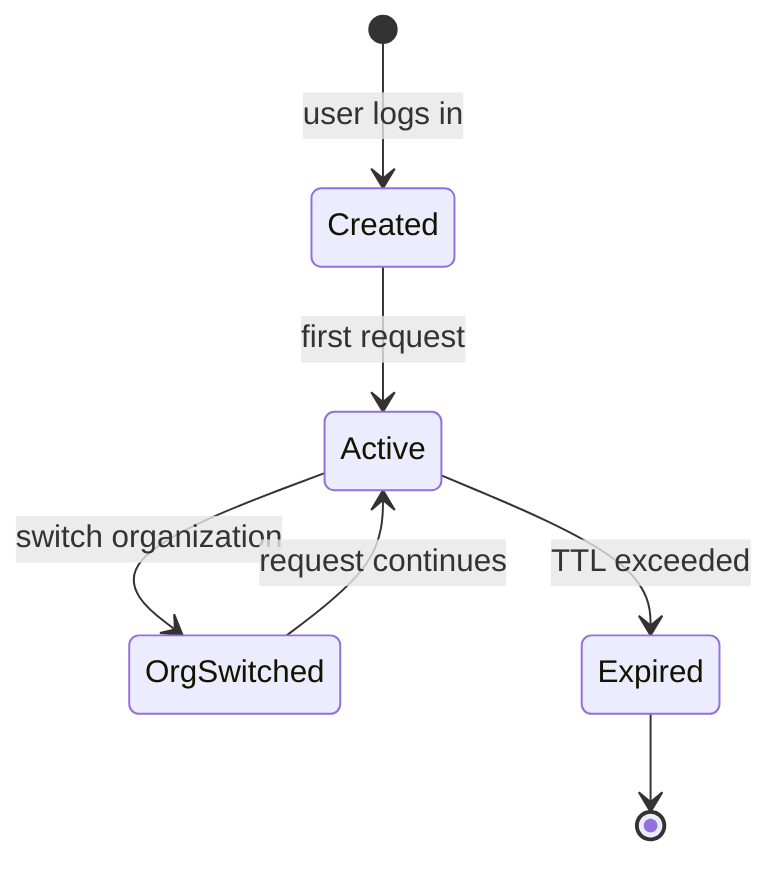
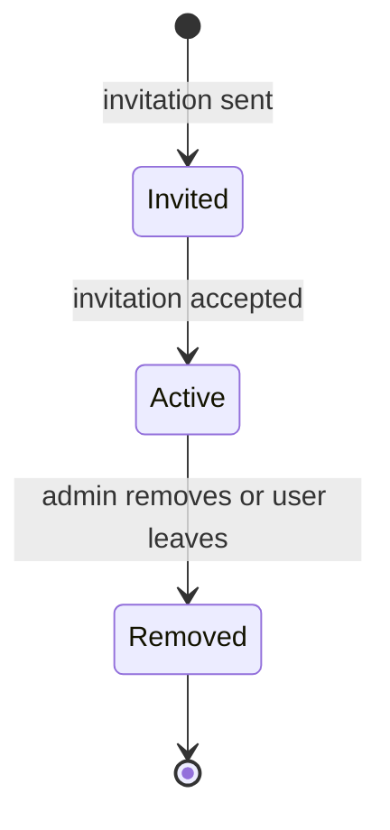

This glossary covers the current domain model. It is extended as new features are implemented.

## Glossary

| Term | Definition | Source |
|------|-----------|--------|
| **Invitation** | A pending org membership invite with an expiration. Requires acceptance by the invitee. | [Auth &amp; Security](./auth-security) |
| **Member** | A user's membership in a specific organization. Stored in the `members` table with both a Better Auth `role` text column and an RBAC `role_id` FK. | [RBAC](./rbac) |
| **Organization** | A Better Auth entity representing a group of users. Maps to a row in the `organizations` table. | [Multi-Tenant](./multi-tenant) |
| **Permission** | A `resource:action` string (e.g., `members:write`). 15 possible permissions across 5 resources and 3 actions. | [RBAC](./rbac) |
| **Role** | A named set of permissions scoped to an organization. Four defaults: Owner, Admin, Member, Viewer. Custom roles are also supported. | [RBAC](./rbac) |
| **Session** | An authenticated session tracking the user and their active organization via `sessions.active_organization_id`. | [Multi-Tenant](./multi-tenant) |
| **Tenant** | The logical data isolation boundary. Currently 1:1 with Organization (each org is a root tenant). | [Multi-Tenant](./multi-tenant) |
| **Tenant Context** | The resolved `tenant_id` propagated from the HTTP session through CLS into PostgreSQL RLS policies. | [Multi-Tenant](./multi-tenant) |
| **User** | An authenticated individual with a `users` table row. Can belong to multiple organizations. | [Auth &amp; Security](./auth-security) |

## Common Confusions

### Tenant vs Organization

Organization is the Better Auth entity. Tenant is the logical isolation boundary. Currently 1:1, but the architecture supports parent-org hierarchies where a parent org is the tenant boundary for its children.

### Member (entity) vs Member (role)

The `members` table stores org membership (the entity). The "Member" role is one of four default RBAC roles. A user has a Member entity in each org they belong to, but their role within that org could be Owner, Admin, Member, or Viewer.

### Better Auth `role` vs RBAC `role_id`

The `members` table has both. The Better Auth `role` is a text string for Better Auth's internal use. The `role_id` FK links to the RBAC roles table for fine-grained permission checks.

## Entity Lifecycle Diagrams

### Invitation Lifecycle

### Session Lifecycle

### Member Lifecycle

