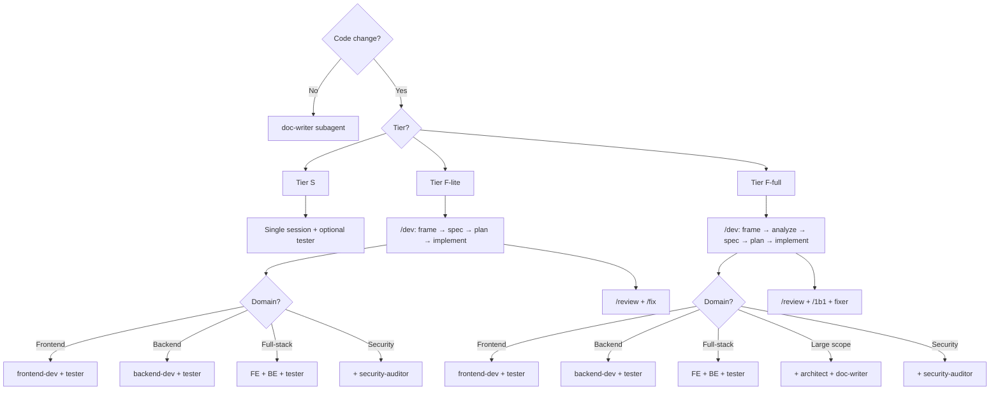
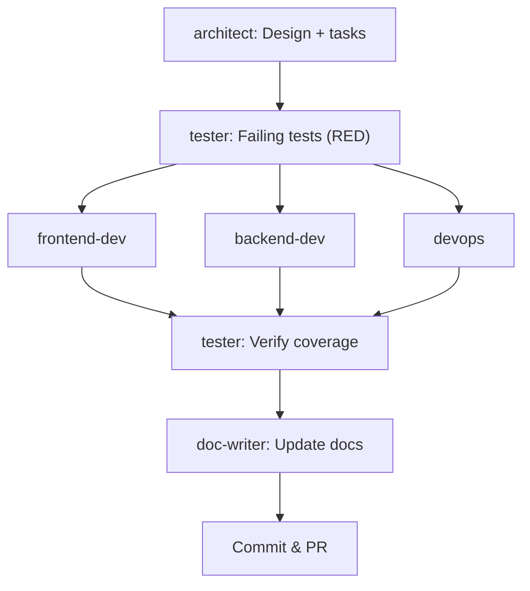
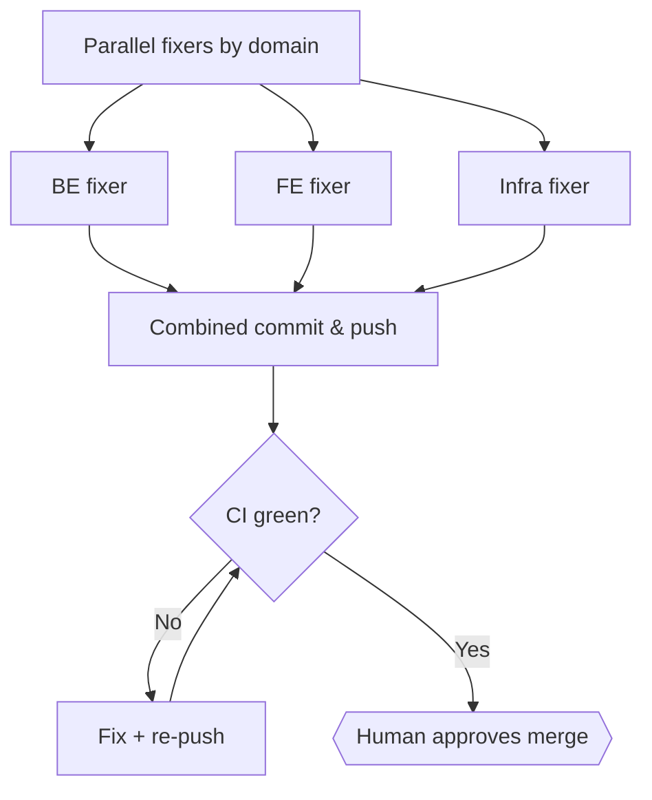

Run specialized AI agents in parallel to implement features faster. Each agent has a dedicated role, domain, and tool access.

## Prerequisites

- Claude Code CLI installed
- Subagents work out of the box — no flags needed
- _(Optional)_ For experimental Agent Teams (multi-process swarm), enable: `export CLAUDE_CODE_EXPERIMENTAL_AGENT_TEAMS=1`

## How It Works

### Subagents (`.claude/agents/`)

Each `.md` file in `.claude/agents/` defines a **subagent** — a pre-defined role with specific tools, permissions, and domain boundaries. Claude Code auto-discovers these files and makes them available as specialized workers within a single session via the `Task` tool.

Subagents are **stable** and work without any experimental flags.

### Agent Teams (experimental swarm)

Agent Teams go further: multiple independent Claude Code sessions coordinate in parallel via a shared task list and mailbox. Each teammate runs as a separate process with its own context window.

Agent Teams require the experimental flag:

```bash
export CLAUDE_CODE_EXPERIMENTAL_AGENT_TEAMS=1
```

### How they connect

The `.md` files in `.claude/agents/` serve **both** purposes:
- **Single session**: The lead uses `Task` tool to delegate work to a subagent by referencing its definition
- **Agent Teams**: Team members reference the same `.md` files as their `agentType`, getting the same role, tools, and permissions

---

## Quick Start

### 1. Determine your tier

Before spawning agents, check the [Development Process](../processes/dev-process) to classify your task:

| Tier | Criteria | Agent Mode |
|------|----------|------------|
| **S** | &lt;=3 files, no arch risk | Single session + optional tester subagent |
| **F-lite** | Clear scope, documented requirements, single domain | Worktree + agents + /review (skip analyze) |
| **F-full** | New arch concepts, unclear requirements, or >2 domain boundaries | Full `/dev` pipeline + worktree + agents + /review |

F-lite vs F-full is **judgment-based**, not file-count-based. Human always validates.

### 2. Pick your agents

Use the routing decision tree:



### 3. Start a session

**Single session (subagents via Task tool):**

```bash
# Start Claude Code — subagents are auto-discovered from .claude/agents/
claude

# Ask Claude to delegate to a subagent
> "Use the frontend-dev agent to implement the UserProfile component"
```

Claude uses the `Task` tool internally to spawn the subagent with the role's tools and permissions.

**Run as a specific agent (`--agent`):**

```bash
# Start Claude Code as a pre-defined agent
claude --agent backend-dev
```

The `--agent` flag loads an agent definition from `.claude/agents/<name>.md` (or `~/.claude/agents/`) and applies it to the **main conversation** — not as a subagent. The session uses the agent's system prompt, tools, permissions, and model. Useful for dedicated single-domain work sessions.

**Define ephemeral agents inline (`--agents`):**

```bash
# Pass agent definitions as JSON for a single session (not saved to disk)
claude --agents '{
  "quick-reviewer": {
    "description": "Quick code reviewer",
    "prompt": "You are a senior code reviewer. Focus on correctness and security.",
    "tools": ["Read", "Grep", "Glob"],
    "model": "sonnet"
  }
}'
```

The `--agents` (plural) flag accepts JSON with the same fields as agent `.md` frontmatter: `description`, `prompt`, `tools`, `disallowedTools`, `model`, `permissionMode`, `maxTurns`, `skills`, `hooks`, and `memory`. These agents exist only for the current session.

### 4. Delegate to subagents

As the lead, you spawn subagents via the `Task` tool to delegate work:

```
> "Use the backend-dev agent to implement GET /api/users/:id endpoint"
> "Use the frontend-dev agent to create the UserProfile component"
> "Use the tester agent to write tests for user profile"
```

For multi-domain work, spawn agents in parallel (multiple `Task` calls in one message). Each agent receives a focused, self-contained task with all necessary context in the prompt.

### 5. Review and merge

Once all tasks are complete, review the deliverables and create the PR.

---

## Available Agents

### Domain Agents (code writers)

| Agent | Color | Domain | Standards |
|-------|-------|--------|-----------|
| **frontend-dev** | white | `apps/web/`, `packages/ui/` | [Frontend Patterns](../standards/frontend-patterns) |
| **backend-dev** | white | `apps/api/`, `packages/types/` | [Backend Patterns](../standards/backend-patterns) |
| **devops** | white | `packages/config/`, root configs | [Configuration](../configuration) |

### Quality Agents (verification and fixing)

| Agent | Color | Role | Standards |
|-------|-------|------|-----------|
| **fixer** | white | Fullstack quick fixer — applies accepted review comments. Spawned in parallel (one per domain) when fixes span multiple domains. | [Code Review](../standards/code-review) |
| **tester** | white | Test generation &amp; validation | [Testing](../standards/testing) |
| **security-auditor** | white | Vulnerability detection | OWASP Top 10 |

### Strategy Agents (planning &amp; alignment)

| Agent | Color | Role | Standards |
|-------|-------|------|-----------|
| **architect** | white | System design, tier classification | [Architecture](../architecture/) |
| **product-lead** | white | Product ownership, requirements, triage | [Issue Management](../processes/issue-management) |
| **doc-writer** | white | Documentation maintenance | [Contributing](../contributing) |

---

## Tool Availability Matrix

Reference for what each agent can and cannot do. Use this when deciding which agent to assign a task to or diagnosing unexpected behaviour.

### Core Tools

| Tool | frontend-dev | backend-dev | devops | fixer | tester | doc-writer | architect | product-lead | security-auditor |
|------|:---:|:---:|:---:|:---:|:---:|:---:|:---:|:---:|:---:|
| Read | ✅ | ✅ | ✅ | ✅ | ✅ | ✅ | ✅ | ✅ | ✅ |
| Write | ✅ | ✅ | ✅ | ✅ | ✅ | ✅ | ✅ | ✅ | ❌ disallowed |
| Edit | ✅ | ✅ | ✅ | ✅ | ✅ | ✅ | ✅ | ✅ | ❌ disallowed |
| Glob | ✅ | ✅ | ✅ | ✅ | ✅ | ✅ | ✅ | ✅ | ✅ |
| Grep | ✅ | ✅ | ✅ | ✅ | ✅ | ✅ | ✅ | ✅ | ✅ |
| Bash | ✅ | ✅ | ✅ | ✅ | ✅ | ✅ | ✅ | ✅ | ✅ |
| WebSearch | ✅ | ✅ | ✅ | ✅ | ✅ | ✅ | ✅ | ✅ | ✅ |
| WebFetch | ✅ | ✅ | ✅ | ✅ | ✅ | ✅ | ✅ | ✅ | ✅ |
| Task | ✅ | ✅ | ✅ | ✅ | ✅ | ✅ | ✅ | ✅ | ✅ |
| SendMessage | ✅ | ✅ | ✅ | ✅ | ✅ | ✅ | ✅ | ✅ | ✅ |
| TeamCreate | ❌ | ❌ | ❌ | ❌ | ❌ | ❌ | ✅ | ✅ | ❌ |
| TeamDelete | ❌ | ❌ | ❌ | ❌ | ❌ | ❌ | ✅ | ✅ | ❌ |
| TaskCreate / TaskGet / TaskUpdate / TaskList | ✅ | ✅ | ✅ | ✅ | ✅ | ✅ | ✅ | ✅ | ✅ |
| AskUserQuestion | ❌ by design | ❌ | ❌ | ❌ | ❌ | ❌ | ❌ | ❌ | ❌ |

> **Note:** `AskUserQuestion` is intentionally excluded from agents. Agents escalate blockers to the lead via `SendMessage` — they do not interact with the user directly.

### MCP Plugins

MCP tools (Context7, Vercel) are only available to the **orchestrator** (main Claude Code session). Sub-agents use skills as partial workarounds, or `WebSearch` + `Bash` CLI equivalents.

| MCP Tool | Orchestrator | Agents | Workaround |
|----------|:---:|:---:|---|
| Context7: resolve-library-id / query-docs | ✅ | ❌ | `context7-plugin:docs` skill (backend-dev, doc-writer) |
| Vercel: deploy, logs, get_deployment, etc. | ✅ | ❌ | `vercel:logs`, `vercel:deploy` skills (devops) |

### Known Gaps

| Gap | Severity | Impact |
|-----|----------|--------|
| Context7 MCP tools not available to agents | 🟡 Workaround available | Agents use `context7-plugin:docs` skill (doc-writer, backend-dev) or `WebSearch` as fallback. Context7 MCP tools (`resolve-library-id`, `query-docs`) remain orchestrator-only |
| Vercel MCP tools not available to `devops` | 🟡 Workaround available | devops uses `vercel:logs`, `vercel:deploy` skills + `vercel` / `gh` CLI via Bash. Vercel MCP structured tools remain orchestrator-only |

---

## Agent Configuration

Each agent's `.md` file contains YAML frontmatter that controls its behavior:

### `permissionMode`

Controls what the agent can do without user approval.

| Mode | Meaning | Used by |
|------|---------|---------|
| `bypassPermissions` | Agent can execute all its tools freely — appropriate for agents that write code or fix issues | frontend-dev, backend-dev, devops, tester, doc-writer, product-lead, architect, fixer |
| `plan` | Agent can only read and analyze — it proposes changes but cannot execute them | security-auditor |

### `maxTurns`

Maximum number of agentic turns (API round-trips) before the agent stops. Prevents runaway token usage.

| Value | Used by |
|-------|---------|
| `50` | Domain agents, tester, fixer, architect, and product-lead |
| `30` | Security-auditor, doc-writer |

### `memory: project`

All agents use `memory: project`, which enables persistent learnings stored in `.claude/agent-memory/`. Agents accumulate knowledge about the codebase across sessions.

### `skills`

Some agents have skills preloaded, matching their primary function:

| Agent | Skill | Purpose |
|-------|-------|---------|
| frontend-dev | `frontend-design`, `ui-ux-pro-max` | UI design guardrails + design system |
| backend-dev | `context7-plugin:docs` | NestJS / Drizzle / library documentation lookup |
| devops | `vercel:logs`, `vercel:deploy` | Vercel deployment + log access |
| doc-writer | `context7-plugin:docs` | Library reference lookups while writing docs |
| fixer | `fix` | Apply review findings workflow |
| tester | `test` | Test generation |
| architect | `adr` | Architecture Decision Records |
| product-lead | `interview`, `issue-triage`, `issues`, `1b1` | Product ownership toolkit |
| security-auditor | — | No skill (pure analysis) |

### `disallowedTools`

Defense-in-depth: even if an agent's `tools` list doesn't include certain tools, `disallowedTools` provides an explicit deny list as an extra safety layer:

| Agent | Disallowed |
|-------|------------|
| security-auditor | Write, Edit |

---

## Review Model

Review is performed by **fresh agent instances** — not the agents that wrote the code. This prevents bias and ensures independent verification.

### How it works

1. After a PR is created, Main Claude runs `/review`
2. The review skill spawns fresh review agents via the `Task` tool:

   | Always spawned | Conditionally spawned |
   |----------------|----------------------|
   | security-auditor | frontend-dev (if FE files changed) |
   | architect | backend-dev (if BE files changed) |
   | product-lead | devops (if config files changed) |
   | tester | |

3. Each agent reviews the diff from its area of expertise, producing Conventional Comments
4. Main Claude merges findings, deduplicates, and walks the human through each one via `/1b1`
5. Human accepts, rejects, or defers each finding
6. Accepted findings are split by domain and sent to **parallel fixer agents** — one per affected domain (backend, frontend, infra). Single-domain fixes use one fixer.
7. Fixers run in parallel, then the lead commits, pushes, and CI runs

### Why fresh agents?

- No agent reviews code it wrote (eliminates confirmation bias)
- Each reviewer is scoped to what it knows best (security-auditor focuses on OWASP, architect on design patterns, etc.)
- The old single "reviewer" agent tried to cover all domains — splitting review from fixing gives better separation of concerns

### Fixer vs old reviewer

The **fixer** agent replaces the old reviewer agent. Key differences:

| Old reviewer | New fixer |
|--------------|-----------|
| Reviewed AND fixed AND verified CI | Only fixes accepted review comments |
| Single agent covering all domains | Fullstack — fixes across FE + BE + tests + config |
| Reviewed its own work | Never reviews — fresh agents handle review |
| Spawned automatically by /review | Spawned after human validates findings via /1b1 |

### Parallel Fixers

When accepted findings span **2+ domains** (e.g., backend + frontend + config), the lead spawns **one fixer per domain in parallel** instead of a single sequential fixer. This cuts fix time proportionally.

| Domain | Fixer scope | Files |
|--------|-------------|-------|
| **Backend** | `apps/api/`, `packages/types/` | Backend source + tests |
| **Frontend** | `apps/web/`, `packages/ui/` | Frontend source + tests |
| **Infra** | `packages/config/`, root configs, CI | Config + infrastructure |

Each parallel fixer:
- Receives only its domain's accepted findings
- Edits only files within its scope
- Does **not** commit — the lead combines all fixes into a single commit after all fixers complete
- Reports what was fixed and any issues

Single-domain fixes still use one fixer that commits and pushes directly.

---

## Playbooks

### Playbook 1: Frontend Feature (F-lite)

**Scenario:** Add a new page with components, no API changes. Clear requirements.

```bash
# Phase 2 — Create worktree and start working
git worktree add ../roxabi-XXX -b feat/XXX-slug staging
cd ../roxabi-XXX && bun install
```

Spawn subagents via `Task` tool: `frontend-dev` + `tester`.

**Task flow (test-first):**

```
[tester: Write failing tests from spec (RED)]
        |
[frontend-dev: Implement to pass tests (GREEN)]
        |
[frontend-dev: Refactor (REFACTOR)]
        |
[tester: Verify coverage + edge cases]
        |
Commit & PR
        |
/review (spawns fresh reviewers)
        |
/1b1 (human walks through findings)
        |
[fixer: Fix accepted comments]
        |
Merge
```

**As the lead, you:**
1. Confirm spec exists (Phase 1 — assessment)
2. tester writes failing tests from the spec
3. frontend-dev implements to pass the tests
4. Create the PR
5. Run `/review` — fresh agents review the code
6. Walk through findings with `/1b1` — accept, reject, or defer each
7. fixer applies accepted fixes
8. Approve merge once CI is green

### Playbook 2: Full-Stack Feature (F-lite)

**Scenario:** New API endpoint + frontend page that consumes it. Requirements documented.

Spawn subagents via `Task` tool: `frontend-dev` + `backend-dev` + `tester`.

**Task flow (test-first):**

```
[tester: Write failing API + UI tests (RED)]
        |
[backend-dev: Implement API endpoint + types (GREEN)]
        |
[frontend-dev: Implement UI consuming the API (GREEN)]
        |
[tester: Verify coverage + edge cases]
        |
Commit & PR
        |
/review (spawns fresh reviewers)
        |
/1b1 (human walks through findings)
        |
[fixer: Fix accepted comments]
        |
Merge
```

**As the lead, you:**
1. Confirm spec exists (Phase 1)
2. tester writes failing tests for both API and UI
3. backend-dev implements the endpoint and shared types to pass API tests
4. frontend-dev implements the UI to pass UI tests
5. Create the PR
6. Run `/review` — fresh agents review
7. Walk through findings via `/1b1`
8. fixer applies accepted fixes
9. Approve merge once CI is green

### Playbook 3: Bug Fix with Regression Test

**Scenario:** Backend bug that needs a fix and regression test.

Spawn subagents via `Task` tool: `backend-dev` + `tester`.

**Task flow (test-first):**

```
[tester: Write failing regression test that reproduces the bug (RED)]
        |
[backend-dev: Fix the bug to pass the test (GREEN)]
        |
Commit & PR
        |
/review (spawns fresh reviewers)
        |
/1b1 (human walks through findings)
        |
[fixer: Fix accepted comments]
        |
Merge
```

**As the lead, you:**
1. Describe the bug with reproduction steps
2. tester writes a regression test that reproduces the bug
3. backend-dev fixes the bug to pass the test
4. Create the PR
5. Run `/review`, walk through findings via `/1b1`
6. fixer applies accepted fixes
7. Approve merge once CI is green

### Playbook 4: Large Feature (F-full with /dev)

**Scenario:** Major feature spanning frontend, backend, and infrastructure. New arch concepts or unclear requirements.

**Phase 1 — Assessment (/dev Frame + Shape):**

```bash
/dev #N
# Orchestrator drives: frame → analyze → spec with expert review at each gate
# Expert reviewers (architect, doc-writer, devops, product-lead) review at each gate
# User selects which experts to involve per document
# Human approves frame, analysis, and spec before proceeding
```

**Phase 2 — Implementation (test-first):**

Spawn subagents via `Task` tool: `architect` + `frontend-dev` + `backend-dev` + `devops` + `tester` + `doc-writer` (+ `security-auditor` if security-sensitive).

**Task flow:**



**Phase 3 — Review:**

```
/review (spawns fresh domain reviewers)
        |
/1b1 (human walks through all findings)
```

**Phase 4 — Fix and Merge:**



**As the lead, you:**
1. Run `/dev #N` — orchestrator drives frame → analyze → spec, spawns expert reviewers (architect, doc-writer, devops, product-lead as needed)
2. Human approves the spec
3. tester writes failing tests from spec
4. Domain agents implement in parallel (each in their own packages) to pass tests
5. doc-writer updates documentation
6. Create the PR
7. Run `/review` — fresh agents review from each domain
8. Walk through all findings via `/1b1`
9. fixer applies accepted fixes
10. Approve merge once CI is green

---

## Coordination Rules

All agents follow these rules (baked into their system prompts):

1. **Stay in your domain** — Never modify files outside your assigned packages
2. **Claim, don't grab** — Pick tasks from the shared task list, don't create your own
3. **Report blockers** — If stuck, message the lead with a clear description
4. **Hand off properly** — When done, mark your task complete and create tasks for the next agent
5. **Escalate cross-domain needs** — If you need changes in another domain, create a task for that agent

## Plugins

Claude Code plugins are enabled in `.claude/settings.json` and extend agent capabilities:

| Plugin | Available to | Purpose |
|--------|-------------|---------|
| `frontend-design@claude-plugins-official` | Orchestrator + frontend-dev (preloaded skill) | Design guardrails for UI — prevents AI-generated design slop |
| `context7-plugin` (Context7) | Orchestrator only | Versioned library documentation lookup (`resolve-library-id` + `query-docs`) |
| `vercel` (Vercel MCP) | Orchestrator only | Structured access to deployments, build logs, runtime logs, domain management |

> MCP plugin tools are available to the orchestrator only — not to sub-agents. Agents use `WebSearch` + `Bash` CLI equivalents.

12 plugins are enabled in total — see `.claude/settings.json` → `enabledPlugins` for the full list.

### Built-in Tools

`AskUserQuestion` is a built-in tool always available to all agents, regardless of the `tools:` field in their definition. It does not need to be listed explicitly.

---

## Model Tiering

Model assignments are configured in each agent's `.md` frontmatter (`model:` field).

- **6 agents explicitly set `model: sonnet`**: backend-dev, devops, doc-writer, fixer, frontend-dev, tester
- **3 agents inherit** (no explicit `model` set — they use the session default, Opus when run by the orchestrator): architect, product-lead, security-auditor

| Tier | Model | Agents | Rationale |
|------|-------|--------|-----------|
| **Heavy** | Opus (inherited) | product-lead, architect, security-auditor | Complex analysis, planning, product decisions |
| **Standard** | Sonnet | frontend-dev, backend-dev, devops, tester, doc-writer, fixer | Implementation, testing, documentation, fixes |

> `model: sonnet` is explicitly set in agent frontmatter for domain and quality agents. Strategy agents (product-lead, architect, security-auditor) inherit Opus from the orchestrator session since they are not assigned a model in frontmatter.

---

## Troubleshooting

| Problem | Solution |
|---------|----------|
| Agent modifies wrong files | Check its `.claude/agents/*.md` boundaries section. Remind it of its domain. |
| Agent doesn't claim tasks | Make sure the task description matches the agent's domain keywords. |
| Context window exhausted | Restart the agent. The task list persists across sessions. |
| Agent teams feature not working | Verify `CLAUDE_CODE_EXPERIMENTAL_AGENT_TEAMS=1` is set. Check Claude Code version. |
| Two agents conflict on a file | Add a `blockedBy` dependency to serialize access. |
| Too expensive for small tasks | Use a single session for Tier S. Reserve parallel subagents for Tier F multi-domain. |

## Fallback: Single Agent Mode

If agent teams are unstable or unavailable, the agent `.md` files still work as reference documents. You can:

1. Use a single Claude Code session
2. Read the relevant agent's `.md` file for domain context
3. Follow the same boundaries and standards manually

The agent definitions are designed to be useful both as agent team prompts and as human reference guides.
