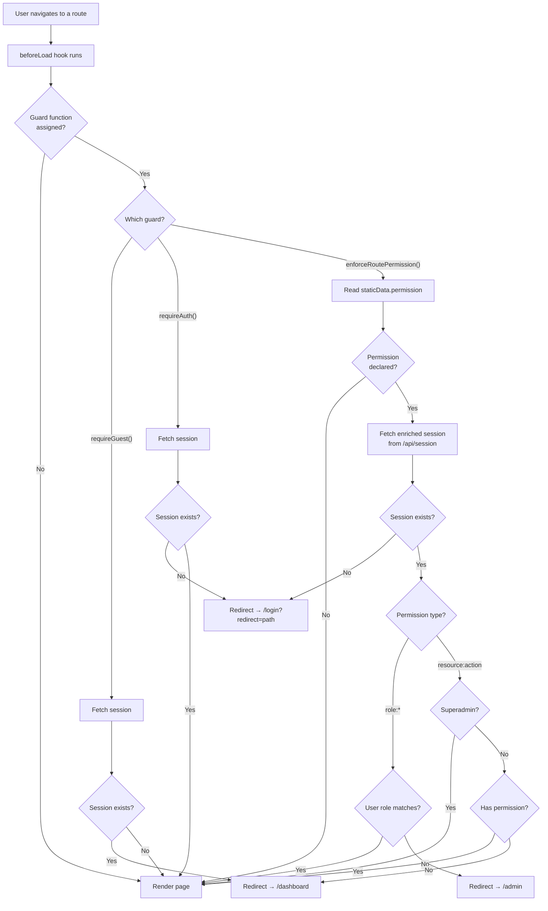

## Overview

The frontend uses **TanStack Router's `beforeLoad` hook** to enforce access control before a page renders. This prevents flashes of forbidden content and provides a smooth redirect experience.

Three guard functions handle all navigation scenarios:

| Guard | Purpose | Source |
|-------|---------|--------|
| `requireAuth()` | Redirect unauthenticated users to `/login` | `apps/web/src/lib/routeGuards.ts` |
| `requireGuest()` | Redirect authenticated users away from auth pages | `apps/web/src/lib/routeGuards.ts` |
| `enforceRoutePermission()` | Check org-level permissions or system roles | `apps/web/src/lib/routePermissions.ts` |

The backend enforces the same rules via the global `AuthGuard` (see [Auth & Security Architecture](../architecture/auth-security)). Frontend guards exist for **UX** — they prevent unnecessary page loads and provide meaningful redirects. The backend remains the source of truth.

## Navigation Decision Matrix

This table covers every user-state and page-type combination:

| User State | Page Type | Example Routes | Outcome |
|---|---|---|---|
| Not authenticated | Public | `/`, `/legal/*`, `/design-system`, `/docs/*` | Renders normally |
| Not authenticated | Guest-only | `/login`, `/register`, `/reset-password` | Renders normally |
| Not authenticated | Protected | `/dashboard`, `/settings/*` | Redirect to `/login?redirect=<current_path>` |
| Not authenticated | Permission-gated | `/admin/*` | Redirect to `/login` |
| Authenticated | Public | `/`, `/legal/*`, `/design-system`, `/docs/*` | Renders normally |
| Authenticated | Guest-only | `/login`, `/register`, `/reset-password` | Redirect to `/dashboard` |
| Authenticated | Protected | `/dashboard`, `/settings/*` | Renders normally |
| Authenticated + has permission | Org permission-gated | `/admin/members`, `/admin/settings` | Renders normally |
| Authenticated + missing permission | Org permission-gated | `/admin/members`, `/admin/settings` | Redirect to `/dashboard` |
| Authenticated + superadmin | System role-gated | `/admin/users`, `/admin/audit-logs`, `/admin/organizations` | Renders normally |
| Authenticated + not superadmin | System role-gated | `/admin/users`, `/admin/audit-logs`, `/admin/organizations` | Redirect to `/admin` |
| Soft-deleted account | Any protected | `/dashboard`, `/admin/*` | Backend returns 401/403, treated as unauthenticated |

## Guard Functions

### `requireAuth()`

Used in `beforeLoad` for pages that need an authenticated user. Fetches the session via `authClient.getSession()`. If no session exists, redirects to `/login` with the current path captured as a `redirect` search parameter.

```ts
export const Route = createFileRoute('/dashboard')({
  beforeLoad: requireAuth,
  component: DashboardPage,
})
```

After login, `safeRedirect()` validates the captured redirect URL before navigating — blocking protocol-relative URLs (`//`), URL-encoded traversal (`/%2F`, `/%5C`), and cross-origin redirects. Invalid values fall back to `/dashboard`.

### `requireGuest()`

Used in `beforeLoad` for auth pages (login, register, reset password). If the user already has a valid session, redirects to `/dashboard`.

```ts
export const Route = createFileRoute('/login')({
  beforeLoad: requireGuest,
  component: LoginPage,
})
```

### `enforceRoutePermission()`

A generic guard that reads `staticData.permission` from the route definition. Supports two permission formats:

| Format | Example | Check | Redirect on Failure |
|--------|---------|-------|---------------------|
| Permission string | `members:write` | Checks `session.permissions` array | `/dashboard` |
| Role prefix | `role:superadmin` | Checks `session.user.role` | `/admin` |

Superadmin users automatically pass all org-level permission checks.

```ts
export const Route = createFileRoute('/admin/members')({
  staticData: { permission: 'members:write' },
  beforeLoad: enforceRoutePermission,
  component: AdminMembersPage,
})
```

The `staticData.permission` field is type-safe via declaration merging on TanStack Router's `StaticDataRouteOption` interface (defined in `apps/web/src/lib/routePermissions.ts`).

## Client-Side Navigation Flow



## Complete Route Inventory

### Public Pages (no guard)

| Route | Description |
|-------|-------------|
| `/` | Landing page |
| `/legal/*` | Legal pages (CGU, privacy, cookies, mentions legales) |
| `/design-system` | Design system showcase |
| `/docs/$` | Documentation (catch-all) |
| `/talks`, `/talks/claude-code` | Talk pages |
| `/verify-email` | Email verification callback |
| `/account-deleted` | Deletion confirmation |
| `/account-reactivation` | Account recovery |
| `/$` | Catch-all 404 |

### Guest-Only Pages (`requireGuest`)

| Route | Redirect if authenticated |
|-------|---------------------------|
| `/login` | `/dashboard` |
| `/register` | `/dashboard` |
| `/reset-password` | `/dashboard` |
| `/reset-password/confirm` | `/dashboard` |
| `/magic-link/verify` | `/dashboard` |

### Protected Pages (`requireAuth`)

| Route | Description |
|-------|-------------|
| `/dashboard` | Main dashboard |
| `/settings` | Settings layout (children inherit auth) |
| `/settings/profile` | Profile settings (inherits from `/settings`) |
| `/settings/account` | Account settings (inherits from `/settings`) |
| `/settings/api-keys` | API key management (inherits from `/settings`) |

### Admin — Org-Level (`enforceRoutePermission`)

| Route | Permission | Redirect on Failure |
|-------|------------|---------------------|
| `/admin` | `members:write` | `/dashboard` |
| `/admin/members` | `members:write` | `/dashboard` |
| `/admin/settings` | `members:write` | `/dashboard` |

### Admin — System-Level (`enforceRoutePermission`)

| Route | Permission | Redirect on Failure |
|-------|------------|---------------------|
| `/admin/users` | `role:superadmin` | `/admin` |
| `/admin/users/$userId` | `role:superadmin` | `/admin` |
| `/admin/audit-logs` | `role:superadmin` | `/admin` |
| `/admin/organizations` | `role:superadmin` | `/admin` |
| `/admin/organizations/$orgId` | `role:superadmin` | `/admin` |

### Legacy Redirects

| Route | Redirects to |
|-------|-------------|
| `/org` | `/admin` |
| `/org/members` | `/admin/members` |
| `/org/settings` | `/admin/settings` |
| `/changelog` | `/docs/$` |

## Layout Inheritance

TanStack Router's layout routes apply `beforeLoad` guards to all children. Two layouts use this pattern:

- **`/settings`** — applies `requireAuth`. All `/settings/*` routes inherit authentication without declaring their own guard.
- **`/admin`** — applies `enforceRoutePermission` with `members:write`. Child routes can declare additional permissions (e.g., `role:superadmin` for `/admin/users`), which are checked **in addition to** the parent guard.

This means a route like `/admin/users` goes through two guard checks: first the `/admin` layout guard (`members:write`), then its own (`role:superadmin`).

## SSR and Edge Cases

### Server-Side Rendering

All guards return early when running on the server:

```ts
if (typeof window === 'undefined') return
```

This means the server renders the page shell without auth enforcement. Auth checks happen on client hydration. This is intentional — server-side loaders must not fetch sensitive data without auth, and session cookies are not available during SSR.

### Session Fetch Failures

When `authClient.getSession()` or `fetchEnrichedSession()` fails (network error, server down), the session is treated as `null`. The user is redirected as if unauthenticated. There is no retry logic — React Query is configured with `retry: false` for the enriched session.

### Post-Login Redirect

When `requireAuth()` redirects to `/login`, it captures the original path:

```
/login?redirect=/admin/members
```

After successful login, `safeRedirect()` validates the URL before navigating. Invalid redirect values (cross-origin, protocol-relative, encoded traversal) are silently replaced with `/dashboard`.

### UI-Level Permission Checks

Beyond route guards, individual components use `useCanAccess(path)` and `hasPermission(session, permission)` to conditionally render UI elements (navigation links, buttons, menu items). This prevents showing links to pages the user cannot access.

## File Reference

| File | Purpose |
|------|---------|
| `apps/web/src/lib/routeGuards.ts` | `requireAuth()`, `requireGuest()`, `safeRedirect()` |
| `apps/web/src/lib/routePermissions.ts` | `enforceRoutePermission()`, `useCanAccess()`, `useEnrichedSession()` |
| `apps/web/src/lib/permissions.ts` | `hasPermission()`, `hasAllPermissions()`, `hasAnyPermission()` |
| `apps/web/src/lib/authClient.ts` | Better Auth React client (`useSession`, `signIn`, `signOut`) |

## Related Documentation

- [Authentication Guide](./authentication) — Backend auth guard, decorators, session management
- [RBAC Guide](./rbac) — Permission model, protecting endpoints, frontend permission helpers
- [Auth & Security Architecture](../architecture/auth-security) — Guard evaluation order, session lifecycle, cookie strategy
- [Frontend Architecture](../architecture/frontend) — TanStack Router, file-based routing, SSR
