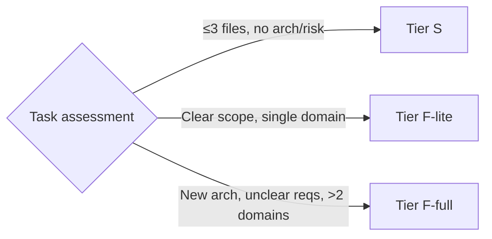
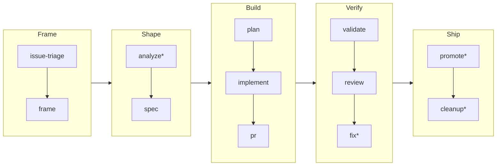
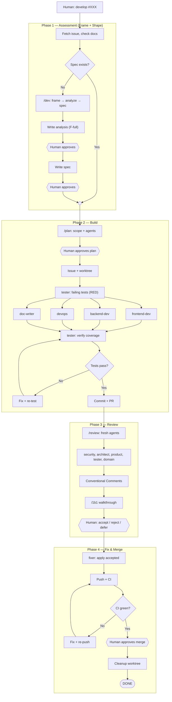

Use `/dev #N` as the single entry point for any development task. It scans existing artifacts, displays phase progress, and delegates to the right step skill — resuming automatically from wherever you left off.

## Step 0: Determine Tier



| Tier | Name | Criteria | `/dev #N` phases |
|------|------|----------|-----------------|
| **S** | Quick Fix | &lt;=3 files, no arch, no risk | triage → implement → pr → validate → review |
| **F-lite** | Feature (lite) | Clear scope, documented requirements, single domain | frame → spec → plan → implement → verify → ship |
| **F-full** | Feature (full) | New arch concepts, unclear requirements, or >2 domain boundaries | frame → analyze → spec → plan → implement → verify → ship |

### F-lite vs F-full (judgment-based)

File count alone does not determine the tier. A 50-file mechanical change may be F-lite, while a 3-file rate limiter with design decisions may be F-full. Use judgment, then validate with the human.

**F-full (frame + analyze + spec required):**

```
New architectural concepts or patterns?              -> F-full
Unclear or competing requirements?                   -> F-full
Affects >2 domain boundaries?                        -> F-full
```

**F-lite (analyze skipped, frame + spec only):**

```
Mechanical/repetitive regardless of file count?      -> F-lite
Requirements fully documented (analysis/spec exist)? -> F-lite
Single domain, clear scope?                          -> F-lite
```

**Human always validates** the F-lite/F-full classification before proceeding.

> **Branch Strategy:** `staging` is the default integration branch. All feature and fix branches are created from `staging` and PRs target `staging`. Only `hotfix/*` branches may target `main` directly. Merges to `main` trigger production deploys; merges to `staging` do not auto-deploy (use the **Deploy Preview** GitHub Action for on-demand previews).

## Phase Model

`/dev #N` organises work into five phases. Each phase produces artifacts that serve as resumption checkpoints.



`*` = conditional (skipped based on tier or outcome)

| Phase | Artifact produced | Gate |
|-------|-------------------|------|
| **Frame** | `artifacts/frames/{slug}.mdx` | User approves frame |
| **Shape** | `artifacts/analyses/{N}-{slug}.mdx` + `artifacts/specs/{N}-{slug}.mdx` | User approves spec |
| **Build** | `artifacts/plans/{N}-{slug}.mdx` + code in worktree + PR | User approves plan; confirms PR ready |
| **Verify** | Review findings on PR | User chooses fix / merge / stop |
| **Ship** | Version tag + GitHub Release | — |

---

## Development Checklist

**CRITICAL: Before considering a development complete, verify ALL applicable items.**

### 1. Source Code

| Artifact | When | Typical files |
|----------|------|---------------|
| Frontend components | UI changes | `apps/web/src/**/*.tsx` |
| Backend modules | API changes | `apps/api/src/**/*.ts` |
| Shared UI | Reusable components | `packages/ui/src/**/*.tsx` |
| Shared types | Type definitions | `packages/types/src/**/*.ts` |

### 2. Tests

| Type | When | Typical files |
|------|------|---------------|
| Unit tests | New function/logic | `**/*.test.ts`, `**/*.spec.ts` |
| E2E tests | User flows | `apps/web/e2e/**/*.spec.ts` |
| API tests | Endpoints | `apps/api/src/**/*.spec.ts` |

**Rule: Any new public function must have at least one test.**

### 3. Documentation

| Artifact | When | Files |
|----------|------|-------|
| Frame | Problem framing | `artifacts/frames/*.mdx` |
| Analysis | Deep exploration (F-full) | `artifacts/analyses/*.mdx` |
| Feature spec | Solution design | `artifacts/specs/*.mdx` |
| Plan | Task breakdown | `artifacts/plans/*.mdx` |
| Architecture | Structure change | `docs/architecture/*.mdx` |
| CLAUDE.md | Critical change | `CLAUDE.md` |

### 4. Configuration

| Artifact | When | Files |
|----------|------|-------|
| Environment variables | New config | `.env.example`, `turbo.jsonc` |
| Package dependencies | New packages | `package.json`, `bun.lock` |
| TypeScript config | Compiler settings | `tsconfig.json` |

---

## Tier S: Quick Fix

### S.1 — Scope
- Identify files (max 3)
- Confirm no regression risk
- **List all impacted artifacts** (see checklist above)

> **XS exception:** For Size XS changes (single file, &lt;1h, zero risk), use `AskUserQuestion` to confirm with the lead. If approved, direct branch from staging is acceptable without worktree.

### S.2 — Create Worktree

```bash
git worktree add ../roxabi-XXX -b fix/XXX-description staging
cd ../roxabi-XXX
cp .env.example .env && bun install
cd apps/api && bun run db:branch:create --force XXX
```

### S.3 — Validate
- Present approach with `AskUserQuestion`
- Include: files to modify, related artifacts (tests, docs)
- Wait for explicit approval

### S.4 — Implement
Follow this order:

1. **Read** existing files before modifying
2. **Implement** business logic
3. **Update tests**
4. **Run quality checks**: `bun lint && bun typecheck && bun run test`
5. **Verify** all checks pass
6. *(Optional)* Delegate to **tester** subagent for a quick quality check

### S.5 — Verify & PR

Before creating the PR, verify **all applicable items** from the [Quality Checklist](#quality-checklist):
- All impacted artifacts are included (code, tests, docs, config)
- `bun lint && bun typecheck && bun run test` pass locally
- No debug code or console.log left behind

```bash
# 1. Check changes — verify nothing is missing
git status
git diff --stat

# 2. Add files (NEVER git add -A)
git add <file1> <file2> ...

# 3. Commit with standard format
git commit -m "$(cat <<'EOF'
<type>(<scope>): <description>

<optional body>

Co-Authored-By: Claude <model> <noreply@anthropic.com>
EOF
)"

# 4. Create PR
gh pr create --title "<type>: description" --body "Closes #XXX"
```

### S.6 — Wait for CI

**MANDATORY:** Wait for all CI checks to pass before merging.

```bash
# Watch CI status until completion
gh pr checks <pr-number> --watch
```

CI runs: **lint → typecheck → test → build** (+ E2E if relevant paths changed).

If CI fails: fix the issue, push a new commit, and wait for CI again. **Never merge with failing checks.**

### S.7 — Cleanup Worktree (after merge)

```bash
# Return to main project directory
cd ../roxabi_boilerplate
git worktree remove ../roxabi-XXX
```

**Commit types:** `feat`, `fix`, `refactor`, `docs`, `style`, `test`, `chore`, `ci`, `perf`

---

## Agent Coordination

Agents are spawned as subagents via the `Task` tool. See the [Agent Teams Guide](../guides/agent-teams) for full setup and playbooks.

| Mode | Mechanism | When | Overhead |
|------|-----------|------|----------|
| **Single session** | Direct implementation | Tier S (simple fixes) | Minimal |
| **Subagents** | `Task` tool | Tier S optional + all Tier F | Low — results return to your context |

**Quick decision:**
- Tier S: single session, optionally delegate to **tester** subagent
- Tier F single-domain: subagents via `Task` tool
- Tier F multi-domain: parallel subagents via `Task` tool

**Intra-domain parallelization (Tier F-full):** When a single domain has 4+ tasks on independent file groups, spawn multiple agents of the same type. Each agent receives a distinct task subset with no shared files. Example: 2 `backend-dev` agents — one for auth service, one for user service.

### Roles

| Actor | Role | Does NOT |
|-------|------|----------|
| **Human** | Decision-maker at every gate (spec approval, review comment acceptance, merge) | -- |
| **Main Claude** | Orchestrator — assesses issues, spawns agents, runs skills, coordinates flow | Does not implement code directly (Tier F — for Tier S, single session implements) |
| **product-lead** | Writes analyses and specs, triages issues, interacts with human when spawned | Does not orchestrate or merge |
| **Domain agents** (FE, BE, infra) | Implement within their domain boundaries | Do not review their own code |
| **tester** | Writes failing tests first (RED), verifies coverage | Does not write production code |
| **fixer** (domain-scoped) | Fixes accepted review comments within its domain (parallel fixers for multi-domain) | Does not review or write new features |
| **Fresh review agents** | Review code they did not write (security, architecture, product, tests, domain) | Do not fix code — that is the fixer's job |

---

## Tier F: Feature (4-Phase Workflow)

Tier F follows four phases: **Assess, Implement, Review, Fix/Merge**. The human is the decision-maker at every gate. Main Claude is the orchestrator.



### Phase 1 — Assessment

1. Human runs `/dev #XXX`
2. `/dev` scans artifacts and displays progress. It fetches the GitHub issue and checks for:
   - `artifacts/frames/*` — approved frame
   - `artifacts/analyses/*` — matching analysis
   - `artifacts/specs/*` — matching spec
3. **If a sufficient spec exists** — skip to Phase 2 (Build)
4. **If gaps exist** (no frame, no spec):
   - `/dev` delegates to `/frame`, then `/analyze` (F-full only), then `/spec`
   - Each step produces an artifact and pauses for user approval before continuing
   - Once spec is approved, `/dev` proceeds to Phase 2

> **Investigation (optional):** If the analysis reveals technical uncertainty, the orchestrator may suggest spiking a solution before writing the spec. See the `/analyze` skill for details.

> **Deprecated:** `/bootstrap` is a deprecated alias for `/dev`. It emits a warning and redirects automatically.

> **F-lite shortcut:** If the task is classified as F-lite (clear scope, documented requirements), `/dev #N` skips the analyze step and proceeds directly from frame → spec → plan.

### Build Phase (`/plan` + `/implement` + `/pr`)

`/dev` delegates the Build phase to three atomic skills that together take a spec all the way to a PR:

5. **Plan** (`/plan`) — Reads the spec, analyzes scope, determines tier, breaks into tasks, picks agents. Human approves the plan.

6. **Setup** (`/implement`) — Creates the GitHub issue (if none exists), creates worktree:
   ```bash
   git worktree add ../roxabi-XXX -b feat/XXX-slug staging
   cd ../roxabi-XXX && cp .env.example .env && bun install
   cd apps/api && bun run db:branch:create --force XXX
   ```

7. **Implement** (`/implement`) — Spawns agents based on the plan (agents create files from scratch):

   | Change type | Agent |
   |-------------|-------|
   | Frontend | frontend-dev |
   | Backend | backend-dev |
   | CI/CD / config | devops |
   | Any code change | tester (always) |
   | Security-sensitive | security-auditor (during review) |
   | Documentation | doc-writer |

   **Test-first** (RED → GREEN → REFACTOR):
   1. **RED** — Tester writes failing tests from spec acceptance criteria
   2. **GREEN** — Domain agents implement to pass the tests
   3. **REFACTOR** — Domain agents refactor while keeping tests green
   4. Tester verifies coverage and adds edge cases

8. **Quality gate** — `bun lint && bun typecheck && bun run test`
   - **Pass** — proceed to PR
   - **Fail** — agents fix, re-test, loop until green

9. **PR** — `/pr` commits and creates the PR:
    ```bash
    gh pr create --title "feat: description" --body "Closes #XXX"
    ```

> **Deprecated:** `/scaffold` is a deprecated alias for `/dev --from plan`. It emits a warning and redirects automatically.

### Phase 3 — Review

11. Main Claude runs `/review` which spawns **fresh review agents** (new instances with no implementation context):

    | Always | Conditional |
    |--------|-------------|
    | security-auditor | frontend-dev (if FE changes) |
    | architect | backend-dev (if BE changes) |
    | product-lead | devops (if config changes) |
    | tester | |

    Each reviewer produces Conventional Comments scoped to their domain.

12. Main Claude collects all review comments and presents a verdict (findings + recommendation).
13. Human chooses: **Fix now** (delegates to `/fix`) | **Merge as-is** | **Stop**

### Phase 4 — Fix and Merge

14. `/fix` receives the accepted findings and handles: auto-apply (high-confidence), `/1b1` walkthrough, then **parallel domain fixers** scoped to their domain:
    - **Backend fixer** — if findings touch `apps/api/` or `packages/types/`
    - **Frontend fixer** — if findings touch `apps/web/` or `packages/ui/`
    - **Infra fixer** — if findings touch `packages/config/`, root configs, or CI
    - Single-domain findings → one fixer. Multi-domain → parallel fixers.
15. Push combined fixes, post a follow-up comment on the PR confirming which findings were addressed (and noting any rejected/deferred).
16. CI runs:
    - **Pass** — merge and cleanup worktree
    - **Fail** — fixer investigates and fixes, CI again, loop until green
17. Human approves merge:
    ```bash
    gh pr merge <pr-number> --squash --delete-branch
    ```
18. Cleanup:
    ```bash
    cd ../roxabi_boilerplate
    git worktree remove ../roxabi-XXX
    ```

**Never merge with failing checks.**

### Promote to Production (`/promote`)

After features have been validated on staging:

19. Human runs `/promote` to merge staging → main.
20. `/promote` computes the version, generates the changelog and release notes, commits them to staging, and creates a PR from staging to main.
21. Human reviews the promotion PR (which includes the changelog).
22. Merge → Vercel auto-deploys with changelog and release notes already included.
23. Run `/promote --finalize` to tag the release and create the GitHub Release.

> Promotion is **not per-feature** — it batches all staging changes into a single release. See the `/promote` skill for details.

---

## Naming Conventions

| Type | Pattern | Example |
|------|---------|---------|
| Branch | `feat/XXX-slug` | `feat/123-user-auth` |
| Branch | `fix/XXX-slug` | `fix/456-login-bug` |
| Branch | `hotfix/XXX-slug` | `hotfix/99-security-patch` |
| Branch | `docs/slug` | `docs/api-reference` |
| Branch | `spike/[XXX-]slug` | `spike/123-sqlite-vec` or `spike/sqlite-vec` |
| Spec | `artifacts/specs/XXX-slug.mdx` | `artifacts/specs/123-user-auth.mdx` |
| Worktree | `../roxabi-XXX` | `../roxabi-123` |

> XXX = GitHub issue number

### File Naming

Enforced by Biome `useFilenamingConvention` at `error` level.

| File Type | Convention | Example |
|-----------|-----------|---------|
| Component `.tsx` (in `**/components/**`) | PascalCase | `BanDialog.tsx`, `ActionEmail.tsx` |
| Hooks, utils, lib, config `.ts` | camelCase | `useConsent.ts`, `formatDate.ts` |
| API modules `.ts` (with suffixes) | camelCase + preserved suffix | `adminUsers.service.ts`, `apiKey.controller.ts` |
| Route files | TanStack conventions (exempt) | `$postId.tsx`, `__root.tsx`, `index.tsx` |
| Integration wrappers `.tsx` (not in `components/`) | camelCase | `rootProvider.tsx`, `devtools.tsx` |
| Email templates `.tsx` (not in `components/`) | camelCase | `magicLink.tsx`, `resetPassword.tsx` |
| Test files | Match source convention + `.test` suffix | `BanDialog.test.tsx`, `errorUtils.test.ts` |
| Scripts `.ts` | camelCase | `dbSeed.ts`, `checkEnvSync.ts` |

> **`strictCase: true` (Biome default):** Consecutive uppercase characters are forbidden. Use `apiUrl.ts` not `apiURL.ts`.
>
> **NestJS CLI:** `nest generate` outputs kebab-case by default. Rename the file post-scaffold, then run `bun run lint` to verify.

---

## Principles

1. **Human decides, Claude orchestrates, agents specialize** — The human is the decision-maker at every gate. Main Claude coordinates the workflow. Agents execute within their domain.
2. **Validate before implementing** — Always get user approval on approach before writing code
3. **Match process to complexity** — Tier S for quick fixes, F-lite for clear features, F-full for complex features
4. **Test first** — Tester writes failing tests before implementation (RED, GREEN, REFACTOR)
5. **Fresh eyes for review** — No agent reviews code it wrote. Review agents are fresh instances.
6. **Understand before building** — Read code before modifying
7. **Complete the checklist** — Every applicable artifact must be updated
8. **Track progress** — Keep GitHub issue updated
9. **Respect patterns** — Use shared packages, follow conventions
10. **No speculative complexity** — Build what's requested

---

## Quality Checklist

**Before creating PR:**
- [ ] All impacted artifacts included (code, tests, docs, config)
- [ ] Code follows conventions (Biome)
- [ ] Tests pass (`bun run test`)
- [ ] Linting passes (`bun lint`)
- [ ] Types check (`bun typecheck`)
- [ ] No console.log or debug code
- [ ] PR description is clear
- [ ] Documentation updated if needed

**Before merging PR:**
- [ ] CI checks pass (`gh pr checks &lt;pr-number&gt; --watch`)
- [ ] `/review` completed with fresh domain agents (Tier F)
- [ ] Human walked through all review comments via `/1b1`
- [ ] Accepted comments fixed by fixer agent
- [ ] Fix confirmation comment posted to PR
