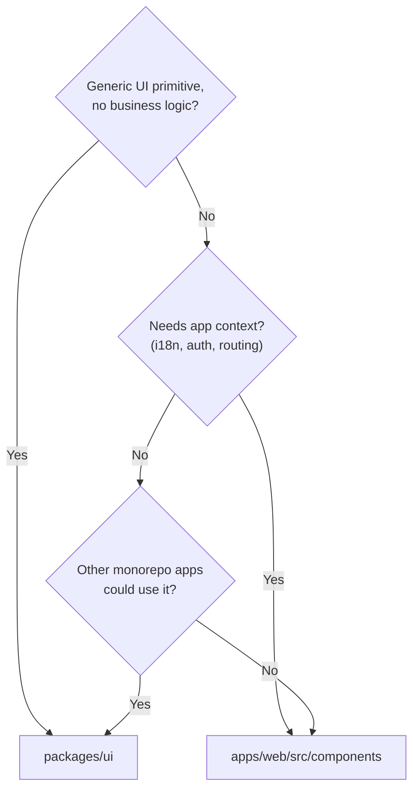

## TypeScript Preamble

Use the TypeScript compiler as a safety net, not a suggestion engine. Every pattern below exists in
or is derived from the codebase.

| Pattern | Example | Source |
|---------|---------|--------|
| Const assertions | `const LOCALES = ['en', 'fr'] as const` | Paraglide (generated in `apps/web/src/paraglide/`) |
| Derived unions | `type Locale = (typeof LOCALES)[number]` | Paraglide (generated in `apps/web/src/paraglide/`) |
| Type guards | `function isValidLocale(s): s is Locale` | New pattern |
| Assertion functions | `function assertLocale(s): asserts s is Locale` | New pattern |
| `satisfies` validation | `config satisfies Record&lt;Locale, ...>` | New pattern |
| `as const satisfies` | `['en', 'fr'] as const satisfies readonly string[]` | New pattern |
| Generic responses | `ApiResponse&lt;T>` (discriminated union preferred) | `packages/types/src/index.ts` |
| Mapped types | `Record&lt;Locale, { native: string; english: string }>` | `LocaleSwitcher.tsx` |
| Type-only imports | `import type { Locale }` | Enforced by Biome |
| Template literal types | `` type LocalizedRoute = `/${Locale}/${string}` `` | New pattern |

**Anti-patterns:**

- **`any`** -- Use `unknown` instead. Biome enforces this via `noExplicitAny: "warn"`.
- **`!` non-null assertion** -- Use null checks, optional chaining, or assertion functions. Biome enforces via `noNonNullAssertion: "warn"`.
- **`as X` type casting** -- Use `satisfies` for compile-time validation or type guards for runtime narrowing.

**`type` vs `interface`:** Use `type` as default. It prevents accidental declaration merging and supports unions/intersections directly. Use `interface extends` only for deep type hierarchies where compiler performance matters (rare).

**Auto-enforced:** `biome.json` enables `useImportType: "error"` and `noExplicitAny: "warn"`. `tsconfig.json` sets `strict: true` across all packages.

## 1.1 Monorepo Component Strategy

### Where to Put Components

| Location | Use Case | Examples |
|----------|----------|----------|
| `packages/ui/src/components/` | Reusable primitives, design system | Button, Card, Input, Select |
| `apps/web/src/components/` | App-specific, business logic | LocaleSwitcher, Header, ResumeAssistant |

**Decision tree:**



**Rules:**

- **`packages/ui`**: Zero business logic. Only styling, variants, and accessibility. No imports from `apps/*`.
- **`apps/web/src/components`**: Can import from `@repo/ui`. Can use app context (router, i18n, auth).
- **Composition over modification**: Wrap `@repo/ui` components in app components rather than forking them.

### Consuming `@repo/ui`

```tsx
// Import components
import { Button, Card, CardContent } from '@repo/ui'

// Import utility
import { cn } from '@repo/ui'

// Import styles in your app's root (e.g., root layout or CSS entry)
import '@repo/ui/styles.css'
```

## 1.2 Code Organization

Structure feature directories consistently:

```
lib/feature/
├── types.ts        # Type definitions
├── hooks.ts        # React hooks
├── client.ts       # Client-side utilities
├── server.ts       # Server-side utilities (createServerFn)
└── __tests__/      # Tests (alternative to colocated .test.ts)
```

Apply this structure when creating new feature directories in `apps/web/src/lib/`.

### File Naming

- **Component files** (`**/components/**/*.tsx`): PascalCase — `BanDialog.tsx`, `FilterBar.tsx`
- **Everything else** (hooks, utils, lib): camelCase — `useConsent.ts`, `formatDate.ts`
- **Route files**: exempt (TanStack conventions — `$postId.tsx`, `__root.tsx`)
- Test files match source convention: `BanDialog.test.tsx`, `formatDate.test.ts`

Enforced by Biome `useFilenamingConvention` at `error` level. `strictCase: true` forbids consecutive uppercase — use `apiUrl.ts` not `apiURL.ts`.

**Rules:**

- **No barrel files in app code.** Import directly from the source file: `@/lib/feature/hooks`, not `@/lib/feature`. Barrel files increase bundle size and create circular dependency risks.
- **Barrel files allowed only in `packages/*/src/index.ts`** for public API surfaces of shared packages.
- **Separate client and server files** for isomorphic features. Never import server-only code (e.g., cookie parsing, database calls) into client modules.
- **Hooks in a dedicated file.** Do not mix hook definitions with utility functions. `hooks.ts` contains React hooks; `client.ts` and `server.ts` contain plain functions.
- **TanStack Start conventions:** Use `$param` for dynamic route segments (e.g., `$locale/dashboard.tsx`), `_` prefix for pathless layouts (e.g., `$locale/_layout.tsx`), and `__root.tsx` for the root route.

## 1.3 Design Patterns

| Pattern | Source | Example |
|---------|--------|---------|
| Focused Utilities | Paraglide runtime (`apps/web/src/paraglide/`) | `getLocale`, `setLocale` -- single-purpose functions with one job each |
| Companion Hook | `apps/web/src/components/LocaleSwitcher.tsx` | Logic co-located with the component it serves |
| Error Boundary | `react-error-boundary` package | `&lt;ErrorBoundary>` with `fallbackRender` prop |
| Component Composition | `apps/web/src/components/LocaleSwitcher.tsx` | App component built by composing `@repo/ui` primitives (DropdownMenu, Button) |
| Module Namespace | `apps/web/src/paraglide/` directory | Related files grouped in a dedicated directory |

**Design principles:**

- **Focused hooks.** Each hook does one thing. Each utility serves a single purpose. Do not combine unrelated concerns.
- **Minimal props.** Pass only what the component needs. Derive internal state from props rather than requiring callers to pre-compute it.
- **Extension via composition.** Add variants without modifying internals. Use a `variant` prop to switch between rendering modes.
- **Compound components over config props.** If a component accumulates more than 4-5 configuration props, refactor it into a compound component pattern with subcomponents.

## 1.4 Error Handling

**Existing patterns in the codebase:**

- Error boundaries via `react-error-boundary` at route and feature level.
- `null` return for graceful degradation (e.g., utility functions return `null` when no match is found).
- `console.warn` for non-critical failures (e.g., missing translation keys).
- Try/catch in hooks with `undefined` fallback (e.g., hooks catch missing context).

**Rules:**

- **Use `react-error-boundary`.** Do not write hand-rolled class components for error boundaries.
- **React 19 behavior:** Errors thrown in `useTransition` async callbacks propagate to the nearest error boundary automatically.
- **Utility and UI helpers may return `null` or `undefined`** for expected failure cases. Callers handle the absent value.
- **Business logic: use Result types.** For operations that can fail in expected ways, return discriminated unions instead of throwing:

```ts
type Result<T, E = string> =
  | { success: true; data: T }
  | { success: false; error: E }
```

- **Never throw from functions called during rendering.** Thrown errors in the render path crash the component tree. Return fallback UI or `null` instead.

## 1.5 Component Patterns

- **Functional components only.** No class components, no exceptions.
- **Props type as `type`, not `interface`.** Use PascalCase with a `Props` suffix:

```tsx
type LocaleSwitcherProps = {
  className?: string
  variant?: 'dropdown' | 'buttons'
}
```

- **Extract logic into companion hooks** when a component's logic grows beyond simple event handlers.
- **Named exports only.** Never use default exports. Exception: framework conventions that require them (e.g., route components if mandated by the framework).
- **Variant pattern** for multi-mode components. Use a `variant` prop with a union type rather than separate components or boolean flags:

```tsx
variant?: 'dropdown' | 'buttons'  // Good
isDropdown?: boolean              // Avoid
```

- **Avoid premature memoization.** Do not add manual `React.memo`, `useMemo`, or `useCallback` unless profiling proves a measurable performance problem. Most components don't need memoization, and it adds complexity without benefit.

## 1.6 Shared UI Library (`packages/ui`)

The `@repo/ui` package uses **shadcn/ui** patterns: Radix UI primitives + CVA + Tailwind CSS.

### Core Dependencies

| Package | Purpose |
|---------|---------|
| `radix-ui` | Accessible, unstyled primitives |
| `class-variance-authority` | Type-safe variant management |
| `clsx` + `tailwind-merge` | Conditional class composition via `cn()` |
| `lucide-react` | Icons |

### The `cn()` Utility

Always use `cn()` for className composition. It merges Tailwind classes intelligently:

```tsx
import { cn } from '@repo/ui'

// Merges and deduplicates Tailwind classes
cn('px-4 py-2', 'px-6')           // → 'py-2 px-6'
cn('text-red-500', isActive && 'text-blue-500')  // conditional
cn(baseStyles, className)          // allow className override
```

### CVA (Class Variance Authority) Pattern

Use CVA for components with multiple variants:

```tsx
import { cva, type VariantProps } from 'class-variance-authority'

const buttonVariants = cva(
  // Base styles (always applied)
  'inline-flex items-center justify-center rounded-md font-medium',
  {
    variants: {
      variant: {
        default: 'bg-primary text-primary-foreground',
        outline: 'border bg-background',
        ghost: 'hover:bg-accent',
      },
      size: {
        default: 'h-9 px-4 py-2',
        sm: 'h-8 px-3',
        lg: 'h-10 px-6',
      },
    },
    defaultVariants: {
      variant: 'default',
      size: 'default',
    },
  }
)

// Export variants for external use (composition)
export { buttonVariants }
```

### Props Pattern for Primitives

Extend native HTML props and add variant types:

```tsx
import type * as React from 'react'
import type { VariantProps } from 'class-variance-authority'

function Button({
  className,
  variant,
  size,
  asChild = false,
  ...props
}: React.ComponentProps<'button'> &
  VariantProps<typeof buttonVariants> & {
    asChild?: boolean
  }) {
  const Comp = asChild ? Slot.Root : 'button'
  return (
    <Comp
      className={cn(buttonVariants({ variant, size, className }))}
      {...props}
    />
  )
}
```

**Key points:**

- `React.ComponentProps&lt;'button'>` — inherit all native button props
- `VariantProps&lt;typeof buttonVariants>` — type-safe variant props
- `className` in CVA call — allows consumer override
- `asChild` + `Slot` — Radix pattern for composing with other elements

### Data Attributes Convention

Add data attributes for CSS targeting and testing:

```tsx
<button
  data-slot="button"
  data-variant={variant}
  data-size={size}
  // ...
/>
```

### Adding New shadcn/ui Components

> **Note:** The shadcn CLI does not work correctly in our monorepo setup (`packages/ui` has no framework detected). Always use manual copy.

1. **Visit**: [ui.shadcn.com](https://ui.shadcn.com/docs/components)
2. **Copy** the component code
3. **Create** `packages/ui/src/components/ComponentName.tsx`
4. **Adapt** imports:
   - Change `@/lib/utils` → `@/lib/utils` (same path alias)
   - Use `radix-ui` instead of individual `@radix-ui/*` packages
5. **Export** from `packages/ui/src/index.ts`
6. **Test**: Add `ComponentName.test.tsx` with basic render test

**Both methods require:**

```tsx
// packages/ui/src/index.ts
export { NewComponent } from './components/NewComponent'
```

### Compound Components

For complex components (Select, Dialog), export all sub-components:

```tsx
export {
  Select,
  SelectContent,
  SelectGroup,
  SelectItem,
  SelectTrigger,
  SelectValue,
} from './components/Select'
```


## 1.7 TanStack Query Patterns

TanStack Query v5 is the data-fetching layer for all server state in `apps/web`. These patterns
establish consistent, maintainable conventions across the codebase — from query definition to
cache invalidation.

### 1.7.1 `queryOptions()` Factory

Co-locate `queryKey` and `queryFn` in a single reusable object using the `queryOptions()` helper
instead of defining them inline inside `useQuery`.

> **Migration in progress.** The `queryOptions()` factory is the **Target Pattern** — this is the
> standard we are actively migrating toward. Some existing code (including `feature-flags.tsx`)
> still uses the Current Pattern (inline `useQuery` with standalone key constants). New code
> should follow the Target Pattern; existing code will be migrated incrementally.

**Current Pattern — inline `useQuery` with standalone key constant:**

```tsx
// apps/web/src/routes/admin/feature-flags.tsx (current state)
const FEATURE_FLAGS_QUERY_KEY = ['admin', 'feature-flags'] as const

function FeatureFlagsPage() {
  const { data } = useQuery<FeatureFlag[]>({
    queryKey: FEATURE_FLAGS_QUERY_KEY,
    queryFn: async () => {
      const res = await fetch('/api/admin/feature-flags', { credentials: 'include' })
      if (!res.ok) throw new Error('Failed to fetch feature flags')
      return res.json()
    },
  })
}
```

This pattern keeps the key reusable within the file but does not extract it into a sharable
factory. It cannot be used with route-level `ensureQueryData` prefetching (see §1.7.3).

**Target Pattern — `queryOptions()` factory (migration target):**

```ts
// apps/web/src/lib/{feature}/queries.ts
import { queryOptions } from '@tanstack/react-query'
import type { FeatureFlag } from '@repo/types'

export const featureFlagQueries = {
  list: () =>
    queryOptions({
      queryKey: ['admin', 'feature-flags', 'list'] as const,
      queryFn: async ({ signal }): Promise<FeatureFlag[]> => {
        const res = await fetch('/api/admin/feature-flags', {
          credentials: 'include',
          signal,
        })
        if (!res.ok) throw new Error('Failed to fetch feature flags')
        return res.json()
      },
    }),
}
```

```tsx
// Consumed in the component — one import, no duplication
import { featureFlagQueries } from '@/lib/admin-feature-flags/queries'

function FeatureFlagsPage() {
  const { data } = useQuery(featureFlagQueries.list())
}
```

The factory approach enables:

- **Reuse** — the same options object is used by `useQuery`, `useSuspenseQuery`, and
  `ensureQueryData` without duplication
- **Type inference** — `queryFn` return type is inferred automatically; no need for the
  `useQuery&lt;T>` generic
- **Testability** — factories are plain functions, easily unit-tested without rendering components

> **Known migration debt — `feature-flags.tsx`:** The current implementation has three areas
> pending migration:
>
> 1. Uses direct `fetch` in event handlers (pre-`useMutation` pattern)
> 2. Uses inline `useQuery` with a standalone key constant (pre-`queryOptions` migration)
> 3. Migration to `useMutation` + `queryOptions` factory is pending
>
> This file is the reference for what the migration will transform, not a model to follow for
> new code.

The existing `useOrganizations` hook in `apps/web/src/lib/useOrganizations.ts` is an example of
the pattern we are migrating away from: it exports a key constant and embeds the query options
inside the hook, but the options are not extracted into a `queryOptions()` factory and therefore
cannot be shared with route-level prefetching (see §1.7.3).

### 1.7.2 Query Key Convention

Use a hierarchical key factory object so keys are consistent, typed, and easy to invalidate at
any level of specificity.

**Key factory pattern:**

```ts
// apps/web/src/lib/{feature}/queryKeys.ts
export const featureFlagKeys = {
  all: ['feature-flags'] as const,
  list: () => [...featureFlagKeys.all, 'list'] as const,
  detail: (id: string) => [...featureFlagKeys.all, 'detail', id] as const,
} as const
```

**Usage across the codebase:**

```ts
// Broad invalidation — all feature-flag queries
queryClient.invalidateQueries({ queryKey: featureFlagKeys.all })

// Targeted invalidation — only the list query
queryClient.invalidateQueries({ queryKey: featureFlagKeys.list() })

// Single-item invalidation
queryClient.invalidateQueries({ queryKey: featureFlagKeys.detail(id) })
```

The existing `FEATURE_FLAGS_QUERY_KEY = ['admin', 'feature-flags'] as const` constant in
`apps/web/src/routes/admin/feature-flags.tsx` is the starting point this pattern builds on. It
solves key co-location but does not yet provide hierarchical granularity or a reusable factory.
The members page in `apps/web/src/routes/admin/members.tsx` goes further by scoping keys with
`['admin-members', orgId, page, limit, search]`, but those arrays are hardcoded at each call
site rather than centrally defined.

**Rules:**

- One key factory per feature module, in `apps/web/src/lib/{feature}/queryKeys.ts`
- Always start from a single `all` root so broad invalidation works correctly
- Keys are plain arrays of string/primitive literals — no objects inside keys
- Export the factory object, never raw string arrays

### 1.7.3 Route-Level Prefetching

Prefetch data in `beforeLoad` using `ensureQueryData` so the component renders with data
already in the cache — no loading spinner on first visit.

```tsx
// apps/web/src/routes/admin/feature-flags.tsx
import { createFileRoute } from '@tanstack/react-router'
import { featureFlagQueries } from '@/lib/admin-feature-flags/queries'
import { enforceRoutePermission } from '@/lib/routePermissions'

export const Route = createFileRoute('/admin/feature-flags')({
  staticData: { permission: 'role:superadmin' },
  beforeLoad: async (ctx) => {
    // 1. Auth guard first — abort before fetching if unauthorized
    await enforceRoutePermission(ctx)

    // 2. Prefetch data — only reached if the guard passes
    await ctx.context.queryClient.ensureQueryData(featureFlagQueries.list())
  },
  component: FeatureFlagsPage,
})
```

**Guard-then-prefetch ordering is mandatory.** The auth guard (`enforceRoutePermission`) must
run and succeed before any data fetch. Reversing the order would trigger data fetches for
unauthenticated or unauthorized users before redirecting them.

`setupRouterSsrQueryIntegration()` is already configured in `apps/web/src/router.tsx`. It
dehydrates the query cache on the server and rehydrates it on the client, so `ensureQueryData`
results are available immediately without a client-side refetch on first load.

`beforeLoad` is already used in more than 30 route files for auth guards. Adding data prefetching
follows the same pattern — extend the existing `beforeLoad` rather than creating a separate
loader.

**`ensureQueryData` vs `prefetchQuery`:**

| | `ensureQueryData` | `prefetchQuery` |
|---|---|---|
| Returns data | Yes | No |
| Throws on error | Yes | No |
| Use when | Route requires data to render | Data is opportunistic (sidebar, related content) |

Use `ensureQueryData` for required route data and `prefetchQuery` for optional data you want
warm in the cache.

### 1.7.4 Cache Strategy

**Global `staleTime`:**

Configure a sensible default in the `QueryClient` options to avoid unnecessary refetches on
every component mount:

```ts
new QueryClient({
  defaultOptions: {
    queries: {
      staleTime: 30_000,  // 30 seconds — matches existing useOrganizations staleTime
    },
  },
})
```

Override per-query when the data has different freshness requirements — for example,
`staleTime: 60_000` for reference data like roles (as in `members.tsx`), or `staleTime: 0`
for real-time feeds.

**Invalidation — broad vs targeted:**

```ts
// Broad — existing pattern in members.tsx and feature-flags.tsx; simple but
// refetches more queries than necessary after a narrow mutation
queryClient.invalidateQueries({ queryKey: ['admin-members'] })

// Targeted — recommended; invalidates only the queries affected by the mutation
queryClient.invalidateQueries({ queryKey: memberKeys.list({ orgId }) })
```

Prefer targeted invalidation when the mutated entity is known. Use broad invalidation only when
a mutation could affect multiple distinct query variants (e.g., a bulk delete).

**`useQuery` vs `useSuspenseQuery`:**

- Use `useQuery` by default. It exposes `isLoading`, `isError`, and `data` for explicit state
  handling within the component.
- Use `useSuspenseQuery` when the component is wrapped in a `&lt;Suspense>` boundary. It removes
  the need to handle `isLoading` and `isError` inline — those states are delegated to the
  boundary's `fallback` and nearest `ErrorBoundary` respectively.

**When to consider `setQueryData` for optimistic updates:**

Use `setQueryData` to update the cache immediately before a mutation response arrives, making
the UI feel instant. It is appropriate when:

- The mutation outcome is fully deterministic (e.g., toggling a boolean flag, renaming an item)
- A rollback strategy exists if the mutation fails (restore the previous cache value in `onError`)
- The component renders frequently enough that waiting for `invalidateQueries` produces visible
  latency

See §1.7.5 for the implementation pattern.

### 1.7.5 Mutation Patterns

**Canonical `useMutation` + `invalidateQueries`:**

The standard pattern: call the API in `mutationFn`, then invalidate the relevant queries in
`onSuccess`. This matches the existing approach in `apps/web/src/routes/admin/feature-flags.tsx`
(flag toggle and delete actions).

```ts
import { useMutation, useQueryClient } from '@tanstack/react-query'
import type { FeatureFlag } from '@repo/types'
import { featureFlagKeys } from '@/lib/admin-feature-flags/queryKeys'

function useToggleFeatureFlag() {
  const queryClient = useQueryClient()

  return useMutation({
    mutationFn: async ({ id, enabled }: { id: string; enabled: boolean }) => {
      const res = await fetch(`/api/admin/feature-flags/${id}`, {
        method: 'PATCH',
        credentials: 'include',
        headers: { 'Content-Type': 'application/json' },
        body: JSON.stringify({ enabled }),
      })
      if (!res.ok) throw new Error('Failed to update feature flag')
      return res.json() as Promise<FeatureFlag>
    },
    onSuccess: () => {
      queryClient.invalidateQueries({ queryKey: featureFlagKeys.list() })
    },
  })
}
```

**Optimistic update with `setQueryData`:**

For mutations where the result is fully predictable before the server responds, update the cache
immediately and roll back on failure:

```ts
function useToggleFeatureFlagOptimistic() {
  const queryClient = useQueryClient()

  return useMutation({
    mutationFn: ({ id, enabled }: { id: string; enabled: boolean }) =>
      fetch(`/api/admin/feature-flags/${id}`, {
        method: 'PATCH',
        credentials: 'include',
        headers: { 'Content-Type': 'application/json' },
        body: JSON.stringify({ enabled }),
      }).then((res) => {
        if (!res.ok) throw new Error('Failed to update feature flag')
        return res.json() as Promise<FeatureFlag>
      }),

    onMutate: async ({ id, enabled }) => {
      // Cancel outgoing refetches to avoid overwriting the optimistic update
      await queryClient.cancelQueries({ queryKey: featureFlagKeys.list() })

      // Snapshot the current value for rollback
      const previous = queryClient.getQueryData&lt;FeatureFlag[]>(featureFlagKeys.list())

      // Optimistically update the cache
      queryClient.setQueryData&lt;FeatureFlag[]>(featureFlagKeys.list(), (old) =>
        old?.map((flag) => (flag.id === id ? { ...flag, enabled } : flag)) ?? [],
      )

      return { previous }
    },

    onError: (_err, _vars, context) => {
      // Restore previous value on failure
      if (context?.previous) {
        queryClient.setQueryData(featureFlagKeys.list(), context.previous)
      }
    },

    onSettled: () => {
      // Always sync with server after mutation completes (success or error)
      queryClient.invalidateQueries({ queryKey: featureFlagKeys.list() })
    },
  })
}
```

### 1.7.6 Rules

**Target (migration in progress):**

- Wrap `queryKey` + `queryFn` in a `queryOptions()` factory — target for new code; existing
  inline `useQuery` definitions are being migrated incrementally
- Define query keys in a central key factory (`queryKeys.ts`) — target for new code; existing
  standalone key constants are being migrated incrementally

**Always:**

- Invalidate after every mutation — never let stale data persist after a write
- Order `beforeLoad` as: auth guard first, data prefetch second
- Pass `signal` from the `queryFn` context parameter to `fetch` for automatic request
  cancellation on navigation

**Choose the right hook:**

- `useQuery` — default for components that manage their own loading/error state
- `useSuspenseQuery` — when a `&lt;Suspense>` boundary owns the loading state
- `useInfiniteQuery` — for cursor-based or offset-based paginated lists (see
  `apps/web/src/hooks/useCursorPagination.ts` for the established wrapper)
- `useMutation` — for all writes (POST, PATCH, DELETE); never call `fetch` directly in an
  event handler when TanStack Query is in scope

**Anti-patterns:**

| Anti-pattern | Problem | Fix |
|---|---|---|
| Inline `queryKey`/`queryFn` in `useQuery` | Keys duplicated across files; not reusable in `ensureQueryData` | Extract to `queryOptions()` factory |
| Hardcoded key strings at call sites | Typos cause silent cache misses; no targeted invalidation | Central key factory |
| Missing `signal` in `queryFn` | Requests not cancelled on navigation; wasted network and server load | Destructure `{ signal }` from `queryFn` param and pass to `fetch` |
| `useQuery` inside a `&lt;Suspense>` boundary | `isLoading` is always `false` inside Suspense; broken loading state | Switch to `useSuspenseQuery` |
| Optimistic update without rollback | Failed mutation leaves UI in incorrect state | Always implement `onError` rollback via context returned from `onMutate` |
| Data prefetch before auth guard | Unauthorized users trigger data fetches before redirect | Auth guard first, data prefetch second in `beforeLoad` |


## 1.8 SOLID Principles — Frontend

SOLID in React means clear separation between orchestration, logic, and presentation — enforced through TypeScript's structural type system rather than class hierarchies.

### SRP — Single Responsibility

Each layer owns exactly one concern: routes orchestrate, hooks manage logic, components render. A route component should not contain `useEffect` fetch loops or business-rule conditionals — those belong in a dedicated hook. The dashboard (`apps/web/src/routes/dashboard.tsx`) demonstrates this cleanly: `DashboardPage` contains no data-fetching or business logic; it delegates to `useAccountDeletionCheck` and `useAutoSelectOrg`, then renders `QuickActionCard` sub-components.

```tsx
// apps/web/src/routes/dashboard.tsx

// Hook — owns one concern: account deletion check
function useAccountDeletionCheck(navigate: ReturnType<typeof useNavigate>) {
  const accountCheckDone = useRef(false)
  const [accountChecked, setAccountChecked] = useState(false)

  useEffect(() => {
    const controller = new AbortController()
    async function checkAccountStatus() {
      const res = await fetchUserProfile(controller.signal)
      if (!res.ok) return
      const profile = (await res.json()) as Record<string, unknown>
      if (profile.deletedAt) {
        navigate({ to: '/account-reactivation', search: { ... } })
      }
    }
    checkAccountStatus()
    return () => controller.abort()
  }, [navigate])

  return accountChecked
}

// Route component — orchestrates, does not fetch
function DashboardPage() {
  const { data: session } = useSession()
  const { data: orgs, isLoading: orgsLoading } = useOrganizations(session?.user?.id)
  const navigate = useNavigate()

  const accountChecked = useAccountDeletionCheck(navigate)  // logic in hook
  useAutoSelectOrg(accountChecked, activeOrg, orgs)         // logic in hook

  if (!session || orgsLoading) return <DashboardSkeleton /> // presentation only
  return <div>...</div>
}
```

### OCP — Open/Closed

Components should be open to extension through callback props and composition, not modification. The `QuickActionCard` in `dashboard.tsx` accepts an `icon` prop typed as `React.ComponentType` — callers swap the icon without touching the card implementation. The same pattern applies to dialog composition: wrap `Dialog` from `@repo/ui` rather than adding conditional rendering inside it.

```tsx
// apps/web/src/routes/dashboard.tsx

type QuickActionCardProps = {
  icon: React.ComponentType<{ className?: string }> // caller supplies the icon
  title: string
  description: string
  linkTo: string
  linkParams?: Record<string, string>
  linkLabel: string
}

function QuickActionCard({ icon: Icon, title, description, linkTo, linkLabel }: QuickActionCardProps) {
  return (
    <Card>
      <CardHeader className="pb-2">
        <CardTitle className="flex items-center gap-2 text-base">
          <Icon className="size-4 text-muted-foreground" /> {/* injected, not hardcoded */}
          {title}
        </CardTitle>
      </CardHeader>
      <CardContent>
        <p className="mb-3 text-sm text-muted-foreground">{description}</p>
        <Button variant="outline" size="sm" asChild>
          <Link to={linkTo}>{linkLabel}</Link>
        </Button>
      </CardContent>
    </Card>
  )
}

// Usage — extend with new icons without modifying QuickActionCard
<QuickActionCard icon={SettingsIcon} title="Settings" ... />
<QuickActionCard icon={UsersIcon}    title="Members"  ... />
```

### LSP — Liskov Substitution

React has no class inheritance to substitute; component contracts are enforced by TypeScript prop types, so any component satisfying a prop interface is a valid substitute.

### ISP — Interface Segregation

Prop types should describe exactly what a component uses — nothing more. Similarly, hooks should return only the values consumers need. `QuickActionCardProps` is a good example of a lean interface: every field maps directly to something the component renders or routes to. The profile settings page (`apps/web/src/routes/settings/profile.tsx`) splits state and actions into focused types that sub-components receive only the slice they need.

```tsx
// apps/web/src/routes/settings/profile.tsx — state and actions split into focused types

// State describes only what form rendering needs
type ProfileFormState = {
  firstName: string
  lastName: string
  fullName: string
  fullNameCustomized: boolean
  avatarStyle: AvatarStyle
  avatarSeed: string
  avatarOptions: Record<string, unknown>
  saving: boolean
  loaded: boolean
}

// Actions describe only what mutations are available
type ProfileActions = {
  setFirstName: (v: string) => void
  setLastName: (v: string) => void
  // ...focused setters only
}

// Sub-component receives state + actions slices — not the full page's session or user object
function ProfileInfoSection({
  state,
  actions,
}: {
  state: ProfileFormState
  actions: ProfileActions
}) { ... }

// apps/web/src/lib/useOrganizations.ts — hook returns exactly what callers need
export function useOrganizations(sessionKey?: string | null) {
  ...
  return { data, isLoading, error, refetch } // lean, no internal implementation details
}
```

**Anti-pattern:** passing the entire `session` object into a component that only reads `session.user.name`.

### DIP — Dependency Inversion

High-level components depend on hook abstractions, not directly on fetch calls or query clients. `useOrganizations` (`apps/web/src/lib/useOrganizations.ts`) hides TanStack Query and the `fetchOrganizations` function behind a stable interface — `DashboardPage` calls `useOrganizations(session?.user?.id)` and never sees the HTTP layer.

```tsx
// apps/web/src/lib/useOrganizations.ts — abstraction layer

export function useOrganizations(sessionKey?: string | null) {
  const queryClient = useQueryClient()

  const { data, isLoading, error } = useQuery<Organization[]>({
    queryKey: [...ORGANIZATIONS_QUERY_KEY, sessionKey],
    queryFn: async ({ signal }) => {
      const res = await fetchOrganizations(signal)
      return res.ok ? res.json() : []
    },
    staleTime: 30_000,
    enabled: sessionKey !== undefined,
  })

  const refetch = useCallback(() => {
    queryClient.invalidateQueries({ queryKey: ORGANIZATIONS_QUERY_KEY })
  }, [queryClient])

  return { data, isLoading, error, refetch }
}

// apps/web/src/routes/dashboard.tsx — depends on the abstraction, not the HTTP layer
const { data: orgs, isLoading: orgsLoading } = useOrganizations(session?.user?.id)
```

**Rules:**

- Route components orchestrate — no fetch loops, no business conditionals inline.
- Extract logic into named hooks; one hook per concern.
- Prop interfaces describe exactly what the component uses — pass slices, not whole objects.
- Hooks abstract data sources; consumers never import fetch functions or query clients directly.
- Extend components via callback/component props, not by modifying internals.

## 1.9 AI Quick Reference

Compressed imperative rules for AI agent consumption. No examples, no rationale.

**TypeScript:**

- Use `unknown` over `any`
- Use `satisfies` over `as` for type validation
- Use `type` over `interface` as default
- Enforce type-only imports (`import type`)
- No `!` non-null assertions -- use optional chaining or assertion functions
- Use const assertions with derived union types
- Use discriminated unions for API responses
- Escape `&lt;` as `&amp;lt;` in MDX text (not in code blocks)

**Frontend (App Components):**

- No barrel files in app code -- import directly from source files
- Functional components only -- no class components
- Named exports only (exception: framework conventions)
- Use `react-error-boundary` for error boundaries
- No manual `React.memo`/`useMemo`/`useCallback` unless profiling proves necessary
- Extract complex logic into companion hooks
- Variant pattern for multi-mode components (`variant?: 'a' | 'b'`, not `isA?: boolean`)
- Client/server file separation for isomorphic features
- Props as `type` with `Props` suffix
- Never throw from render path
- TanStack Start: `$param` for dynamic segments, `_` prefix for pathless layouts

**TanStack Query:**

- Target: use `queryOptions()` factories -- migration in progress; avoid inline query config in `useQuery()` for new code
- Target: centralize keys in a `queryKeys` factory per domain -- migration in progress; avoid hardcoded string arrays in new code
- Prefetch in `beforeLoad` with `ensureQueryData` -- auth guard first, data second
- Use `useQuery` by default; `useSuspenseQuery` only inside `&lt;Suspense>` boundaries
- Always invalidate related queries in mutation `onSuccess`
- Prefer targeted `invalidateQueries({ queryKey: queryKeys.domain.all })` over broad invalidation
- Optimistic updates: always implement `onError` rollback via `onMutate` context

**SOLID (Frontend):**

- SRP: routes orchestrate, hooks own logic, components render -- no fetch loops in routes
- OCP: extend via callback/component props, not internal modification
- ISP: prop types describe exactly what the component uses -- pass slices, not whole objects
- DIP: hooks abstract data sources -- consumers never import fetch functions directly

**Shared UI (`packages/ui`):**

- Generic primitives only -- no business logic, no app imports
- Use CVA (`class-variance-authority`) for variant management
- Use `cn()` for all className composition
- Extend `React.ComponentProps&lt;'element'>` for native props
- Use `VariantProps&lt;typeof variants>` for type-safe variants
- Support `asChild` prop with Radix `Slot` for composition
- Add `data-slot`, `data-variant` attributes
- Export component + variants (e.g., `Button`, `buttonVariants`)
- Export compound component parts separately
- Copy shadcn/ui components manually (no CLI) and adapt imports
